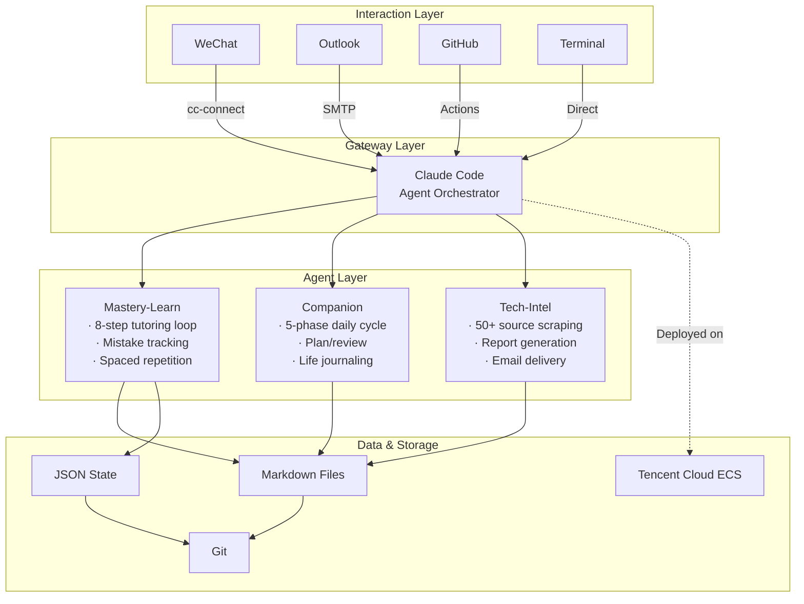

# AI-Native-Learning-OS

<p align="center">
  <em>An AI Agent-Powered Personal Learning Operating System</em>
</p>

<p align="center">
  
  
  
  
  
</p>

> **中文读者：** 详见 [README_CN.md](README_CN.md)。

---

## What Is This?

A personal learning operating system where **AI Agents are the OS, not an add-on**. Instead of opening ChatGPT for one-off conversations, you interact with three persistent AI Agents — a mastery learning tutor, a daily companion, and a tech intelligence reporter — all through WeChat, as naturally as texting a friend.

**Three core agents:**

| Agent | What It Does | Trigger |
|-------|-------------|---------|
| **Mastery-Learn** | 1-on-1 tutoring based on Bloom's 2 Sigma theory; tracks mistakes; schedules spaced repetition | `/mastery-learn <course>` via WeChat |
| **Companion** | Generates daily plans, sends morning/evening reports, records life reflections | Auto-running cron + WeChat chat |
| **Tech-Intel** | Scrapes 50+ sources daily; delivers an AI morning briefing to your inbox | GitHub Actions cron at 7:00 AM CST |

---

## Why?

Four fragmentation problems in university learning:

1. **Task fragmentation** — assignments, self-study, and research reading scattered across platforms
2. **Knowledge blind spots** — you finish a course but can't pinpoint what you actually mastered vs. what you're weak on
3. **Cram-based review** — no systematic mistake tracking or spaced repetition until exam week
4. **Unsustainable AI usage** — every ChatGPT session starts from scratch: no memory, no context, no follow-up

This project asks: **what if an AI Agent wasn't a tool you occasionally consult, but the operating system for your learning?**

---

## Architecture



### Core Design Principles

**Files as State.** No database. Agents read Markdown and JSON files to recover context. After each tutoring session, all state is written to disk — current position, mastery scores, newly discovered weak points. The next session picks up exactly where the last one left off.

**Constraints over Prompts.** Agents aren't free to say anything. Behavior is constrained through three layers:
- **Contract layer** — `CLAUDE.md` defines non-bypassable behavioral rules
- **Validation layer** — Python scripts verify Agent output structure
- **Enum layer** — Mastery levels, question permissions, and error types are fixed enumerations

---

## Key Features

### 1. Mastery Learning Engine

Implements Bloom's 2 Sigma problem: 1-on-1 tutoring + mastery learning = +2σ achievement gain.

**8-step tutoring loop:** Set micro-goal → Teach concept → Diagnose understanding → Practice → Grade & feedback → Analyze errors → Remediate or advance → Log to spaced repetition queue

**6 mastery levels:** Unstarted → Recognize → Recall → Apply → Master (≥90%) → Synthesize

**Constraint highlights:** Source-isolated (textbook-only questions), full text traceability (every knowledge point maps to a paragraph `[XXXX]`), no advancement without mastery.

> Agent definition: `agents/mastery-learn.agent.md` (21KB)
> Review engine: `tools/review_system.py` (30KB)

### 2. Daily Companion

A 24/7 learning manager that covers your entire day through WeChat.

**5-phase daily cycle:**

| Time | Phase | Action |
|------|-------|--------|
| 5:00 AM | Auto-generate | Build today's plan from progress + calendar + deadlines |
| 7:00 AM | Morning push | Email "Morning Startup" report |
| 12:30 PM | Re-orient | Check morning progress, adjust afternoon plan |
| 9:30 PM | Review | Summarize completions, log blockers |
| 11:00 PM | Sleep review | Push due spaced repetition cards |

**13+ WeChat commands** covering plan generation, mastery learning sessions, progress updates, tech intel triggers, and casual chat with automatic diary logging.

> Orchestrator: `tools/companion.py` (46KB)
> Command reference: `WECHAT_COMMANDS.md`

### 3. Tech Intelligence Daily Brief

Every morning at 7:00 AM, a focused Edge AI briefing lands in your inbox.

**50+ sources, three tiers:**

| Tier | Type | Examples |
|------|------|----------|
| Primary | Official blogs, framework releases | OpenAI, Anthropic, NVIDIA, PyTorch, ONNX Runtime, ExecuTorch, TensorRT |
| Secondary | Tech communities, papers | arXiv, Hacker News, Reddit (r/MachineLearning, r/LocalLLaMA, r/embedded), HuggingFace |
| Tertiary | Chinese tech media | 机器之心, 量子位, 36氪 |

Pipeline: GitHub Actions cron → parallel scraping with fallback → keyword filtering → Obsidian-compatible Markdown report → SMTP email delivery.

> Agent definition: `agents/tech-intel.agent.md` (19KB)
> Scraper: `tools/tech_intel_cloud.py` (36KB)
> CI/CD: `.github/workflows/tech-intel-daily.yml`

---

## Tech Stack

| Layer | Technology |
|------|-----------|
| AI Agent Framework | Claude Code (Anthropic) |
| Agent Definition | Markdown + YAML Front Matter |
| Automation | Python 3.10+ |
| CI/CD | GitHub Actions |
| Communication | cc-connect (WeChat ↔ CLI) |
| Email | SMTP (QQ Mail) → Outlook |
| Cloud | Tencent Cloud ECS (Ubuntu) |
| Storage | Markdown + JSON (no database) |

---

## Key Engineering Decisions

**Why files instead of a database?** Files can be read and written directly by AI Agents — no API layer needed. After a tutoring session, the Agent writes state to Markdown. Next session reads the file and resumes seamlessly. Trade-off: weaker query capability, but for single-user, text-heavy workloads, Markdown-as-database works perfectly.

**Why WeChat instead of a web UI?** WeChat is the most-used app. Embedding the Agent in an existing chat stream removes adoption friction. No new app to install, no new interaction paradigm to learn.

**Why Python scripts for critical data, not AI generation?** AI is great at creative tasks (explanations, diagnostics) but unreliable for precision-required tasks (course structure, progress tracking, data validation). Core data structures are deterministically generated by Python scripts — formats are always correct regardless of LLM output variance.

---

## Project Structure

```
AI-Native-Learning-OS/
├── CLAUDE.md                     # Agent behavioral constitution
├── AGENTS.md                     # Agent coordination hub
├── profile.md                    # User profile template
├── learning-progress.md          # 12-module capability portrait
├── WECHAT_COMMANDS.md            # Full command reference
├── README.md                     # English README (this file)
├── README_CN.md                  # Chinese README
│
├── claude/                       # Claude Code config
├── agents/                       # Agent definition files
│   ├── mastery-learn.agent.md
│   └── tech-intel.agent.md
├── commands/                     # Slash command definitions (13+)
├── tools/                        # Python automation scripts
│   ├── companion.py              # Daily learning orchestrator (46KB)
│   ├── review_system.py          # Spaced repetition engine (30KB)
│   ├── tech_intel_cloud.py       # Tech intel scraper (36KB)
│   └── ucloud_task_scraper.py    # University platform integration (16KB)
├── plan/                         # Learning plan framework
├── .github/workflows/            # CI/CD
├── docs/                         # Documentation & screenshots
└── examples/                     # Anonymized usage samples
```

---

## Known Limitations

| Limitation | Mitigation Plan |
|------------|----------------|
| Highly customized (BUPT-specific schedules, platforms) | Extract configurable parameters to `config.yaml` |
| No visualization dashboard | Build Streamlit-based web dashboard |
| No quantitative learning efficiency metrics | Design A/B comparison or self-assessment baseline |
| High deployment barrier (Claude Code + cc-connect + cloud server) | Docker-based one-click deployment |
| Single-user architecture | Multi-profile support via file isolation |

---

## Roadmap

**Short-term (1-2 months):** Extract hardcoded params, write deployment docs, add architecture diagram.

**Mid-term (3-6 months):** Streamlit dashboard, Docker deployment, multi-profile support, progress visualization.

**Long-term (6-12 months):** Abstract into a general-purpose framework configurable via YAML. Explore multi-Agent collaborative learning scenarios.

---

## License

MIT License — see [LICENSE](LICENSE)

---

## Acknowledgments

- [Anthropic](https://anthropic.com) — Claude Code platform
- [cc-connect](https://github.com/cc-connect) — WeChat communication gateway
- Benjamin Bloom — 2 Sigma educational theory

---

<p align="center">
  <sub>Running continuously since May 11, 2026.</sub>
</p>
