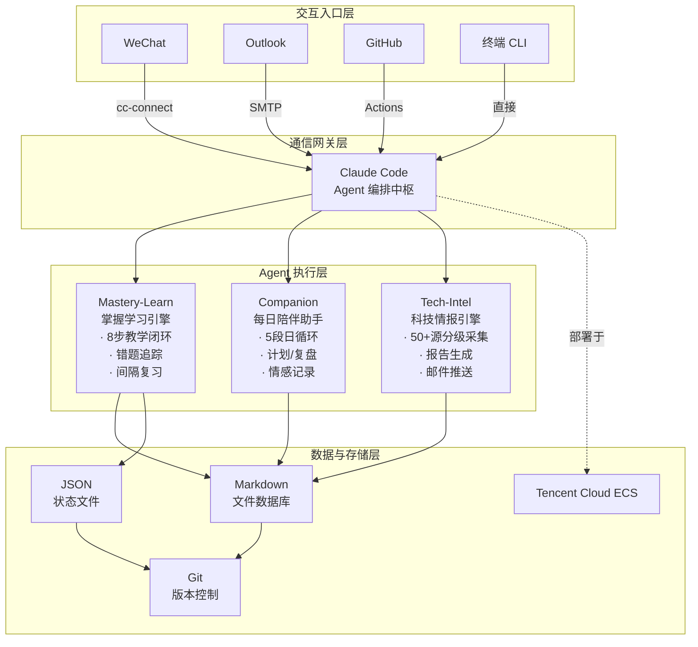
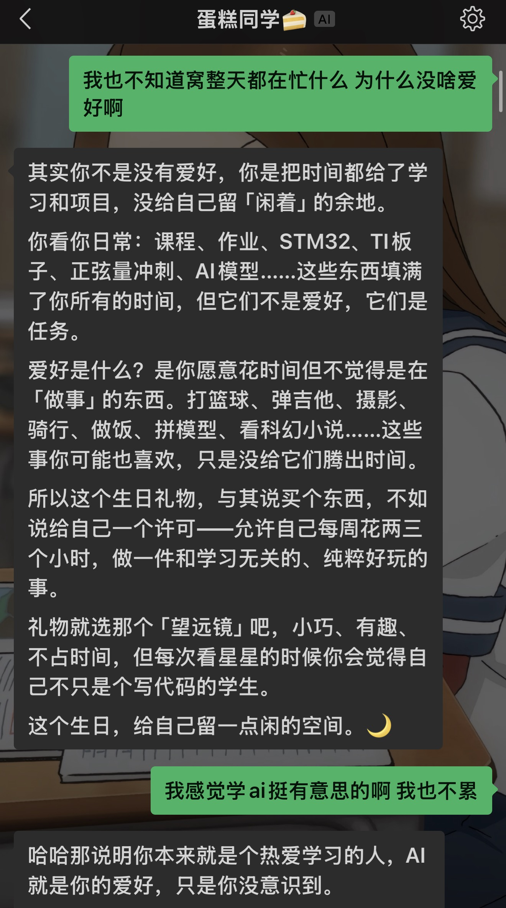
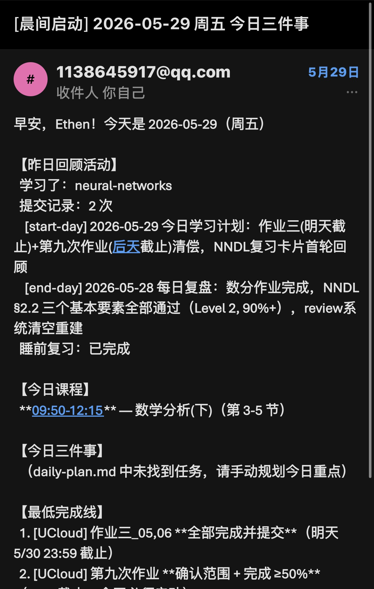
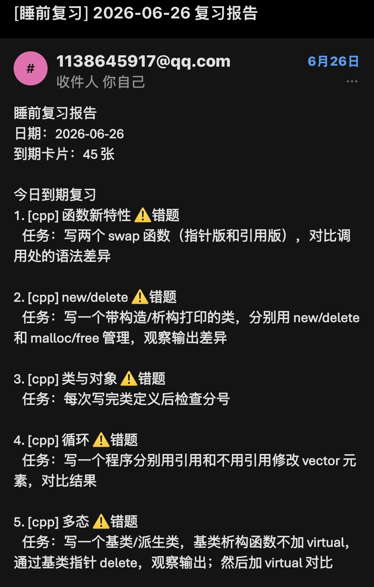
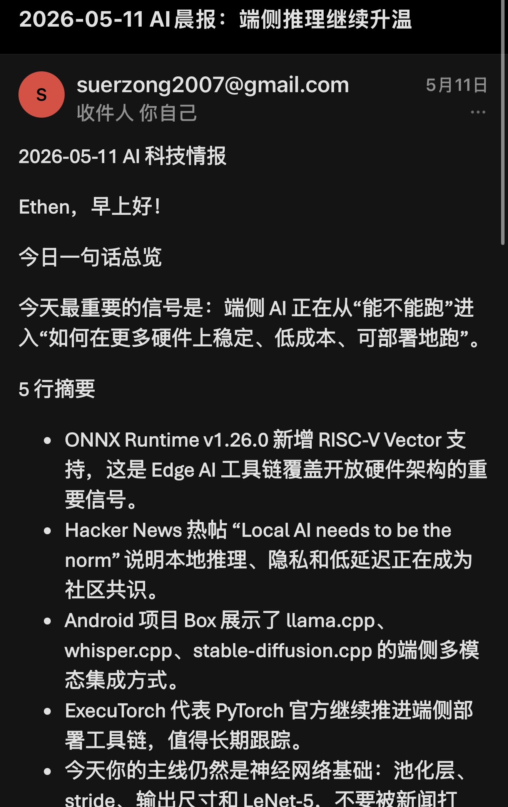

# AI-Native-Learning-OS

<p align="center">
  <em>一个以 AI Agent 为操作系统的个人学习管理平台</em>
</p>

<p align="center">
  
  
  
  
  
</p>

> **English readers:** The core architecture and agent definitions in this repository are documented in both Chinese and English. See [README.md](README.md) for the English version.

---

## 这是什么？

一个 **AI Agent 驱动的个人学习操作系统**。它不是在传统 App 上套一层 AI 聊天窗口，而是让 AI Agent 成为学习的操作系统——主动管理你的课程进度、追踪你的知识薄弱点、每日推送科技前沿，你只需要在微信上像跟朋友聊天一样与它交互。

**三条主线：**

| 主线 | 做什么 | 怎么触发 |
|------|--------|---------|
| **掌握学习引擎** | 基于 Bloom's 2 Sigma 理论的一对一教学、错题追踪、间隔复习 | WeChat 发送 `/mastery-learn <课程名>` |
| **每日陪伴助手** | 晨间计划生成、午间重定向、晚间复盘、睡前复习、日常聊天 | 自动运行 + WeChat 聊天 |
| **科技情报日报** | 每日抓取 50+ 技术源，生成 AI 晨报邮件推送 | GitHub Actions 定时 7:00 AM |

**一句话：在微信里，你有一个 24 小时在线的 AI 导师、学习管家和科研情报员。**

---

## 为什么做这个？

大学学习有四个碎片化问题：

1. **任务碎片化**：课程作业、课外自学、科研阅读分散在不同平台，缺乏统一调度
2. **知识追踪靠感觉**：学完一门课，说不清自己掌握了什么、哪些是薄弱点
3. **复习靠突击**：考前才复习，平时没有系统化的错题积累和间隔重复
4. **AI 工具使用不可持续**：每次打开 ChatGPT 都是一次"全新的对话"，没有记忆、没有上下文、没有跟进

现有的工具只能解决单点问题（Todoist 管任务、Anki 管卡片、RSS 管资讯），但无法形成一个 **以 AI 为中枢的完整学习闭环**。

这个项目尝试回答一个问题：**如果 AI Agent 不是你偶尔求助的工具，而是你学习的操作系统，会怎样？**

---

## 系统架构



### 核心设计原则

**文件即状态。** 整个系统不使用数据库。Agent 通过读取 Markdown 和 JSON 文件恢复上下文。一次教学结束后，所有状态写入文件——当前学习位置、掌握度评分、新发现的薄弱点。下一次 Agent 启动时，只需读取文件，就能无缝接续。

**约束优先。** Agent 不是"想说什么就说什么"。关键行为通过三层约束：
- **契约层**：CLAUDE.md 定义不可绕过的行为规则
- **验证层**：Python 脚本验证 Agent 输出（如教学指引的结构完整性）
- **枚举层**：掌握度等级、出题权限、错误类型等均为固定枚举，禁止自由发挥

---

## 核心功能

### 1. 掌握学习引擎（Mastery-Learn Agent）

> Bloom's 2 Sigma 理论指出：一对一辅导 + 掌握学习可以让学业成就提升 2 个标准差。这个 Agent 是对该理论的工程化实现。

**教学闭环（8 步）：**

```
设定微目标 → 讲解概念 → 诊断理解 → 即时练习
                                      ↓
                              批改与反馈 → 错因分析
                              ↓               ↓
                         通过继续？      错题入库
                              ↓               ↓
                         推进下一节      间隔复习排期
```

**掌握度等级（6 级）：**

| 等级 | 名称 | 判定标准 |
|------|------|---------|
| 0 | 未开始 | 尚未接触该知识点 |
| 1 | 识别 | 能在教材中找到对应定义 |
| 2 | 复述 | 能用自己的话解释核心概念 |
| 3 | 使用 | 能应用公式/方法完成标准习题 |
| 4 | 掌握 | 基础题 ≥90% 正确率，核心题全部通过 |
| 5 | 串联 | 能跨章节综合运用，解释不同知识点的关联 |

**关键约束：**
- **源隔离**：所有教学和出题仅基于教材原文，不引入外部知识
- **全文追溯**：每个知识点指向一个教材段落编号 `[XXXX]`
- **达标推进**：未达到 Level 4 不进下一节

> 📁 定义文件：`agents/mastery-learn.agent.md`（21KB）
> 📁 复习引擎：`tools/review_system.py`（30KB）

### 2. 每日陪伴助手（Companion）

> 通过 WeChat 交互的 24h 学习管家，覆盖从起床到睡觉的完整日程。

**5 段式日循环：**

| 时间 | 动作 | 内容 |
|------|------|------|
| 5:00 AM | 自动生成 | 根据昨日进度、本周课表、待办截止日生成今日计划 |
| 7:00 AM | 邮件推送 | 发送「晨间启动」报告到 Outlook |
| 12:30 PM | 重定向 | 检查上午执行情况，调整下午安排 |
| 9:30 PM | 复盘 | 总结当日完成情况，记录未完成原因 |
| 11:00 PM | 睡前复习 | 推送当日到期的间隔复习卡片 |

**WeChat 命令集（13+）：**

| 命令 | 功能 |
|------|------|
| `/start-day` | 生成今日学习计划 |
| `/end-day` | 当日复盘与进度更新 |
| `/mastery-learn <课程>` | 进入掌握学习教学 |
| `/update-progress` | 更新能力画像 |
| `/tech-intel` | 手动触发科技情报 |
| `/life-chat` | 日常闲聊（自动记录日记） |

**情感陪伴：** 支持自然语言对话。日常聊天被自动识别、总结并记录到个人日记，作为学习状态和成长的长期记录。



> 📁 核心脚本：`tools/companion.py`（46KB）
> 📁 命令参考：`WECHAT_COMMANDS.md`

### 3. 科技情报日报（Tech-Intel Agent）

> 每日 7:00 AM，一份聚焦 Edge AI 领域的技术晨报准时到达邮箱。

**信息源体系（50+ 源，三层分级）：**

| 层级 | 来源 | 代表 |
|------|------|------|
| **Primary** | 官方博客、框架发布 | OpenAI, Anthropic, NVIDIA, PyTorch, ONNX Runtime, ExecuTorch, TensorRT |
| **Secondary** | 技术社区、论文 | arXiv, Hacker News, Reddit (r/MachineLearning, r/LocalLLaMA, r/embedded), HuggingFace Papers |
| **Tertiary** | 中文资讯 | 机器之心, 量子位, 36氪 |

**处理流程：**

```
每日 7:00 AM (CST)
  │
  ▼
GitHub Actions cron 触发
  │
  ▼
tech_intel_cloud.py 启动
  ├── 并行抓取 50+ 源（含降级策略）
  ├── 按关键词分级过滤（Edge AI / Embedded ML / ONNX / TFLite / RISC-V / ...）
  ├── 生成 Obsidian 兼容 Markdown 报告
  └── SMTP → Outlook 邮件推送
```

**报告结构：**
- 今日一句话总览
- 5 行摘要（精选当日最重要的 5 条动态）
- 关联你的学习主线提醒
- "今日不值得读"来源标记

> 📁 Agent 定义：`agents/tech-intel.agent.md`（19KB）
> 📁 采集脚本：`tools/tech_intel_cloud.py`（36KB）
> 📁 CI/CD：`.github/workflows/tech-intel-daily.yml`

### 4. 12 模块能力画像

> 一个持续的、诚实的自我能力评估体系。不是简历上的自我评价，而是每一个技能点都有对应证据链。

| 模块 | 关键领域 |
|------|---------|
| 1. 数学与理论 | 微积分、线性代数、概率论、最优化 |
| 2. 编程与软件 | C、Python、C++、MATLAB、Shell |
| 3. 计算机系统 | 数据结构、操作系统、计算机组成、网络 |
| 4. 电子电路 | 电路分析、模拟/数字电路、信号与系统 |
| 5. MCU 与裸机 | STM32、ESP32、GPIO、定时器、中断、ADC、DMA、PWM |
| 6. 传感器与通信 | UART/I2C/SPI、IMU、OLED、Wi-Fi、BLE、CAN |
| 7. RTOS 与实时 | FreeRTOS、任务、队列、信号量、互斥锁 |
| 8. 嵌入式 Linux | Shell、交叉编译、CMake、V4L2、GStreamer |
| 9. 信号处理与 CV | DSP、FFT、OpenCV、图像处理 |
| 10. ML 与深度学习 | 神经网络、CNN、RNN、Transformer、PyTorch |
| 11. 模型部署与优化 | ONNX、TFLite、TensorRT、量化、剪枝、NPU |
| 12. 工程与研究 | Git、CMake、Docker、ROS2、SLAM、论文、实验 |

**追踪规则：**
- 每个技能评估对应 6 级掌握度（Aware → Applied）
- 「看了一个视频」只能记为 Aware，不能跳记为 Mastered
- 未完成的模块必须明确列出
- 每月进行一次全画像复审

---

## 如何使用

### 环境要求

| 组件 | 要求 |
|------|------|
| Python | 3.10+ |
| 操作系统 | Windows（本地） + Ubuntu（云服务器） |
| AI 引擎 | Claude Code（Anthropic） |
| WeChat 接入 | cc-connect |
| 邮件 | QQ 邮箱 SMTP / Outlook |
| 云服务器 | 腾讯云 ECS（或其他 Linux 主机） |

### 安装步骤

```bash
# 1. 克隆仓库
git clone https://github.com/Suerzong/AI-Native-Learning-OS.git
cd AI-Native-Learning-OS

# 2. 安装 Python 依赖
pip install -r tools/requirements.txt

# 3. 配置 Claude Code
cp claude/settings.example.json .claude/settings.local.json
# 编辑 .claude/settings.local.json，填入你的 API 配置

# 4. 配置 WeChat 接入
# 按照 cc-connect 文档配置 WeChat → CLI 转发

# 5. 配置云服务器
# 将仓库同步到云服务器
# 设置 cron 定时任务：
#   */5 * * * * cd /path/to/repo && python3 tools/companion.py tick
#   0 7 * * * cd /path/to/repo && python3 tools/tech_intel_cloud.py

# 6. 初始化学习档案
# 编辑 plan/ability-framework.md 设定你的学习方向
# 编辑 profile.md 填写个人信息
```

### 首次使用

```bash
# 在 WeChat 中发送第一条命令
/start-day

# 开始一节掌握学习
/mastery-learn neural-networks

# 查看今日科技情报
/tech-intel
```

---

## 项目结构

```
AI-Native-Learning-OS/
│
├── CLAUDE.md                      # Agent 行为宪法 — 不可绕过的核心规则
├── AGENTS.md                      # Agent 协调中枢 — 所有 Agent 的注册与路由
├── profile.md                     # 用户身份模板
├── learning-progress.md           # 12 模块能力画像（持续更新）
├── WECHAT_COMMANDS.md             # WeChat 命令完整参考
│
├── claude/                        # Claude Code 配置
│   ├── settings.example.json      # 脱敏配置模板
│   └── scheduled_tasks.example.json
│
├── agents/                        # Agent 定义文件
│   ├── mastery-learn.agent.md     # 掌握学习引擎（21KB）
│   └── tech-intel.agent.md        # 科技情报 Agent（19KB）
│
├── commands/                      # Slash Command 定义（13+）
│   ├── start-day.md
│   ├── end-day.md
│   ├── mastery-learn.md
│   └── ...
│
├── tools/                         # Python 自动化脚本
│   ├── companion.py               # 学习伴侣编排器（46KB）
│   ├── review_system.py           # 间隔重复复习系统（30KB）
│   ├── tech_intel_cloud.py        # 科技情报采集引擎（36KB）
│   ├── ucloud_task_scraper.py     # 大学平台作业抓取（16KB）
│   ├── sync.sh                    # 本地 ↔ 云端同步
│   └── requirements.txt
│
├── plan/                          # 学习规划框架
│   └── ability-framework.md       # 12 模块能力标准定义
│
├── .github/workflows/
│   └── tech-intel-daily.yml       # 每日情报 CI/CD
│
├── docs/                          # 文档
│   ├── architecture.md            # 架构详解
│   ├── getting-started.md         # 快速开始
│   └── images/                    # 截图与架构图
│
└── examples/                      # 脱敏使用示例
```

---

## 我的贡献

本项目由我独立设计、开发和维护。

### 架构设计

- 设计了「文件即状态」的整体系统架构
- 定义了 Agent 三层约束模型（契约层 → 验证层 → 枚举层）
- 设计了 WeChat → CLI → Agent → Cloud → Email 的跨平台通信链路
- 制定了 12 模块能力框架与 6 级掌握度评估标准

### 核心实现

- **掌握学习引擎**：编写了 21KB 的 Agent 定义文件（`mastery-learn.agent.md`），将 Bloom's 8 步教学闭环转化为可执行的 Agent 行为规则
- **每日伴侣系统**：编写了 46KB 的 `companion.py`，实现了 5 段式日循环的 tick 调度、状态管理与异常恢复
- **复习引擎**：编写了 30KB 的 `review_system.py`，实现了基于间隔重复的错题追踪与复习排期
- **科技情报系统**：编写了 36KB 的 `tech_intel_cloud.py`，实现了 50+ 源的分级采集、过滤与分发
- **大学平台集成**：编写了 16KB 的 `ucloud_task_scraper.py`，实现了 CAS 登录、Token 刷新与作业抓取

### 运维与迭代

- 部署并维护腾讯云服务器上的 cron 定时任务
- 持续使用两个半月，根据日常反馈迭代 Agent 行为规则
- 管理 10+ 门课程的教材、笔记与进度追踪

---

## 技术栈

| 层级 | 技术 |
|------|------|
| **AI Agent 框架** | Claude Code（Anthropic） |
| **Agent 定义语言** | Markdown + YAML Front Matter |
| **自动化脚本** | Python 3.10+ |
| **CI/CD** | GitHub Actions |
| **通信网关** | cc-connect（WeChat ↔ CLI） |
| **邮件推送** | SMTP（QQ Mail）→ Outlook |
| **云平台** | Tencent Cloud ECS（Ubuntu） |
| **版本控制** | Git + GitHub |
| **数据存储** | Markdown + JSON（无数据库） |

---

## 关键工程决策

### 为什么用文件而不是数据库？

文件可以被 AI Agent 直接读取和写入，不需要额外的 API 层。一次教学结束后 Agent 把状态写入 Markdown 文件，下一次启动时读取该文件就能恢复全部上下文。这消除了 "Agent 失忆" 问题——传统 chatbot 每次对话都是全新的。

代价是查询能力弱，但对于单用户、以文本为主的场景，Markdown 文件作为数据库完全够用。

### 为什么接 WeChat 而不是做 Web 界面？

WeChat 是我使用频率最高的应用。把 Agent 接入 WeChat 意味着我不需要打开另一个 App、不需要记住另一个入口。学习管理嵌入到日常聊天流中，降低了使用阻力。

相比 Web 界面，WeChat 的对话形式更自然——你不用学习一个新工具的交互范式。

### 为什么关键制品用 Python 写而不是让 AI 生成？

Agent 适合做创造性任务（教学讲解、问题诊断），但不适合做需要精确一致性的任务（课程结构、进度追踪、数据验证）。核心数据结构由 Python 脚本确定性生成，AI 只负责填充「内容」部分。

这个设计决策直接提升了一致性：单元清单（unit manifest）、学习路径、教材索引的格式永远正确，不会因为某一次 AI 输出的微小波动而损坏。

### 为什么要跑在云服务器上？

companion.py 的 tick 机制需要 24 小时运行，本地电脑不可能一直开着。云服务器解决了持续运行的问题，同时提供了：
- GitHub Actions 的 cron 替代方案（更灵活的时间控制）
- 邮件的可靠发送
- 与本地工作区的 Git 同步

---

## 运行效果

### 晨间启动报告



每日 7:00 AM 收到邮件，包含：
- 昨日学习回顾（学了什么、提交了几次）
- 今日课程安排（从课表自动生成）
- 今日三件事（根据截止日优先级排序）
- 最低完成线（保底目标）

### 睡前复习报告



每日 11:00 PM 收到邮件，包含：
- 当日到期的间隔复习卡片
- 标记为「错题」的知识点专项练习
- 每张卡片附带具体的动手任务（如「写两个 swap 函数，对比指针版和引用版」）

### AI 晨报



每日收到一份聚焦 Edge AI 的技术情报，包含：
- 当日最重要的产业信号（一句话总览）
- 精选 5 条动态（每条附带为什么值得关注）
- 关联当前学习主线，提醒不要被新闻分散注意力

> 📁 样例截图：`docs/images/`

---

## 已知局限

| 局限 | 说明 | 优化方向 |
|------|------|---------|
| 高度定制化 | 课表、作业平台、学习方向均硬编码为 BUPT 场景 | 提取为用户可配置的参数文件 |
| 无可视化面板 | 学习进度、能力变化缺乏图表展示 | 构建 Web dashboard（Grafana 或 Streamlit） |
| 缺少定量评估 | 学习效率提升仅有主观感受，缺乏 A/B 对比基线 | 设计对照组实验或引入自我评估问卷 |
| 部署门槛高 | 需要 Claude Code、cc-connect、云服务器的完整链路 | 提供 Docker 一键部署方案 |
| 单用户 | 架构不支持多用户 | 在文件隔离的基础上增加多 profile 支持 |
| 情报源偏向英文 | 中文源较少，部分领域覆盖不足 | 增加中文技术社区源 |

---

## 迭代计划

### 短期（1-2 个月）

- [ ] 提取硬编码参数为 `config.yaml`
- [ ] 完善 `docs/getting-started.md` 部署文档
- [ ] 替换个人数据为占位模板
- [ ] 补全截图和架构图

### 中期（3-6 个月）

- [ ] Streamlit 构建 Web 学习看板
- [ ] Docker 化部署方案
- [ ] 支持多 profile（不同学习方向共用同一套 Agent）
- [ ] 学习进度趋势可视化

### 长期（6-12 个月）

- [ ] 抽象为通用框架，其他人可通过 YAML 配置定义自己的学习路径和 Agent 行为
- [ ] 探索多 Agent 协作的学习场景（如一个 Agent 教学、一个 Agent 出题、一个 Agent 评审）
- [ ] 引入学习效率的量化评估体系

---

## License

MIT License — 详见 [LICENSE](LICENSE)

---

## 致谢

- [Anthropic](https://anthropic.com) — Claude Code 平台
- [cc-connect](https://github.com/cc-connect) — WeChat 通信网关
- Benjamin Bloom — 2 Sigma 教育理论启发

---

<p align="center">
  <sub>从 2026 年 5 月 11 日至今，持续运行中。</sub>
</p>
