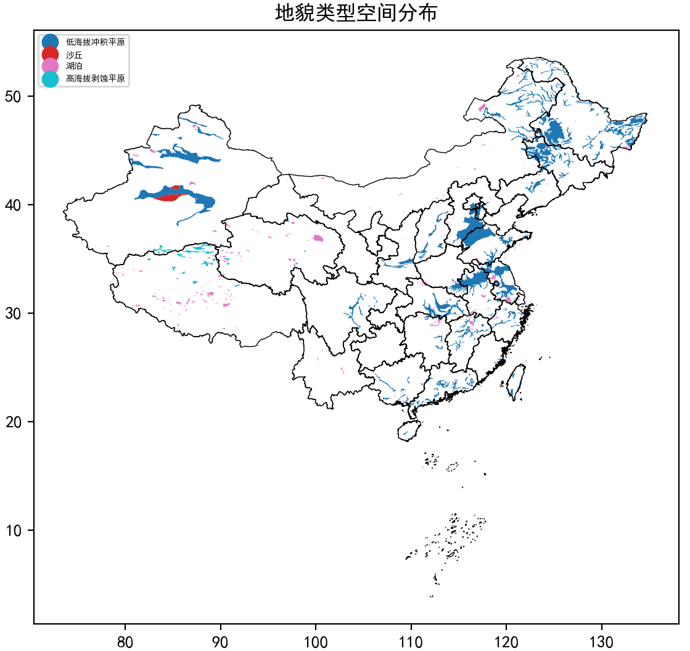
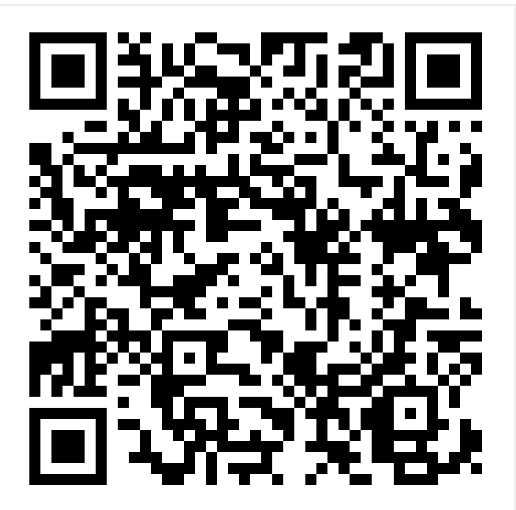
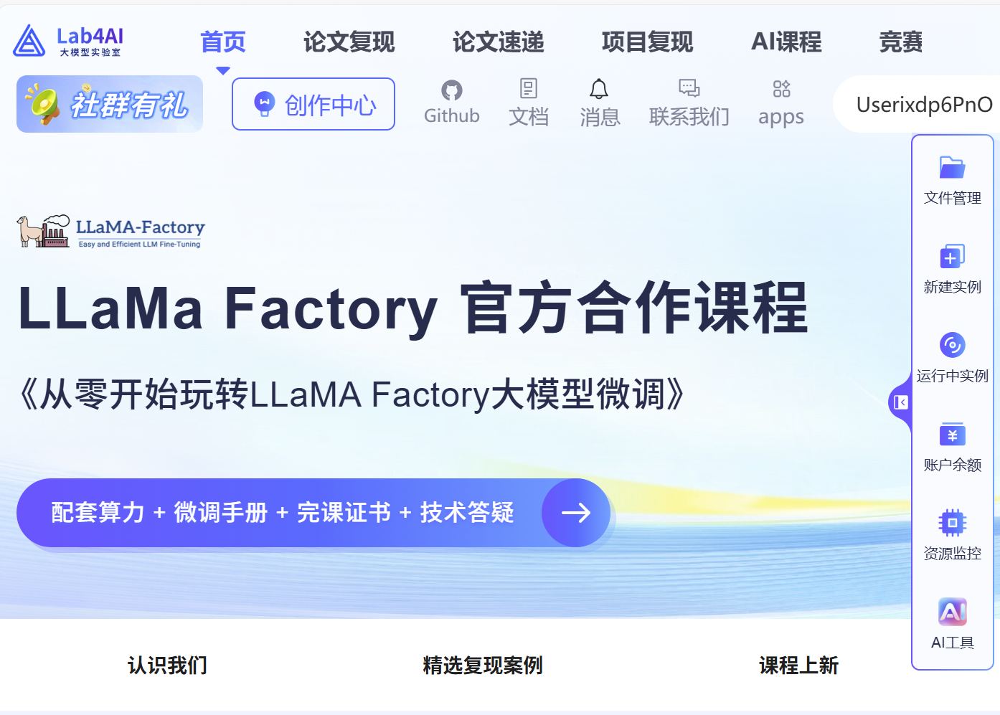
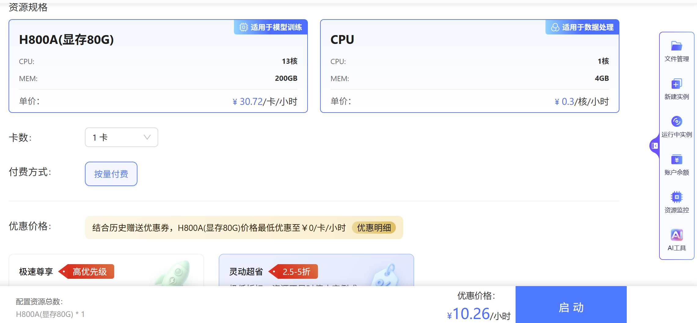
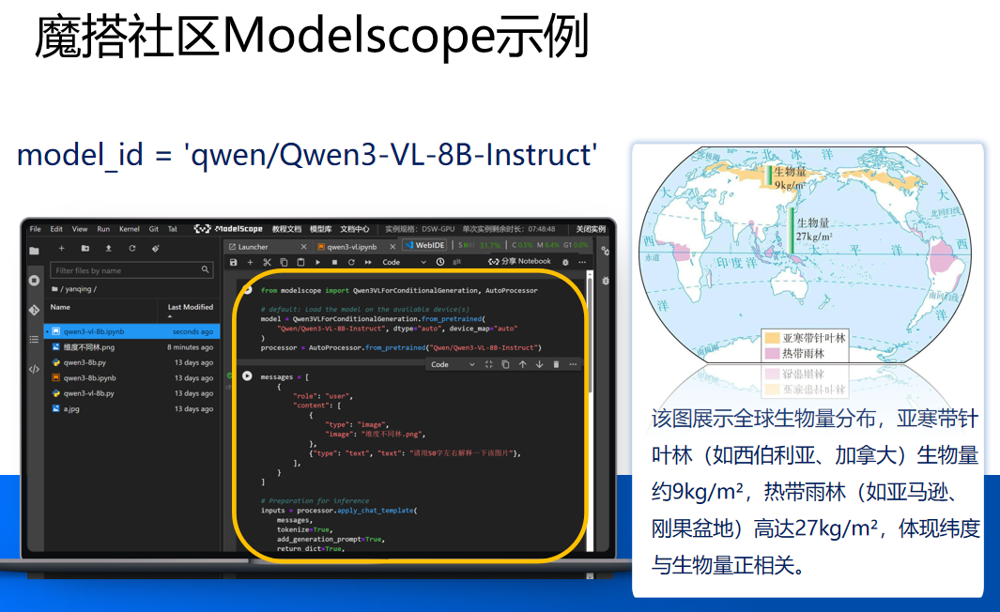

# 附录

其中包含有其他实践代码

## 1. 地形地貌数据集探索实战

见 [geo](geo) 目录，效果如下图：

## 2. 基于SKLearn对加州房价数据集进行预测（包括线性回归和分类）实战

见 [house](house) 目录。

## 3. 19类遥感图像识别实战

见 [rsImgClassification](rsImgClassification) 目录，数据集包含1000左右的图像样本，训练后的模型识别准确率可到98%以上。建议使用GPU环境。

可扫码注册使用九章云极（Lab4AI）的H800A(显存80G)免费算力。

或[点击注册](https://www.lab4ai.cn/register?promoteID=user-rJUY2H2epR)，即可送30元代金券，从而可用其购买算力使用。

## 4. 本地加载QWen3-VL大模型进行图片问答实战

见 [qwen3-vl](qwen3-vl)目录。建议使用魔搭社区平台进行实战。

