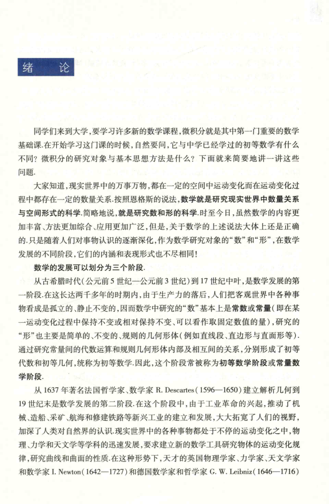

# standalone-images - Image 1

- 源文件：`temp/math/test_page.png`
- 页码/序号：1
- 页图：`temp/math/visual-latex/manual-batches/standalone-images/pages/page-0001.png`
- 转写方式：视觉阅读 + LaTeX 手工整理
- 状态：已转写

## LaTeX Markdown

# 绪论

同学们来到大学，要学习许多新的数学课程，微积分就是其中第一门重要的数学基础课。在开始学习这门课的时候，自然要问，它与中学已经学过的初等数学有什么不同？微积分的研究对象与基本思想方法是什么？下面就来简要地讲一讲这些问题。

大家知道，现实世界中的万事万物，都在一定的空间中运动变化而在运动变化过程中都存在一定的数量关系。按照恩格斯的说法，**数学就是研究现实世界中数量关系与空间形式的科学**。简略地说，就是研究数和形的科学。时至今日，虽然数学的内容更加丰富、方法更加综合、应用更加广泛，但是，关于数学的上述说法大体上还是正确的。只是随着人们对事物认识的逐渐深化，作为数学研究对象的“数”和“形”，在数学发展的不同阶段，它们的内涵和表现形式也不尽相同。

**数学的发展可以划分为三个阶段。**

从古希腊时代（公元前 5 世纪--公元前 3 世纪）到 17 世纪中叶，是数学发展的第一阶段。在这长达两千多年的时期内，由于生产力的落后，人们把客观世界中各种事物看成是孤立的、静止不变的，因而数学中研究的“数”基本上是常数或常量（即在某一运动变化过程中保持不变或相对保持不变、可以看作取固定数值的量），研究的“形”也主要是简单的、不变的、规则的几何形体（例如直线段、直边形与直面形等）。通过研究常量间的代数运算和规则几何形体内部及相互间的关系，分别形成了初等代数和初等几何，统称为初等数学。因此，这个阶段常被称为初等数学阶段或常量数学阶段。

从 1637 年著名法国哲学家、数学家 R. Descartes（1596--1650）建立解析几何到 19 世纪末是数学发展的第二个阶段。在这个阶段中，由于工业革命的兴起，推动了机械、造船、采矿、航海和修建铁路等新兴工业的建立和发展，大大拓宽了人们的视野，加深了人类对自然界的认识。现实世界中的各种事物都处于不停的运动变化之中，物理、力学和天文学等学科的迅速发展，要求建立新的数学工具研究物体的运动变化规律，研究曲线和曲面的性质。在这种形势下，天才的英国物理学家、力学家、天文学家和数学家 I. Newton（1642--1727）和德国数学家和哲学家 G. W. Leibniz（1646--1716）各自独立地创立了微积分。[续见 `工科数学分析基础 上册/transcribed/page-0019.md`]
