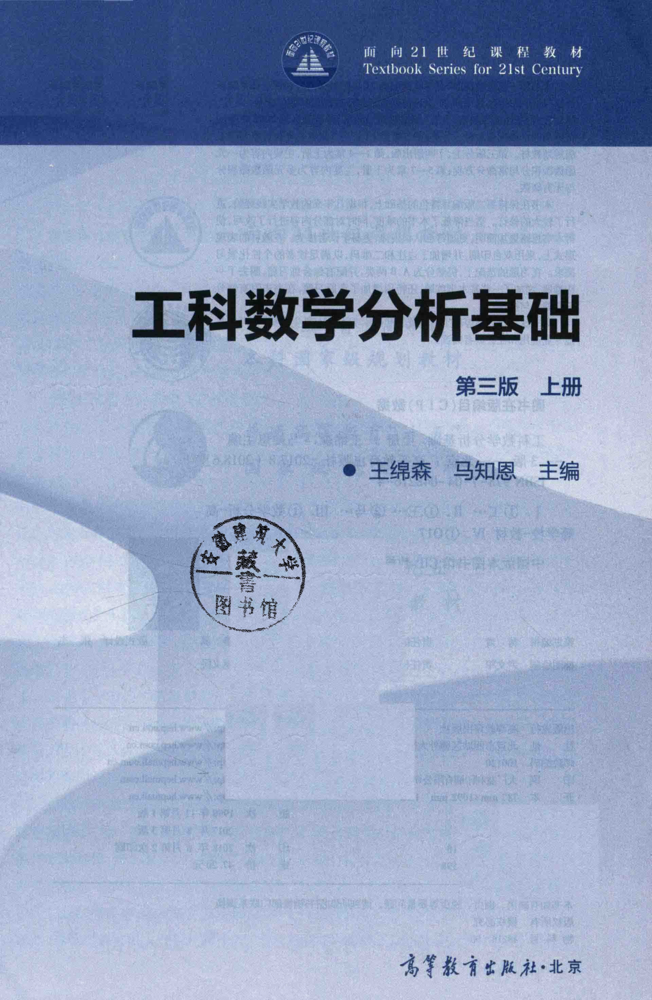

# 工科数学分析基础 上册 - Page 3

- 源文件：`temp/math/工科数学分析基础 上册.pdf`
- PDF 页码：3
- 页图：`temp/math/visual-latex/工科数学分析基础 上册/pages/page-0003.png`
- 转写方式：视觉阅读 + LaTeX 手工整理
- 状态：已转写

## LaTeX Markdown

面向 21 世纪课程教材

Textbook Series for 21st Century

# 工科数学分析基础

第三版 上册

王绵森 马知恩 主编

高等教育出版社·北京
