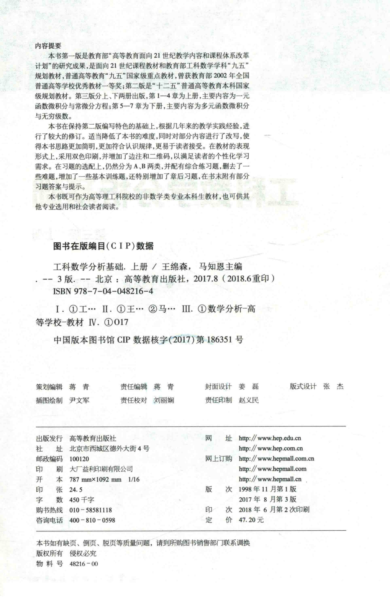

# 工科数学分析基础 上册 - Page 4

- 源文件：`temp/math/工科数学分析基础 上册.pdf`
- PDF 页码：4
- 页图：`temp/math/visual-latex/工科数学分析基础 上册/pages/page-0004.png`
- 转写方式：视觉阅读 + LaTeX 手工整理
- 状态：已转写

## LaTeX Markdown

## 内容提要

本书第一版是教育部“高等教育面向 21 世纪教学内容和课程体系改革计划”的研究成果；第三版上册包括第 1--4 章，下册包括第 5--7 章。第三版在保持原书框架和特色的基础上，对内容难度、写法、习题和附录等进行了修订。

## 版权与出版信息

- 书名：工科数学分析基础（上册）
- 主编：王绵森、马知恩
- 版次：第 3 版
- 出版地：北京
- 出版社：高等教育出版社
- 出版时间：2017 年 8 月
- 重印时间：2018 年 6 月
- ISBN：978-7-04-048216-4
- CIP 数据核字：中国版本图书馆 CIP 数据核字（2017）第 186351 号
- 开本：787 mm $\times$ 1092 mm，$1/16$
- 字数：450 千字
- 定价：47.20 元
