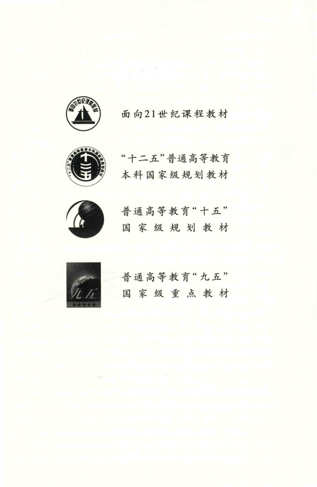

# 工科数学分析基础 上册 - Page 5

- 源文件：`temp/math/工科数学分析基础 上册.pdf`
- PDF 页码：5
- 页图：`temp/math/visual-latex/工科数学分析基础 上册/pages/page-0005.png`
- 转写方式：视觉阅读 + LaTeX 手工整理
- 状态：已转写

## LaTeX Markdown

面向 21 世纪课程教材

“十二五”普通高等教育本科国家级规划教材

普通高等教育“十五”国家级规划教材

普通高等教育“九五”国家级重点教材
