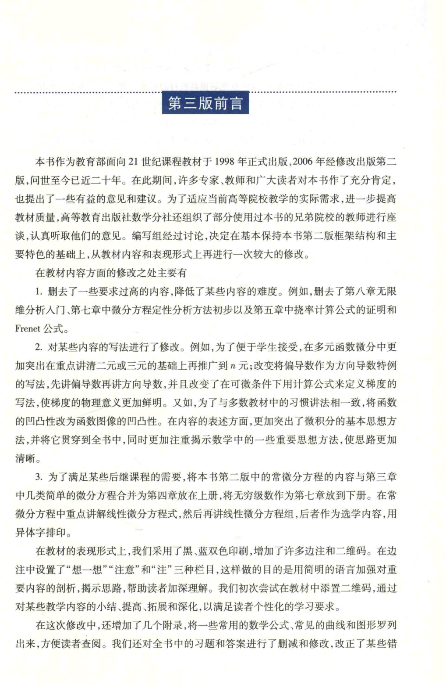

# 工科数学分析基础 上册 - Page 6

- 源文件：`temp/math/工科数学分析基础 上册.pdf`
- PDF 页码：6
- 页图：`temp/math/visual-latex/工科数学分析基础 上册/pages/page-0006.png`
- 转写方式：视觉阅读 + LaTeX 手工整理
- 状态：非数学正文，已做结构归档

## LaTeX Markdown

# 第三版前言

本页为第三版前言首页，说明第三版修订背景、修订原则和主要调整。该页不进入纯数学教学正文；后续教学从“绪论”和第 1 章目录顺序推进。

## 结构要点

- 第三版基本保持第二版框架结构和主要特色。
- 修订方向包括降低部分内容难度、调整写法、移动章节内容、增补附录与习题。
- 本页提到的符号包括 $n$ 元、多元函数、Frenet 公式等，均仅作为前言说明出现。
