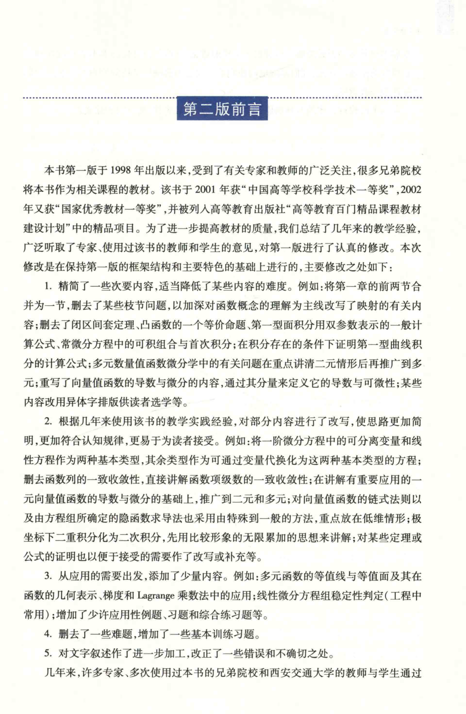

# 工科数学分析基础 上册 - Page 8

- 源文件：`temp/math/工科数学分析基础 上册.pdf`
- PDF 页码：8
- 页图：`temp/math/visual-latex/工科数学分析基础 上册/pages/page-0008.png`
- 转写方式：视觉阅读 + LaTeX 手工整理
- 状态：非数学正文，已做结构归档

## LaTeX Markdown

# 第二版前言

本页为第二版前言首页，说明第二版相对第一版的内容调整和写法调整。该页不进入纯数学教学正文。

## 结构要点

- 说明第一版出版、获奖与入选精品课程教材建设计划情况。
- 介绍第二版在第一版基础上的精简、改写、补充和习题调整。
- 提到的数学内容包括函数概念、闭区间套定理、凸函数、曲线积分、向量值函数、偏导数、微分、极坐标下二重积分、Lagrange 乘数法等。
