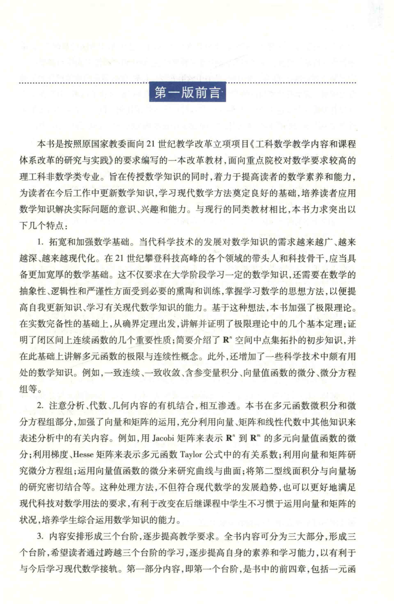

# 工科数学分析基础 上册 - Page 10

- 源文件：`temp/math/工科数学分析基础 上册.pdf`
- PDF 页码：10
- 页图：`temp/math/visual-latex/工科数学分析基础 上册/pages/page-0010.png`
- 转写方式：视觉阅读 + LaTeX 手工整理
- 状态：非数学正文，已做结构归档

## LaTeX Markdown

# 第一版前言

本页为第一版前言首页，说明本书的编写背景、目标读者和内容安排。该页不进入纯数学教学正文。

## 结构要点

- 本书面向对数学要求较高的理工科非数学类专业。
- 强调数学基础、分析、代数、几何内容的结合。
- 提到的符号和术语包括 $\mathbb{R}^n$、$\mathbb{R}^m$、Jacobi 矩阵、Hesse 矩阵、Taylor 公式等。
