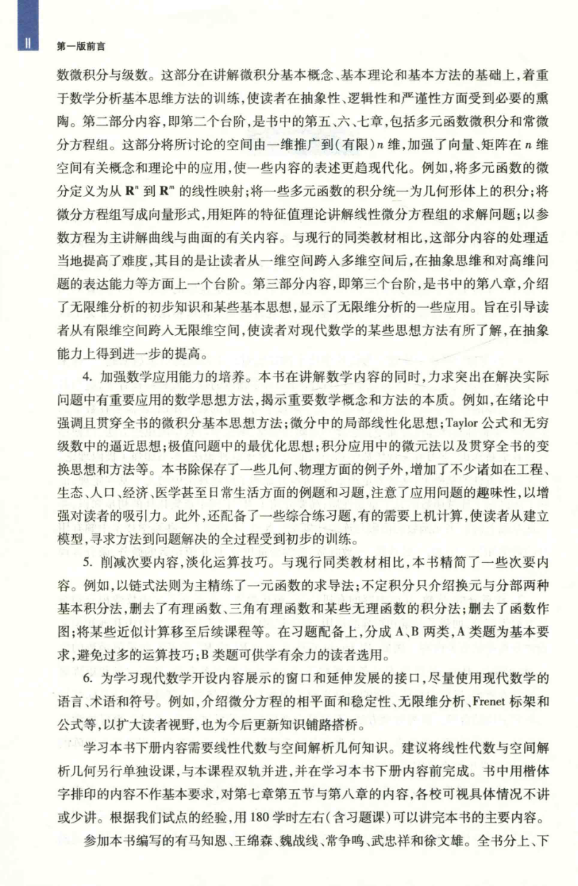

# 工科数学分析基础 上册 - Page 11

- 源文件：`temp/math/工科数学分析基础 上册.pdf`
- PDF 页码：11
- 页图：`temp/math/visual-latex/工科数学分析基础 上册/pages/page-0011.png`
- 转写方式：视觉阅读 + LaTeX 手工整理
- 状态：非数学正文，已做结构归档

## LaTeX Markdown

# 第一版前言（续）

本页为第一版前言中页，继续说明内容分阶段安排、应用能力培养、次要内容删减与习题分类。该页不进入纯数学教学正文。

## 结构要点

- 第一部分：微积分与级数。
- 第二部分：多元函数微积分与常微分方程组。
- 第三部分：无穷维分析的初步知识。
- 习题分为 A、B 两类。
- 建议学习下册前先完成线性代数与空间解析几何预备知识。
