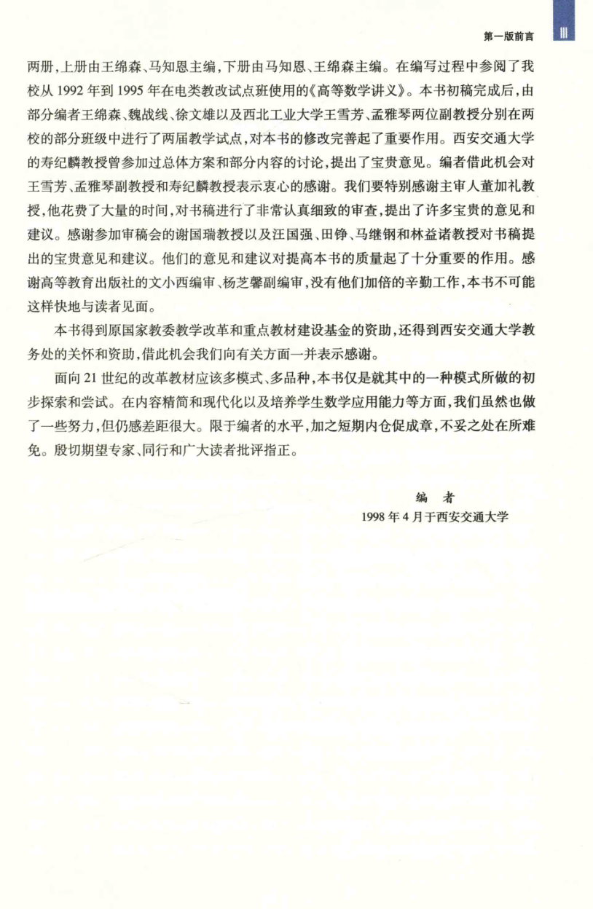

# 工科数学分析基础 上册 - Page 12

- 源文件：`temp/math/工科数学分析基础 上册.pdf`
- PDF 页码：12
- 页图：`temp/math/visual-latex/工科数学分析基础 上册/pages/page-0012.png`
- 转写方式：视觉阅读 + LaTeX 手工整理
- 状态：非数学正文，已做结构归档

## LaTeX Markdown

# 第一版前言（续）

本页为第一版前言末页，主要是致谢、资助说明与落款信息。该页不进入纯数学教学正文。

- 说明本书分上、下两册。
- 落款：编者，1998 年 4 月于西安交通大学。
