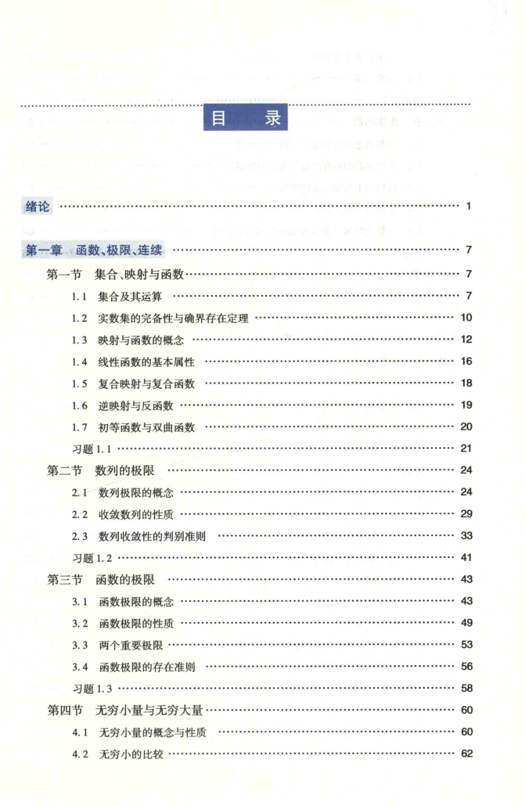

# 工科数学分析基础 上册 - Page 13

- 源文件：`temp/math/工科数学分析基础 上册.pdf`
- PDF 页码：13
- 页图：`temp/math/visual-latex/工科数学分析基础 上册/pages/page-0013.png`
- 转写方式：视觉阅读 + LaTeX 手工整理
- 状态：已转写

## LaTeX Markdown

# 目录

- 绪论 ...... 1

## 第一章 函数、极限、连续 ...... 7

- 第一节 集合、映射与函数 ...... 7
  - 1.1 集合及其运算 ...... 7
  - 1.2 实数集的完备性与确界存在定理 ...... 10
  - 1.3 映射与函数的概念 ...... 12
  - 1.4 线性函数的基本属性 ...... 16
  - 1.5 复合映射与复合函数 ...... 18
  - 1.6 逆映射与反函数 ...... 19
  - 1.7 初等函数与双曲函数 ...... 20
  - 习题 1.1 ...... 21
- 第二节 数列的极限 ...... 24
  - 2.1 数列极限的概念 ...... 24
  - 2.2 收敛数列的性质 ...... 29
  - 2.3 数列收敛性的判别准则 ...... 33
  - 习题 1.2 ...... 41
- 第三节 函数的极限 ...... 43
  - 3.1 函数极限的概念 ...... 43
  - 3.2 函数极限的性质 ...... 49
  - 3.3 两个重要极限 ...... 53
  - 3.4 函数极限的存在准则 ...... 56
  - 习题 1.3 ...... 58
- 第四节 无穷小量与无穷大量 ...... 60
  - 4.1 无穷小量的概念与性质 ...... 60
  - 4.2 无穷小的比较 ...... 62
