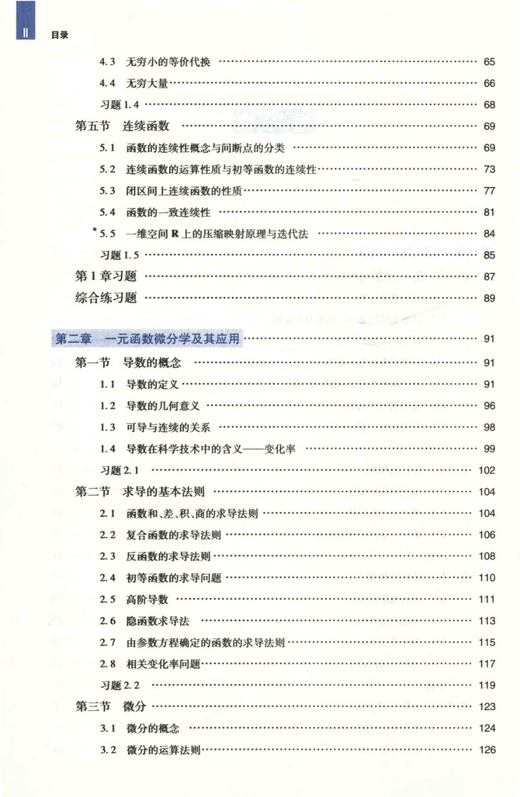

# 工科数学分析基础 上册 - Page 14

- 源文件：`temp/math/工科数学分析基础 上册.pdf`
- PDF 页码：14
- 页图：`temp/math/visual-latex/工科数学分析基础 上册/pages/page-0014.png`
- 转写方式：视觉阅读 + LaTeX 手工整理
- 状态：已转写

## LaTeX Markdown

## 目录（续）

- 4.3 无穷小的等价代换 ...... 65
- 4.4 无穷大量 ...... 66
- 习题 1.4 ...... 68
- 第五节 连续函数 ...... 69
  - 5.1 函数的连续性概念与间断点的分类 ...... 69
  - 5.2 连续函数的运算性质与初等函数的连续性 ...... 73
  - 5.3 闭区间上连续函数的性质 ...... 77
  - 5.4 函数的一致连续性 ...... 81
  - *5.5 一维空间 $\mathbb{R}$ 上的压缩映射原理与迭代法 ...... 84
  - 习题 1.5 ...... 85
- 第 1 章习题 ...... 87
- 综合练习题 ...... 89

## 第二章 一元函数微分学及其应用 ...... 91

- 第一节 导数的概念 ...... 91
  - 1.1 导数的定义 ...... 91
  - 1.2 导数的几何意义 ...... 96
  - 1.3 可导与连续的关系 ...... 98
  - 1.4 导数在科学技术中的含义--变化率 ...... 99
  - 习题 2.1 ...... 102
- 第二节 求导的基本法则 ...... 104
  - 2.1 函数和、差、积、商的求导法则 ...... 104
  - 2.2 复合函数的求导法则 ...... 106
  - 2.3 反函数的求导法则 ...... 108
  - 2.4 初等函数的求导问题 ...... 110
  - 2.5 高阶导数 ...... 111
  - 2.6 隐函数求导法 ...... 113
  - 2.7 由参数方程确定的函数的求导法则 ...... 115
  - 2.8 相关变化率问题 ...... 117
  - 习题 2.2 ...... 119
- 第三节 微分 ...... 123
  - 3.1 微分的概念 ...... 124
  - 3.2 微分的运算法则 ...... 126
