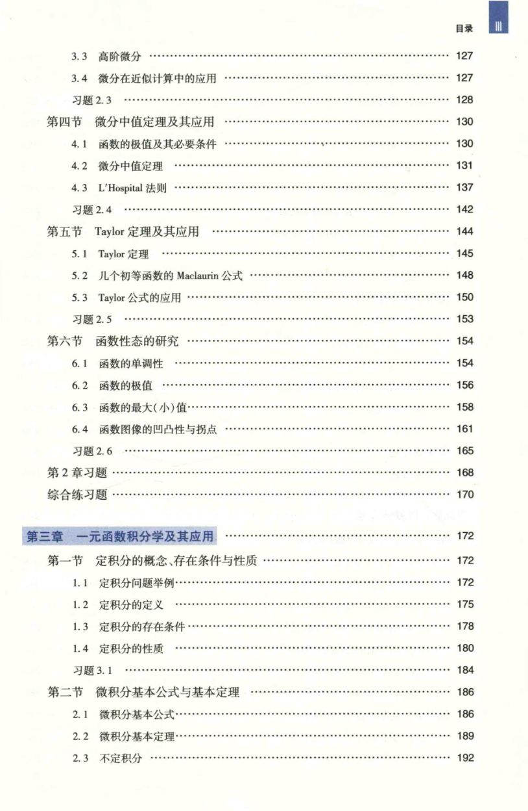

# 工科数学分析基础 上册 - Page 15

- 源文件：`temp/math/工科数学分析基础 上册.pdf`
- PDF 页码：15
- 页图：`temp/math/visual-latex/工科数学分析基础 上册/pages/page-0015.png`
- 转写方式：视觉阅读 + LaTeX 手工整理
- 状态：已转写

## LaTeX Markdown

## 目录（续）

- 3.3 高阶微分 ...... 127
- 3.4 微分在近似计算中的应用 ...... 127
- 习题 2.3 ...... 128
- 第四节 微分中值定理及其应用 ...... 130
  - 4.1 函数的极值及其必要条件 ...... 130
  - 4.2 微分中值定理 ...... 131
  - 4.3 L'Hospital 法则 ...... 137
  - 习题 2.4 ...... 142
- 第五节 Taylor 定理及其应用 ...... 144
  - 5.1 Taylor 定理 ...... 145
  - 5.2 几个初等函数的 Maclaurin 公式 ...... 148
  - 5.3 Taylor 公式的应用 ...... 150
  - 习题 2.5 ...... 153
- 第六节 函数性态的研究 ...... 154
  - 6.1 函数的单调性 ...... 154
  - 6.2 函数的极值 ...... 156
  - 6.3 函数的最大（小）值 ...... 158
  - 6.4 函数图像的凹凸性与拐点 ...... 161
  - 习题 2.6 ...... 165
- 第 2 章习题 ...... 168
- 综合练习题 ...... 170

## 第三章 一元函数积分学及其应用 ...... 172

- 第一节 定积分的概念、存在条件与性质 ...... 172
  - 1.1 定积分问题举例 ...... 172
  - 1.2 定积分的定义 ...... 175
  - 1.3 定积分的存在条件 ...... 178
  - 1.4 定积分的性质 ...... 180
  - 习题 3.1 ...... 184
- 第二节 微积分基本公式与基本定理 ...... 186
  - 2.1 微积分基本公式 ...... 186
  - 2.2 微积分基本定理 ...... 189
  - 2.3 不定积分 ...... 192
