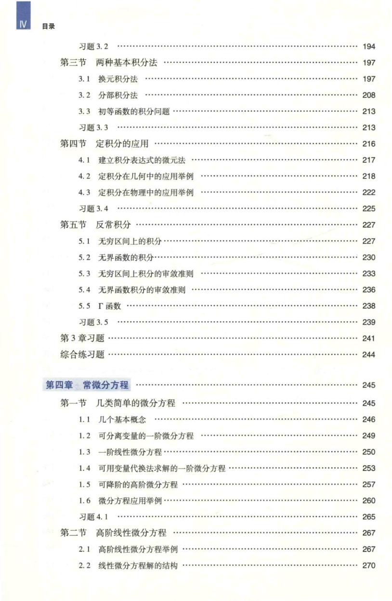

# 工科数学分析基础 上册 - Page 16

- 源文件：`temp/math/工科数学分析基础 上册.pdf`
- PDF 页码：16
- 页图：`temp/math/visual-latex/工科数学分析基础 上册/pages/page-0016.png`
- 转写方式：视觉阅读 + LaTeX 手工整理
- 状态：已转写

## LaTeX Markdown

## 目录（续）

- 习题 3.2 ...... 194
- 第三节 两种基本积分法 ...... 197
  - 3.1 换元积分法 ...... 197
  - 3.2 分部积分法 ...... 208
  - 3.3 初等函数的积分问题 ...... 213
  - 习题 3.3 ...... 213
- 第四节 定积分的应用 ...... 216
  - 4.1 建立积分表达式的微元法 ...... 217
  - 4.2 定积分在几何中的应用举例 ...... 218
  - 4.3 定积分在物理中的应用举例 ...... 222
  - 习题 3.4 ...... 225
- 第五节 反常积分 ...... 227
  - 5.1 无穷区间上的积分 ...... 227
  - 5.2 无界函数的积分 ...... 230
  - 5.3 无穷区间上积分的审敛准则 ...... 233
  - 5.4 无界函数积分的审敛准则 ...... 236
  - 5.5 $\Gamma$ 函数 ...... 238
  - 习题 3.5 ...... 239
- 第 3 章习题 ...... 241
- 综合练习题 ...... 244

## 第四章 常微分方程 ...... 245

- 第一节 几类简单的微分方程 ...... 245
  - 1.1 几个基本概念 ...... 246
  - 1.2 可分离变量的一阶微分方程 ...... 249
  - 1.3 一阶线性微分方程 ...... 250
  - 1.4 可用变量代换法求解的一阶微分方程 ...... 253
  - 1.5 可降阶的高阶微分方程 ...... 257
  - 1.6 微分方程应用举例 ...... 260
  - 习题 4.1 ...... 265
- 第二节 高阶线性微分方程 ...... 267
  - 2.1 高阶线性微分方程举例 ...... 267
  - 2.2 线性微分方程解的结构 ...... 270
