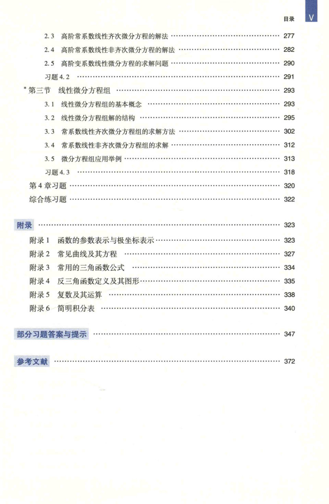

# 工科数学分析基础 上册 - Page 17

- 源文件：`temp/math/工科数学分析基础 上册.pdf`
- PDF 页码：17
- 页图：`temp/math/visual-latex/工科数学分析基础 上册/pages/page-0017.png`
- 转写方式：视觉阅读 + LaTeX 手工整理
- 状态：已转写

## LaTeX Markdown

## 目录（续）

- 2.3 高阶常系数线性齐次微分方程的解法 ...... 277
- 2.4 高阶常系数线性非齐次微分方程的解法 ...... 282
- 2.5 高阶变系数线性微分方程的求解问题 ...... 290
- 习题 4.2 ...... 291
- *第三节 线性微分方程组 ...... 293
  - 3.1 线性微分方程组的基本概念 ...... 293
  - 3.2 线性微分方程组解的结构 ...... 295
  - 3.3 常系数线性齐次微分方程组的求解方法 ...... 302
  - 3.4 常系数线性非齐次微分方程组的求解 ...... 312
  - 3.5 微分方程组应用举例 ...... 313
  - 习题 4.3 ...... 318
- 第 4 章习题 ...... 320
- 综合练习题 ...... 322

## 附录 ...... 323

- 附录 1 函数的参数表示与极坐标表示 ...... 323
- 附录 2 常见曲线及其方程 ...... 327
- 附录 3 常用的三角函数公式 ...... 334
- 附录 4 反三角函数定义及其图形 ...... 335
- 附录 5 复数及其运算 ...... 338
- 附录 6 简明积分表 ...... 340

## 其他

- 部分习题答案与提示 ...... 347
- 参考文献 ...... 372
