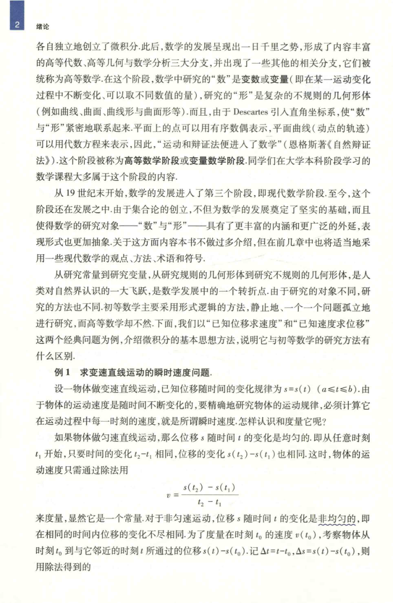

# 工科数学分析基础 上册 - Page 19

- 源文件：`temp/math/工科数学分析基础 上册.pdf`
- PDF 页码：19
- 教材页码：2
- 页图：`temp/math/visual-latex/工科数学分析基础 上册/pages/page-0019.png`
- 转写方式：视觉阅读 + LaTeX 手工整理
- 状态：已转写

## LaTeX Markdown

各自独立地创立了微积分。此后，数学的发展呈现出一日千里之势，形成了内容丰富的高等代数、高等几何与数学分析三大分支，并出现了一些其他的相关分支，它们被统称为高等数学。在这个阶段，数学中研究的“数”是变数或变量（即在某一运动变化过程中不断变化、可以取不同数值的量），研究的“形”是复杂的不规则的几何形体（例如曲线、曲面、曲线形与曲面形等）。而且，由于 Descartes 引入直角坐标系，使“数”与“形”紧密地联系起来。平面上的点可以用有序数偶表示，平面曲线（动点的轨迹）可以用代数方程来表示，因此，“运动和辩证法便进入了数学”（恩格斯著《自然辩证法》）。这个阶段被称为高等数学阶段或变量数学阶段。同学们在大学本科阶段学习的数学课程大多属于这个阶段的内容。

从 19 世纪末开始，数学的发展进入了第三个阶段，即现代数学阶段。至今，这个阶段还在发展之中。由于集合论的创立，不但为数学的发展奠定了坚实的基础，而且使得数学的研究对象--“数”与“形”--具有了更丰富的内涵和更广泛的外延，表现形式也更加抽象。关于这方面内容本书不做过多介绍，但在前几章中也将适当地采用一些现代数学的观点、方法、术语和符号。

从研究常量到研究变量，从研究规则的几何形体到研究不规则的几何形体，是人类对自然界认识的一大飞跃，是数学发展中的一个转折点。由于研究的对象不同，研究的方法也不同。初等数学主要采用形式逻辑的方法，静止地、一个一个问题孤立地进行研究，而高等数学却不然。下面，我们以“已知位移求速度”和“已知速度求位移”这两个经典问题为例，介绍微积分的基本思想方法，说明它与初等数学的研究方法有什么区别。

## 例 1 求变速直线运动的瞬时速度问题

设一物体做变速直线运动，已知位移随时间的变化规律为

$$
s=s(t),\qquad a\le t\le b.
$$

由于物体的运动速度是随时间不断变化的，要精确地研究物体的运动规律，必须计算它在运动过程中每一时刻的速度，就是所谓瞬时速度。怎样认识和度量它呢？

如果物体做匀速直线运动，那么位移 $s$ 随时间 $t$ 的变化是均匀的。即从任意时刻 $t_1$ 开始，只要时间的变化 $t_2-t_1$ 相同，位移的变化 $s(t_2)-s(t_1)$ 也相同，这时，物体的运动速度只需通过除法用

$$
v=\frac{s(t_2)-s(t_1)}{t_2-t_1}
$$

来度量，显然它是一个常量。对于非匀速运动，位移 $s$ 随时间 $t$ 的变化是非均匀的，即在相同的时间内位移的变化不尽相同。为了度量在时刻 $t_0$ 的速度 $v(t_0)$，考察物体从时刻 $t_0$ 到与它邻近的时刻 $t$ 所通过的位移 $s(t)-s(t_0)$。记 $\Delta t=t-t_0$，$\Delta s=s(t)-s(t_0)$，则用除法得到的
