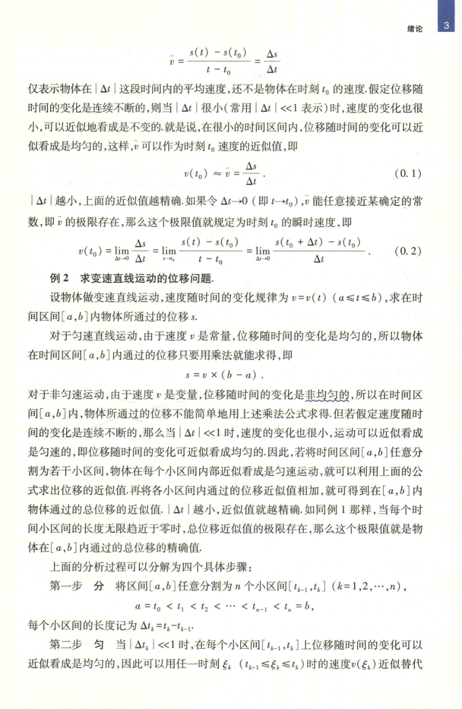

# 工科数学分析基础 上册 - Page 20

- 源文件：`temp/math/工科数学分析基础 上册.pdf`
- PDF 页码：20
- 教材页码：3
- 页图：`temp/math/visual-latex/工科数学分析基础 上册/pages/page-0020.png`
- 转写方式：视觉阅读 + LaTeX 手工整理
- 状态：已转写

## LaTeX Markdown

$$
\bar v=\frac{s(t)-s(t_0)}{t-t_0}=\frac{\Delta s}{\Delta t}
$$

仅表示物体在 $|\Delta t|$ 这段时间内的平均速度，还不是物体在时刻 $t_0$ 的速度。假定位移随时间的变化是连续不断的，则当 $|\Delta t|$ 很小（常用 $|\Delta t|\ll 1$ 表示）时，速度的变化也很小，可以近似地看成是不变的。就是说，在很小的时间区间内，位移随时间的变化可以近似看成是均匀的，这样，$\bar v$ 可以作为时刻 $t_0$ 速度的近似值，即

$$
v(t_0)\approx \bar v=\frac{\Delta s}{\Delta t}. \tag{0.1}
$$

$|\Delta t|$ 越小，上面的近似值越精确。如果令 $\Delta t\to 0$（即 $t\to t_0$），$\bar v$ 能任意接近某确定的常数，即 $\bar v$ 的极限存在，那么这个极限值就规定为时刻 $t_0$ 的瞬时速度，即

$$
v(t_0)
=\lim_{\Delta t\to 0}\frac{\Delta s}{\Delta t}
=\lim_{t\to t_0}\frac{s(t)-s(t_0)}{t-t_0}
=\lim_{\Delta t\to 0}\frac{s(t_0+\Delta t)-s(t_0)}{\Delta t}. \tag{0.2}
$$

## 例 2 求变速直线运动的位移问题

设物体做变速直线运动，速度随时间的变化规律为

$$
v=v(t),\qquad a\le t\le b,
$$

求在时间区间 $[a,b]$ 内物体所通过的位移 $s$。

对于匀速直线运动，由于速度 $v$ 是常量，位移随时间的变化是均匀的，所以物体在时间区间 $[a,b]$ 内通过的位移只要用乘法就能求得，即

$$
s=v\times(b-a).
$$

对于非匀速运动，由于速度 $v$ 是变量，位移随时间的变化是非均匀的，所以在时间区间 $[a,b]$ 内，物体所通过的位移不能简单地用上述乘法公式来求得。但若假定速度随时间的变化是连续不断的，那么当 $|\Delta t|\ll 1$ 时，速度的变化也很小，运动可以近似看成是匀速的，即位移随时间的变化可以近似看成均匀的。因此，若将时间区间 $[a,b]$ 任意分割为若干小区间，物体在每个小区间内部近似看成是匀速运动，就可以利用上面的公式求出位移的近似值；再将各小区间内通过的位移近似值相加，就可得到在 $[a,b]$ 内物体通过的总位移的近似值。$|\Delta t|$ 越小，近似值就越精确。如同例 1 那样，当每个时间小区间的长度无限趋近于零时，总位移近似值的极限存在，那么这个极限值就是物体在 $[a,b]$ 内通过的总位移的精确值。

上面的分析过程可以分解为四个具体步骤：

**第一步 分** 将区间 $[a,b]$ 任意分割为 $n$ 个小区间 $[t_{k-1},t_k]$（$k=1,2,\cdots,n$），

$$
a=t_0<t_1<t_2<\cdots<t_{n-1}<t_n=b,
$$

每个小区间的长度记为 $\Delta t_k=t_k-t_{k-1}$。

**第二步 匀** 当 $|\Delta t_k|\ll 1$ 时，在每个小区间 $[t_{k-1},t_k]$ 上位移随时间的变化可以近似看成是均匀的，因此可以用任一时刻 $\xi_k$（$t_{k-1}\le \xi_k\le t_k$）时的速度 $v(\xi_k)$ 近似替代
