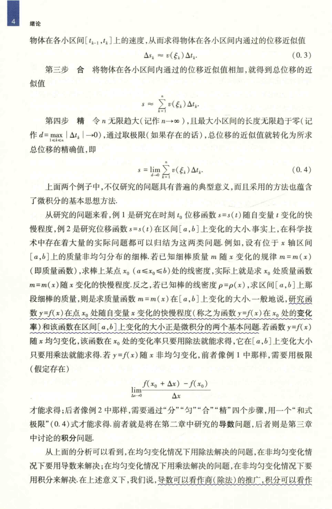

# 工科数学分析基础 上册 - Page 21

- 源文件：`temp/math/工科数学分析基础 上册.pdf`
- PDF 页码：21
- 教材页码：4
- 页图：`temp/math/visual-latex/工科数学分析基础 上册/pages/page-0021.png`
- 转写方式：视觉阅读 + LaTeX 手工整理
- 状态：已转写

## LaTeX Markdown

物体在各小区间 $[t_{k-1},t_k]$ 上的速度，从而求得物体在各小区间内通过的位移近似值

$$
\Delta s_k \approx v(\xi_k)\Delta t_k. \tag{0.3}
$$

**第三步 合** 将物体在各小区间内通过的位移近似值相加，就得到总位移的近似值

$$
s\approx \sum_{k=1}^{n} v(\xi_k)\Delta t_k.
$$

**第四步 精** 令 $n$ 无限增大（记作 $n\to\infty$），且最大的小区间的长度无限趋于零（记作 $d=\max_{1\le k\le n}|\Delta t_k|\to 0$），通过取极限（如果存在的话），总位移的近似值就转化为所求总位移的精确值，即

$$
s=\lim_{d\to 0}\sum_{k=1}^{n} v(\xi_k)\Delta t_k. \tag{0.4}
$$

上面两个例子中，不仅研究的问题具有普遍的典型意义，而且采用的方法也蕴含了微积分的基本思想方法。

从研究的问题来看，例 1 是研究在时刻 $t_0$ 位移函数 $s=s(t)$ 随自变量 $t$ 变化的快慢程度，例 2 是研究位移函数 $s=s(t)$ 在区间 $[a,b]$ 上变化的大小。事实上，在科学技术中存在着大量的实际问题都可以归结为这两类问题。例如，设有位于 $x$ 轴区间 $[a,b]$ 上的质量非均匀分布的细棒。若已知细棒质量 $m$ 随 $x$ 变化的规律 $m=m(x)$（即质量函数），求棒上某点 $x_0$（$a\le x_0\le b$）处的线密度，实际上就是求 $x_0$ 处质量函数 $m=m(x)$ 随 $x$ 变化的快慢程度。反之，若已知棒的线密度 $\rho=\rho(x)$，求区间 $[a,b]$ 上那段细棒的质量，则是求质量函数 $m=m(x)$ 在 $[a,b]$ 上变化的大小。一般地说，研究函数 $y=f(x)$ 在点 $x_0$ 处随自变量 $x$ 变化的快慢程度（称之为函数 $y=f(x)$ 在 $x_0$ 处的变化率）和该函数在区间 $[a,b]$ 上变化的大小正是微积分的两个基本问题。若函数 $y=f(x)$ 随 $x$ 均匀变化，该函数在 $x_0$ 处的变化率只要用除法就能得到，它在 $[a,b]$ 上变化大小只要用乘法就能求得。若 $y=f(x)$ 随 $x$ 非均匀变化，前者像例 1 中那样，需要用极限（假定存在）

$$
\lim_{\Delta x\to 0}\frac{f(x_0+\Delta x)-f(x_0)}{\Delta x}
$$

才能求得；后者像例 2 中那样，需要通过“分”“匀”“合”“精”四个步骤，用一个“和式极限”$(0.4)$ 式才能求得。前者就是将在第二章中研究的导数问题，后者则是第三章中讨论的积分问题。

从上面的分析可以看到，在均匀变化情况下用除法解决的问题，在非均匀变化情况下要用导数来解决；在均匀变化情况下用乘法解决的问题，在非均匀变化情况下要用积分来解决。在上述意义下，我们说，导数可以看作商（除法）的推广，积分可以看作
