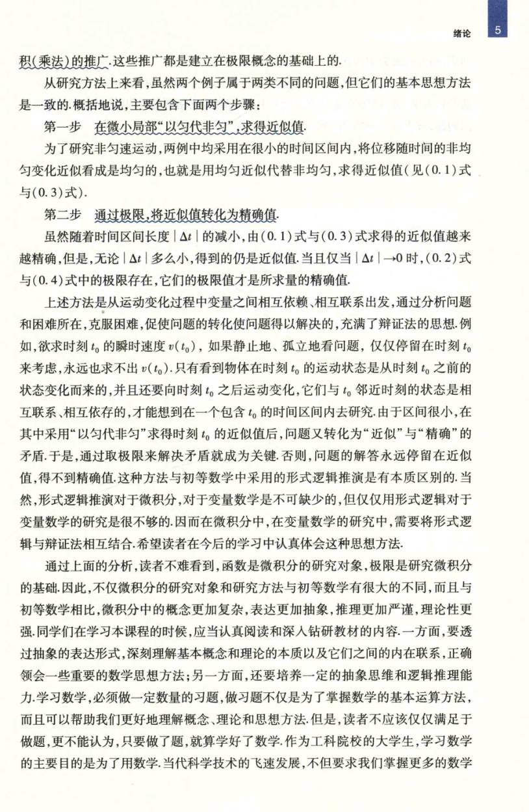

# 工科数学分析基础 上册 - Page 22

- 源文件：`temp/math/工科数学分析基础 上册.pdf`
- PDF 页码：22
- 教材页码：5
- 页图：`temp/math/visual-latex/工科数学分析基础 上册/pages/page-0022.png`
- 转写方式：视觉阅读 + LaTeX 手工整理
- 状态：已转写

## LaTeX Markdown

和（乘法）的推广，这些推广都是建立在极限概念的基础上的。

从研究方法上来看，虽然两个例子属于两类不同的问题，但它们的基本思想方法是一致的。概括地说，主要包含下面两个步骤：

**第一步 在微小局部“以匀代非匀”，求得近似值。**

为了研究非匀速运动，两例中均采用在很小的时间区间内，将位移随时间的非均匀变化近似看成是均匀的，也就是用均匀近似代替非均匀，求得近似值（见 $(0.1)$ 式与 $(0.3)$ 式）。

**第二步 通过极限，将近似值转化为精确值。**

虽然随着时间区间长度 $|\Delta t|$ 的减小，由 $(0.1)$ 式与 $(0.3)$ 式求得的近似值越来越精确，但是，无论 $|\Delta t|$ 多么小，得到的仍是近似值。当且仅当 $|\Delta t|\to 0$ 时，$(0.2)$ 式与 $(0.4)$ 式中的极限存在，它们的极限值才是所求量的精确值。

上述方法是从运动变化过程中变量之间相互依赖、相互联系出发，通过分析问题和困难所在，克服困难，促使问题的转化使问题得以解决的，充满了辩证法的思想。例如，欲求时刻 $t_0$ 的瞬时速度 $v(t_0)$，如果静止地、孤立地看问题，仅仅停留在时刻 $t_0$ 来考虑，永远也求不出 $v(t_0)$。只有看到物体在时刻 $t_0$ 的运动状态是从时刻 $t_0$ 之前的状态变化而来的，并且还要向时刻 $t_0$ 之后运动变化，它们与 $t_0$ 邻近时刻的状态是相互联系、相互依存的，才能想到在一个包含 $t_0$ 的时间区间内去研究。由于区间很小，在其中采用“以匀代非匀”来求时刻 $t_0$ 的近似值后，问题又转化为“近似”与“精确”的矛盾。于是，通过取极限来解决矛盾就成为关键。否则，问题的解答永远停留在近似值，得不到精确值。这种方法与初等数学中采用的形式逻辑推演是有本质区别的。当然，形式逻辑推演对于微积分，对于变量数学是不可缺少的，但仅仅用形式逻辑对于变量数学的研究是很不够的。因而在微积分中，在变量数学的研究中，需要将形式逻辑与辩证法相互结合。希望读者在今后的学习中认真体会这种思想方法。

通过上面的分析，读者不难看到，函数是微积分的研究对象，极限是研究微积分的基础。因此，不仅微积分的研究对象和研究方法与初等数学有很大的不同，而且与初等数学相比，微积分中的概念更加复杂，表达更加抽象，推理更加严谨，理论性更强。同学们在学习本课程的时候，应当认真阅读和深入钻研教材的内容。一方面，要透过抽象的表达形式，深刻理解基本概念和理论的本质以及它们之间的内在联系，正确领会一些重要的数学思想方法；另一方面，还要培养一定的抽象思维和逻辑推理能力。学习数学，必须做一定数量的习题，做习题不仅是为了掌握数学的基本运算方法，而且可以帮助我们更好地理解概念、理论和思想方法。但是，读者不应该仅仅满足于做题，更不能认为，只要做了题，就算学好了数学。作为工科院校的大学生，学习数学的主要目的是为了用数学。当代科学技术的飞速发展，不但要求我们掌握更多的数学
