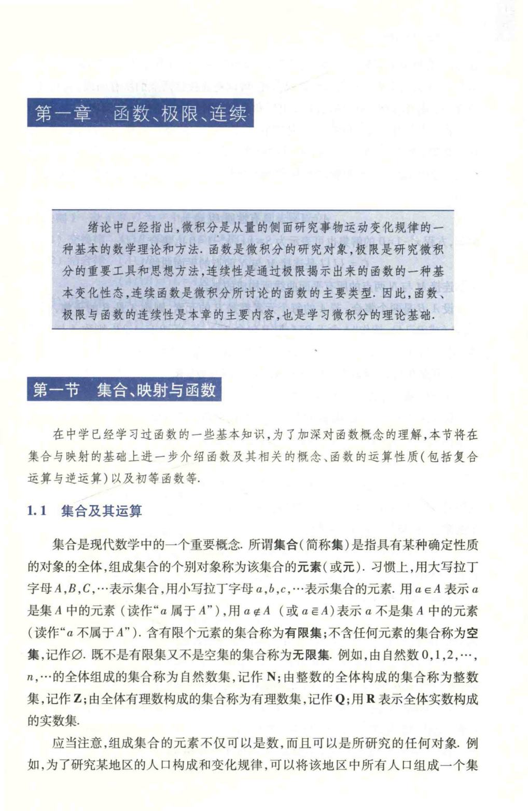

# 工科数学分析基础 上册 - Page 24

- 源文件：`temp/math/工科数学分析基础 上册.pdf`
- PDF 页码：24
- 教材页码：7
- 目录位置：第一章 函数、极限、连续 / 第一节 集合、映射与函数 / 1.1 集合及其运算
- 页图：`temp/math/visual-latex/工科数学分析基础 上册/pages/page-0024.png`
- 转写方式：视觉阅读 + LaTeX 手工整理
- 状态：已转写

## LaTeX Markdown

# 第一章 函数、极限、连续

> 绪论中已经指出，微积分是从量的侧面研究事物运动变化规律的一种基本的数学理论和方法。函数是微积分的研究对象，极限是研究微积分的重要工具和思想方法，连续性是通过极限揭示出来的函数的一种基本变化性态，连续函数是微积分所讨论的函数的主要类型。因此，函数、极限与函数的连续性是本章的主要内容，也是学习微积分的理论基础。

## 第一节 集合、映射与函数

在中学已经学习过函数的一些基本知识，为了加深对函数概念的理解，本节将在集合与映射的基础上进一步介绍函数及其相关的概念、函数的运算性质（包括复合运算与逆运算）以及初等函数等。

## 1.1 集合及其运算

集合是现代数学中的一个重要概念。所谓**集合**（简称集）是指具有某种确定性质的对象的全体，组成集合的个别对象称为该集合的**元素**（或元）。习惯上，用大写拉丁字母 $A,B,C,\cdots$ 表示集合，用小写拉丁字母 $a,b,c,\cdots$ 表示集合的元素。用 $a\in A$ 表示 $a$ 是集 $A$ 中的元素（读作“$a$ 属于 $A$”），用 $a\notin A$（或 $a\bar\in A$）表示 $a$ 不是集 $A$ 中的元素（读作“$a$ 不属于 $A$”）。含有限个元素的集合称为**有限集**；不含任何元素的集合称为**空集**，记作 $\varnothing$。既不是有限集又不是空集的集合称为**无限集**。例如，由自然数 $0,1,2,\cdots,n,\cdots$ 的全体组成的集合称为自然数集，记作 $\mathbb{N}$；由整数的全体构成的集合称为整数集，记作 $\mathbb{Z}$；由全体有理数构成的集合称为有理数集，记作 $\mathbb{Q}$；用 $\mathbb{R}$ 表示全体实数构成的实数集。

应当注意，组成集合的元素不仅可以是数，而且可以是所研究的任何对象。例如，为了研究某地区的人口构成和变化规律，可以将该地区中所有人口组成一个集合。[续下页]
