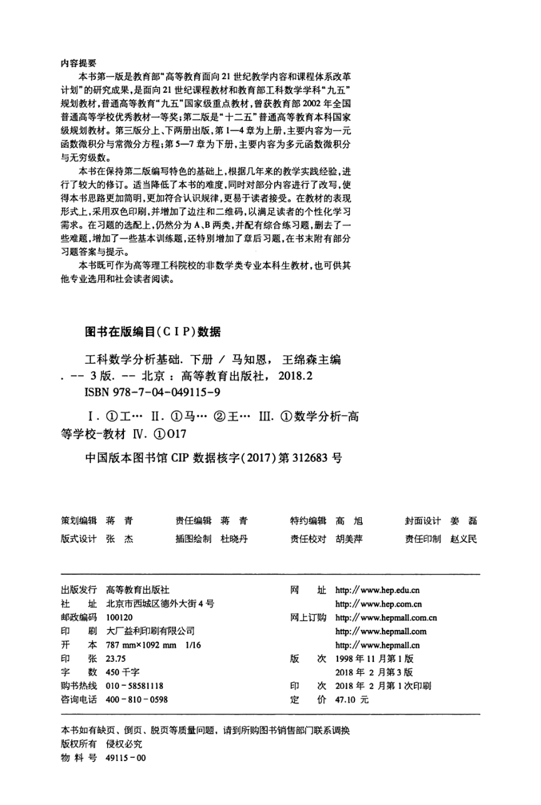

# 工科数学分析基础 下册 - Page 4

- 源文件：`temp/math/工科数学分析基础 下册.pdf`
- PDF 页码：4
- 页图：`temp/math/visual-latex/工科数学分析基础 下册/pages/page-0004.png`
- 转写方式：视觉阅读 + LaTeX 手工整理
- 状态：已转写

## LaTeX Markdown

## 内容提要

本书第一版是教育部“高等教育面向 21 世纪教学内容和课程体系改革计划”的研究成果。第三版分上、下册出版，第 1--4 章为上册，主要内容为一元函数微积分与常微分方程；第 5--7 章为下册，主要内容为多元函数微积分与无穷级数。

第三版在保持第二版编写特色的基础上，根据教学实践经验进行修订：适当降低难度，改写部分内容，使基本思想更明确，更符合认识规律；采用双色印刷，增加边注和二维码；习题仍分为 A、B 两类，并配有综合练习题；书末附有部分习题答案与提示。

## 版权与出版信息

- 书名：工科数学分析基础（下册）
- 主编：马知恩、王绵森
- 版次：第 3 版
- 出版社：高等教育出版社
- 出版时间：2018 年 2 月
- ISBN：978-7-04-049115-9
- CIP 数据核字：中国版本图书馆 CIP 数据核字（2017）第 312683 号
- 开本：787 mm $\times$ 1092 mm，$1/16$
- 字数：450 千字
- 定价：47.10 元
