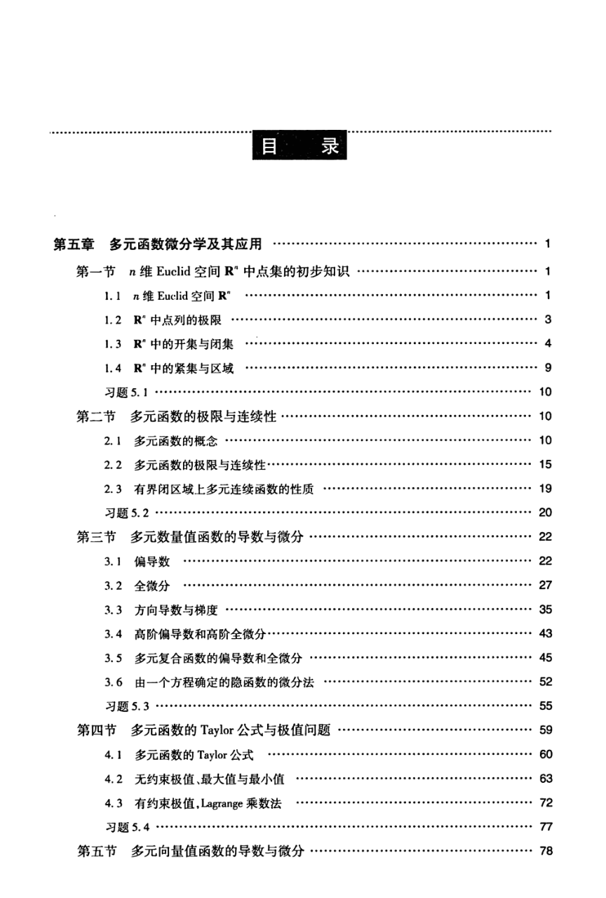

# 工科数学分析基础 下册 - Page 6

- 源文件：`temp/math/工科数学分析基础 下册.pdf`
- PDF 页码：6
- 页图：`temp/math/visual-latex/工科数学分析基础 下册/pages/page-0006.png`
- 转写方式：视觉阅读 + LaTeX 手工整理
- 状态：已转写

## LaTeX Markdown

# 目录

## 第五章 多元函数微分学及其应用 ...... 1

- 第一节 $n$ 维 Euclid 空间 $\mathbb{R}^n$ 中点集的初步知识 ...... 1
  - 1.1 $n$ 维 Euclid 空间 $\mathbb{R}^n$ ...... 1
  - 1.2 $\mathbb{R}^n$ 中点列的极限 ...... 3
  - 1.3 $\mathbb{R}^n$ 中的开集与闭集 ...... 4
  - 1.4 $\mathbb{R}^n$ 中的紧集与区域 ...... 9
  - 习题 5.1 ...... 10
- 第二节 多元函数的极限与连续性 ...... 10
  - 2.1 多元函数的概念 ...... 10
  - 2.2 多元函数的极限与连续性 ...... 15
  - 2.3 有界闭区域上多元连续函数的性质 ...... 19
  - 习题 5.2 ...... 20
- 第三节 多元数量值函数的导数与微分 ...... 22
  - 3.1 偏导数 ...... 22
  - 3.2 全微分 ...... 27
  - 3.3 方向导数与梯度 ...... 35
  - 3.4 高阶偏导数和高阶全微分 ...... 43
  - 3.5 多元复合函数的偏导数和全微分 ...... 45
  - 3.6 由一个方程确定的隐函数的微分法 ...... 52
  - 习题 5.3 ...... 55
- 第四节 多元函数的 Taylor 公式与极值问题 ...... 59
  - 4.1 多元函数的 Taylor 公式 ...... 60
  - 4.2 无约束极值、最大值与最小值 ...... 63
  - 4.3 有约束极值，Lagrange 乘数法 ...... 72
  - 习题 5.4 ...... 77
- 第五节 多元向量值函数的导数与微分 ...... 78
