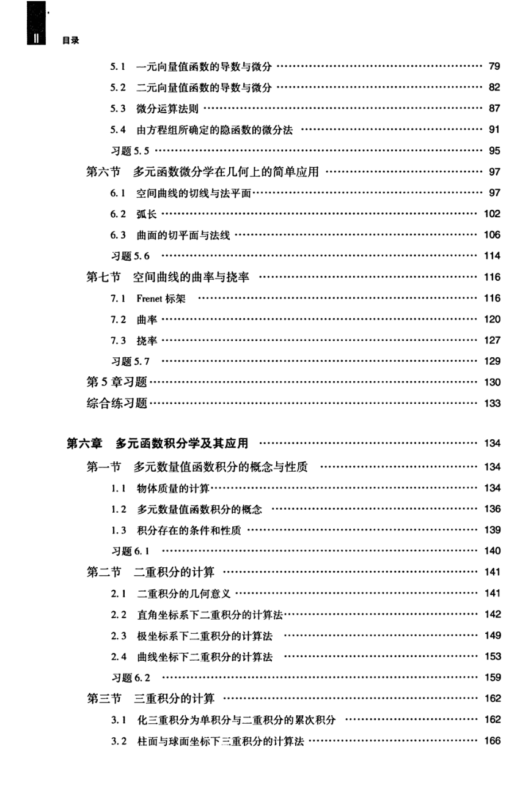

# 工科数学分析基础 下册 - Page 7

- 源文件：`temp/math/工科数学分析基础 下册.pdf`
- PDF 页码：7
- 页图：`temp/math/visual-latex/工科数学分析基础 下册/pages/page-0007.png`
- 转写方式：视觉阅读 + LaTeX 手工整理
- 状态：已转写

## LaTeX Markdown

## 目录（续）

- 5.1 一元向量值函数的导数与微分 ...... 79
- 5.2 二元向量值函数的导数与微分 ...... 82
- 5.3 微分运算法则 ...... 87
- 5.4 由方程组所确定的隐函数的微分法 ...... 91
- 习题 5.5 ...... 95
- 第六节 多元函数微分学在几何上的简单应用 ...... 97
  - 6.1 空间曲线的切线与法平面 ...... 97
  - 6.2 弧长 ...... 102
  - 6.3 曲面的切平面与法线 ...... 106
  - 习题 5.6 ...... 114
- 第七节 空间曲线的曲率与挠率 ...... 116
  - 7.1 Frenet 标架 ...... 116
  - 7.2 曲率 ...... 120
  - 7.3 挠率 ...... 127
  - 习题 5.7 ...... 129
- 第 5 章习题 ...... 130
- 综合练习题 ...... 133

## 第六章 多元函数积分学及其应用 ...... 134

- 第一节 多元数量值函数积分的概念与性质 ...... 134
  - 1.1 物体质量的计算 ...... 134
  - 1.2 多元数量值函数积分的概念 ...... 136
  - 1.3 积分存在的条件和性质 ...... 139
  - 习题 6.1 ...... 140
- 第二节 二重积分的计算 ...... 141
  - 2.1 二重积分的几何意义 ...... 141
  - 2.2 直角坐标系下二重积分的计算法 ...... 142
  - 2.3 极坐标系下二重积分的计算法 ...... 149
  - 2.4 曲线坐标下二重积分的计算法 ...... 153
  - 习题 6.2 ...... 159
- 第三节 三重积分的计算 ...... 162
  - 3.1 化三重积分为单积分与二重积分的累次积分 ...... 162
  - 3.2 柱面与球面坐标下三重积分的计算法 ...... 166
