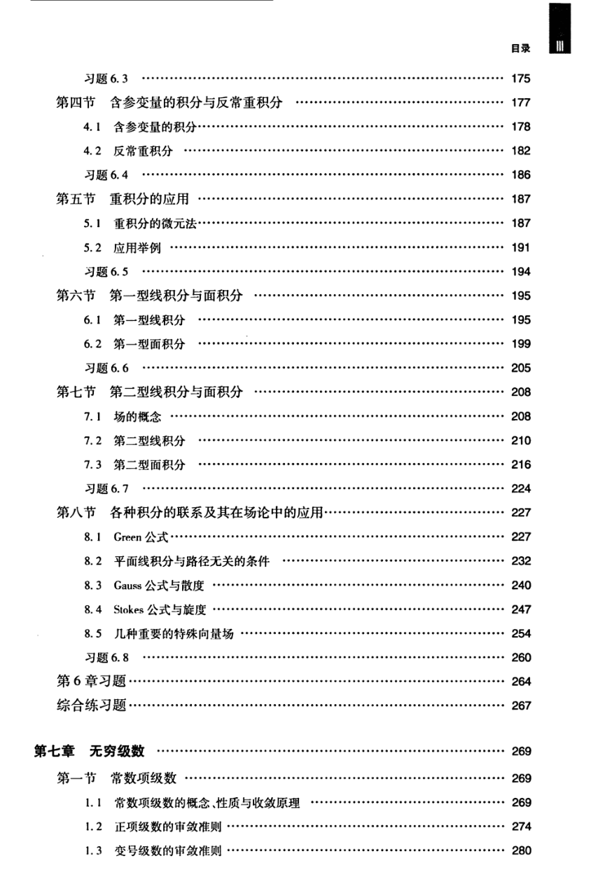

# 工科数学分析基础 下册 - Page 8

- 源文件：`temp/math/工科数学分析基础 下册.pdf`
- PDF 页码：8
- 页图：`temp/math/visual-latex/工科数学分析基础 下册/pages/page-0008.png`
- 转写方式：视觉阅读 + LaTeX 手工整理
- 状态：已转写

## LaTeX Markdown

## 目录（续）

- 习题 6.3 ...... 175
- 第四节 含参变量的积分与反常重积分 ...... 177
  - 4.1 含参变量的积分 ...... 178
  - 4.2 反常重积分 ...... 182
  - 习题 6.4 ...... 186
- 第五节 重积分的应用 ...... 187
  - 5.1 重积分的微元法 ...... 187
  - 5.2 应用举例 ...... 191
  - 习题 6.5 ...... 194
- 第六节 第一型线积分与面积分 ...... 195
  - 6.1 第一型线积分 ...... 195
  - 6.2 第一型面积分 ...... 199
  - 习题 6.6 ...... 205
- 第七节 第二型线积分与面积分 ...... 208
  - 7.1 场的概念 ...... 208
  - 7.2 第二型线积分 ...... 210
  - 7.3 第二型面积分 ...... 216
  - 习题 6.7 ...... 224
- 第八节 各种积分的联系及其在场论中的应用 ...... 227
  - 8.1 Green 公式 ...... 227
  - 8.2 平面线积分与路径无关的条件 ...... 232
  - 8.3 Gauss 公式与散度 ...... 240
  - 8.4 Stokes 公式与旋度 ...... 247
  - 8.5 几种重要的特殊向量场 ...... 254
  - 习题 6.8 ...... 260
- 第 6 章习题 ...... 264
- 综合练习题 ...... 267

## 第七章 无穷级数 ...... 269

- 第一节 常数项级数 ...... 269
  - 1.1 常数项级数的概念、性质与收敛原理 ...... 269
  - 1.2 正项级数的审敛准则 ...... 274
  - 1.3 变号级数的审敛准则 ...... 280
