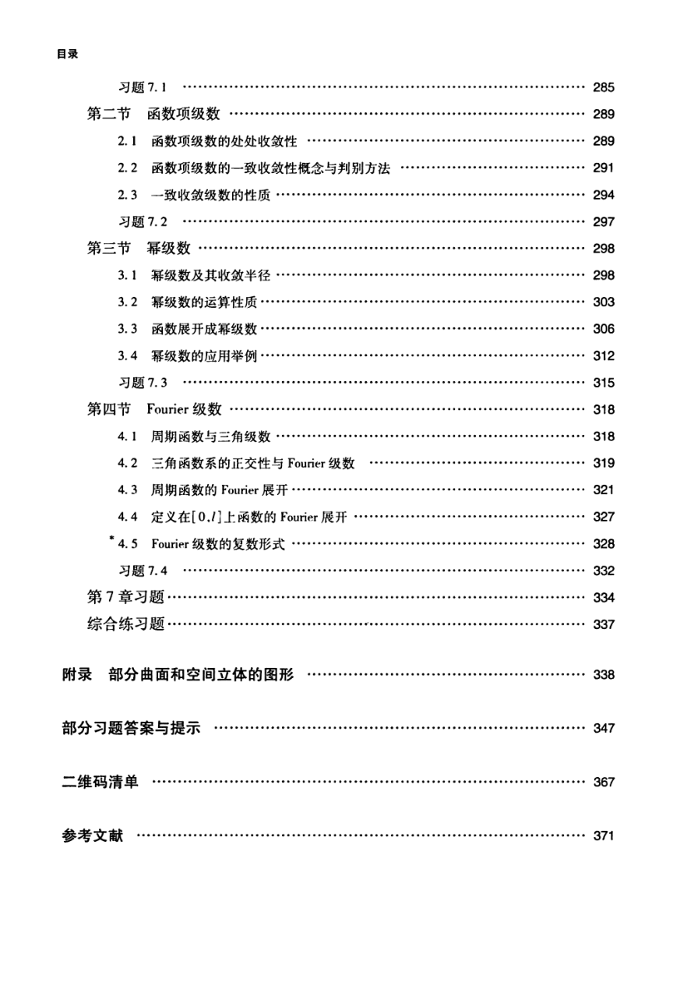

# 工科数学分析基础 下册 - Page 9

- 源文件：`temp/math/工科数学分析基础 下册.pdf`
- PDF 页码：9
- 页图：`temp/math/visual-latex/工科数学分析基础 下册/pages/page-0009.png`
- 转写方式：视觉阅读 + LaTeX 手工整理
- 状态：已转写

## LaTeX Markdown

## 目录（续）

- 习题 7.1 ...... 285
- 第二节 函数项级数 ...... 289
  - 2.1 函数项级数的处处收敛性 ...... 289
  - 2.2 函数项级数的一致收敛性概念与判别方法 ...... 291
  - 2.3 一致收敛级数的性质 ...... 294
  - 习题 7.2 ...... 297
- 第三节 幂级数 ...... 298
  - 3.1 幂级数及其收敛半径 ...... 298
  - 3.2 幂级数的运算性质 ...... 303
  - 3.3 函数展开成幂级数 ...... 306
  - 3.4 幂级数的应用举例 ...... 312
  - 习题 7.3 ...... 315
- 第四节 Fourier 级数 ...... 318
  - 4.1 周期函数与三角级数 ...... 318
  - 4.2 三角函数系的正交性与 Fourier 级数 ...... 319
  - 4.3 周期函数的 Fourier 展开 ...... 321
  - 4.4 定义在 $[0,l]$ 上函数的 Fourier 展开 ...... 327
  - *4.5 Fourier 级数的复数形式 ...... 328
  - 习题 7.4 ...... 332
- 第 7 章习题 ...... 334
- 综合练习题 ...... 337

## 其他

- 附录 部分曲面和空间立体的图形 ...... 338
- 部分习题答案与提示 ...... 347
- 二维码清单 ...... 367
- 参考文献 ...... 371
