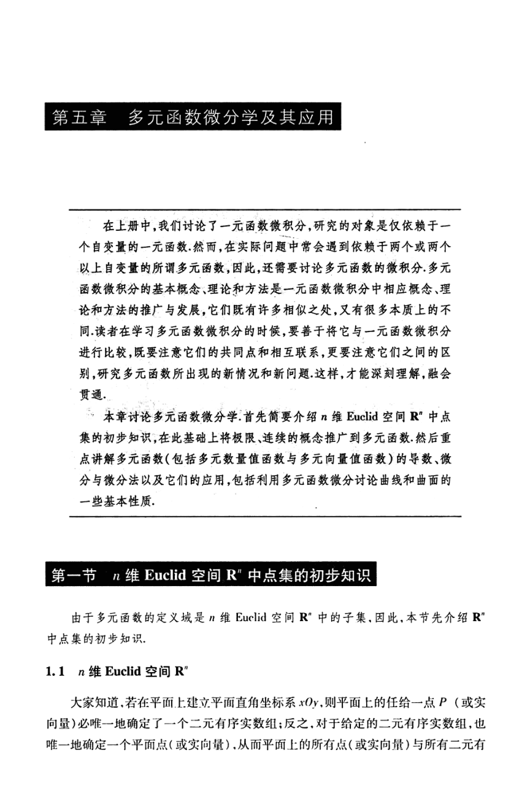

# 工科数学分析基础 下册 - Page 10

- 源文件：`temp/math/工科数学分析基础 下册.pdf`
- PDF 页码：10
- 教材页码：1
- 目录位置：第五章 多元函数微分学及其应用 / 第一节 $n$ 维 Euclid 空间 $\mathbb{R}^n$ 中点集的初步知识 / 1.1 $n$ 维 Euclid 空间 $\mathbb{R}^n$
- 页图：`temp/math/visual-latex/工科数学分析基础 下册/pages/page-0010.png`
- 转写方式：视觉阅读 + LaTeX 手工整理
- 状态：已转写

## LaTeX Markdown

# 第五章 多元函数微分学及其应用

> 在上册中，我们讨论了一元函数微积分，研究的对象是仅依赖于一个自变量的一元函数。然而，在实际问题中常会遇到依赖于两个或两个以上自变量的所谓多元函数，因此，还需要讨论多元函数的微积分。多元函数微积分的基本概念、理论和方法是一元函数微积分中相应概念、理论和方法的推广与发展。它们既有许多相似之处，又有很多本质上的不同。读者在学习多元函数微积分的时候，要善于将它与一元函数微积分进行比较，既要注意它们的共同点和相互联系，更要注意它们之间的区别，研究多元函数所出现的新情况和新问题。这样，才能深刻理解，融会贯通。

本章讨论多元函数微分学。首先简要介绍 $n$ 维 Euclid 空间 $\mathbb{R}^n$ 中点集的初步知识；在此基础上将极限、连续的概念推广到多元函数。然后重点讲解多元函数（包括多元数量值函数与多元向量值函数）的导数、微分与微分法以及它们的应用，包括利用多元函数微分讨论曲线和曲面的一些基本性质。

## 第一节 $n$ 维 Euclid 空间 $\mathbb{R}^n$ 中点集的初步知识

由于多元函数的定义域是 $n$ 维 Euclid 空间 $\mathbb{R}^n$ 中的子集，因此，本节先介绍 $\mathbb{R}^n$ 中点集的初步知识。

## 1.1 $n$ 维 Euclid 空间 $\mathbb{R}^n$

大家知道，若在平面上建立平面直角坐标系 $xOy$，则平面上的任给一点 $P$（或实向量）必唯一地确定了一个二元有序实数组；反之，对于给定的二元有序实数组，也唯一地确定一个平面点（或实向量），从而平面上的所有点（或实向量）与所有二元有序实数组之间建立了一一对应。[续下页]
