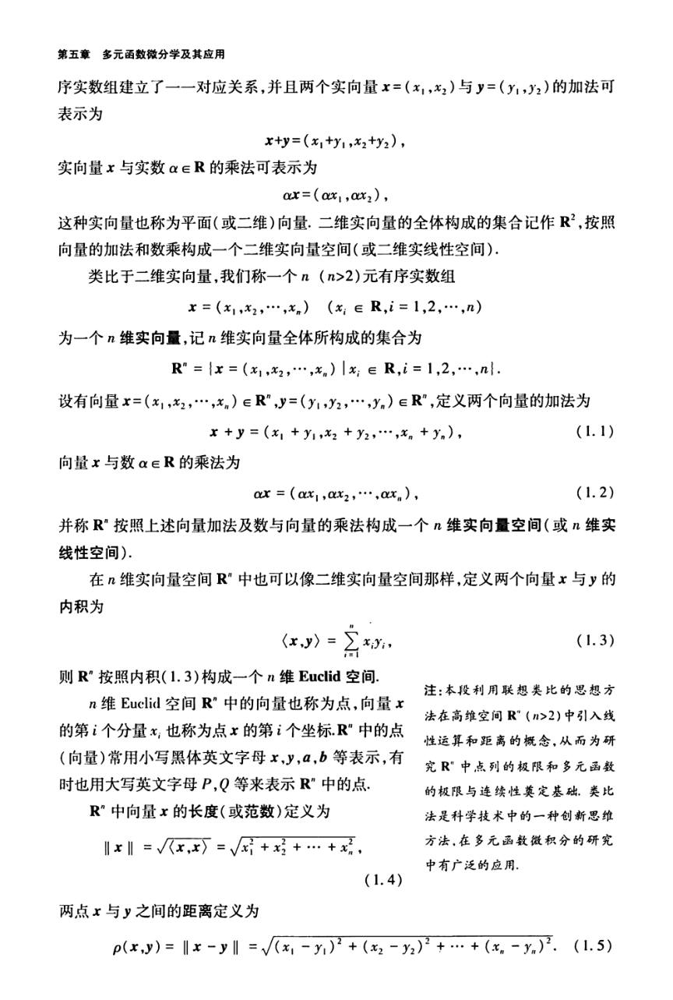

# 工科数学分析基础 下册 - Page 11

- 源文件：`temp/math/工科数学分析基础 下册.pdf`
- PDF 页码：11
- 教材页码：2
- 目录位置：第五章 / 第一节 / 1.1 $n$ 维 Euclid 空间 $\mathbb{R}^n$
- 页图：`temp/math/visual-latex/工科数学分析基础 下册/pages/page-0011.png`
- 转写方式：视觉阅读 + LaTeX 手工整理
- 状态：已转写；页图上方有遮挡，开头若干字句需 `[待核对]`

## LaTeX Markdown

[待核对：本页上方有图像遮挡，开头承接上页关于平面点与二元有序实数组的一一对应。]

这个实向量也称为平面（或二维）向量。二元实向量的全体构成的集合记作 $\mathbb{R}^2$，按照向量的加法和数乘构成一个二维实向量空间（或二维实线性空间）。

类似于二维实向量，我们称一个 $n$（$n>2$）元有序实数组

$$
x=(x_1,x_2,\cdots,x_n),\qquad x_i\in\mathbb{R},\ i=1,2,\cdots,n
$$

为一个 $n$ 维实向量，记 $n$ 维实向量全体所构成的集合为

$$
\mathbb{R}^n=\{x=(x_1,x_2,\cdots,x_n)\mid x_i\in\mathbb{R},\ i=1,2,\cdots,n\}.
$$

设有向量 $x=(x_1,x_2,\cdots,x_n)\in\mathbb{R}^n$，$y=(y_1,y_2,\cdots,y_n)\in\mathbb{R}^n$，定义两个向量的加法为

$$
x+y=(x_1+y_1,x_2+y_2,\cdots,x_n+y_n), \tag{1.1}
$$

向量 $x$ 与数 $\alpha\in\mathbb{R}$ 的乘法为

$$
\alpha x=(\alpha x_1,\alpha x_2,\cdots,\alpha x_n), \tag{1.2}
$$

并称 $\mathbb{R}^n$ 按照上述向量加法及数与向量的乘法构成一个 $n$ 维实向量空间（或 $n$ 维实线性空间）。

在 $n$ 维实向量空间 $\mathbb{R}^n$ 中也可以像二维实向量空间那样，定义两个向量 $x$ 与 $y$ 的内积为

$$
\langle x,y\rangle=\sum_{i=1}^{n}x_i y_i, \tag{1.3}
$$

则 $\mathbb{R}^n$ 按照内积 $(1.3)$ 构成一个 $n$ 维 Euclid 空间。

$n$ 维 Euclid 空间 $\mathbb{R}^n$ 中的向量也称为点，向量 $x$ 的第 $i$ 个分量 $x_i$ 也称为点 $x$ 的第 $i$ 个坐标。$\mathbb{R}^n$ 中的点（向量）常用小写黑体英文字母 $\mathbf{x},\mathbf{y},\mathbf{a},\mathbf{b}$ 等表示，有时也用大写英文字母 $P,Q$ 等表示 $\mathbb{R}^n$ 中的点。

$\mathbb{R}^n$ 中向量 $x$ 的长度（或范数）定义为

$$
\|x\|=\sqrt{\langle x,x\rangle}
=\sqrt{x_1^2+x_2^2+\cdots+x_n^2}, \tag{1.4}
$$

两点 $x$ 与 $y$ 之间的距离定义为

$$
\rho(x,y)=\|x-y\|
=\sqrt{(x_1-y_1)^2+(x_2-y_2)^2+\cdots+(x_n-y_n)^2}. \tag{1.5}
$$
