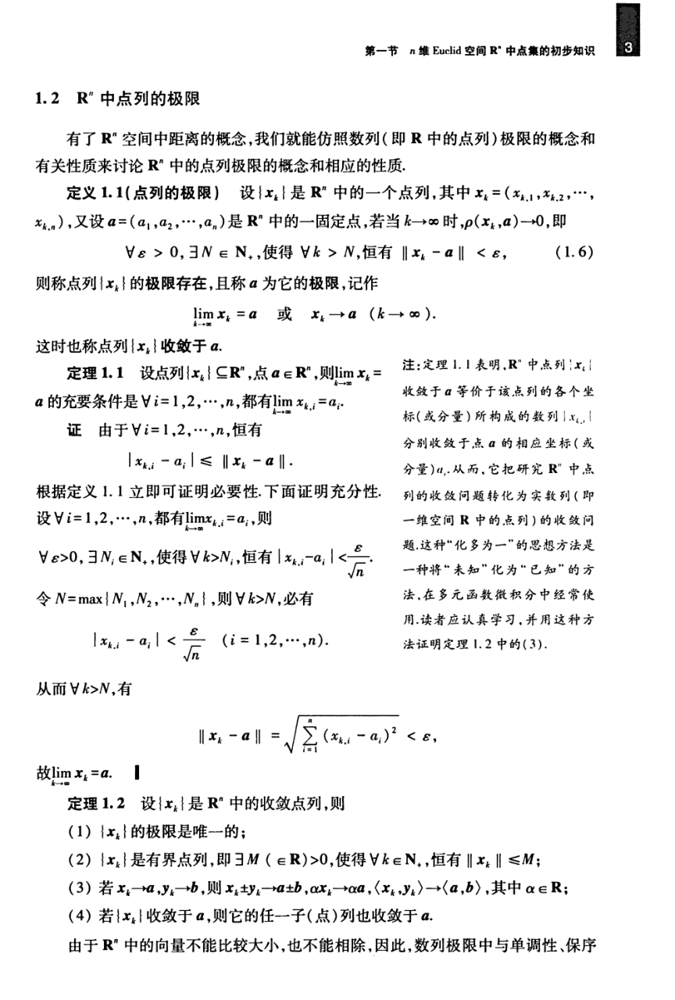

# 工科数学分析基础 下册 - Page 12

- 源文件：`temp/math/工科数学分析基础 下册.pdf`
- PDF 页码：12
- 教材页码：3
- 目录位置：第五章 / 第一节 / 1.2 $\mathbb{R}^n$ 中点列的极限
- 页图：`temp/math/visual-latex/工科数学分析基础 下册/pages/page-0012.png`
- 转写方式：视觉阅读 + LaTeX 手工整理
- 状态：已转写

## LaTeX Markdown

## 1.2 $\mathbb{R}^n$ 中点列的极限

有了 $\mathbb{R}^n$ 空间中距离的概念，我们就能仿照数列（即 $\mathbb{R}$ 中的点列）极限的概念和有关性质来讨论 $\mathbb{R}^n$ 中的点列极限的概念和相应的性质。

**定义 1.1（点列的极限）** 设 $\{x_k\}$ 是 $\mathbb{R}^n$ 中的一个点列，其中

$$
x_k=(x_{k,1},x_{k,2},\cdots,x_{k,n}),
$$

又设 $a=(a_1,a_2,\cdots,a_n)$ 是 $\mathbb{R}^n$ 中的一个固定点，若当 $k\to\infty$ 时，$\rho(x_k,a)\to 0$，即

$$
\forall \varepsilon>0,\ \exists N\in\mathbb{N}_+,\ \text{使得}\ \forall k>N,\ \text{恒有}\ \|x_k-a\|<\varepsilon, \tag{1.6}
$$

则称点列 $\{x_k\}$ 的极限存在，且称 $a$ 为它的极限，记作

$$
\lim_{k\to\infty}x_k=a
\quad\text{或}\quad
x_k\to a\quad(k\to\infty).
$$

这时也称点列 $\{x_k\}$ 收敛于 $a$。

**定理 1.1** 设点列 $\{x_k\}\subseteq\mathbb{R}^n$，点 $a\in\mathbb{R}^n$，则

$$
\lim_{k\to\infty}x_k=a
$$

的充要条件是 $\forall i=1,2,\cdots,n$，都有

$$
\lim_{k\to\infty}x_{k,i}=a_i.
$$

**证** 由于 $\forall i=1,2,\cdots,n$，恒有

$$
|x_{k,i}-a_i|\le \|x_k-a\|.
$$

根据定义 1.1 立即可证明必要性。下面证明充分性。设 $\forall i=1,2,\cdots,n$，都有 $\lim_{k\to\infty}x_{k,i}=a_i$，则

$$
\forall \varepsilon>0,\ \exists N_i\in\mathbb{N}_+,\ \text{使得}\ \forall k>N_i,\ \text{恒有}\ |x_{k,i}-a_i|<\frac{\varepsilon}{\sqrt n}.
$$

令 $N=\max\{N_1,N_2,\cdots,N_n\}$，则 $\forall k>N$，必有

$$
|x_{k,i}-a_i|<\frac{\varepsilon}{\sqrt n}\qquad(i=1,2,\cdots,n).
$$

从而 $\forall k>N$，有

$$
\|x_k-a\|=\sqrt{\sum_{i=1}^{n}(x_{k,i}-a_i)^2}<\varepsilon,
$$

故 $\lim_{k\to\infty}x_k=a$。

**定理 1.2** 设 $\{x_k\}$ 是 $\mathbb{R}^n$ 中的收敛点列，则：

1. $\{x_k\}$ 的极限是唯一的；
2. $\{x_k\}$ 是有界点列，即 $\exists M\in\mathbb{R}$，$M>0$，使得 $\forall k\in\mathbb{N}_+$，恒有 $\|x_k\|\le M$；
3. 若 $x_k\to a$，$y_k\to b$，则 $x_k\pm y_k\to a\pm b$，$\alpha x_k\to \alpha a$，$\langle x_k,y_k\rangle\to\langle a,b\rangle$，其中 $\alpha\in\mathbb{R}$；
4. 若 $\{x_k\}$ 收敛于 $a$，则它的任一子（点）列也收敛于 $a$。

由于 $\mathbb{R}^n$ 中的向量不能比较大小，也不能相除，因此，数列极限中与单调性、保序
