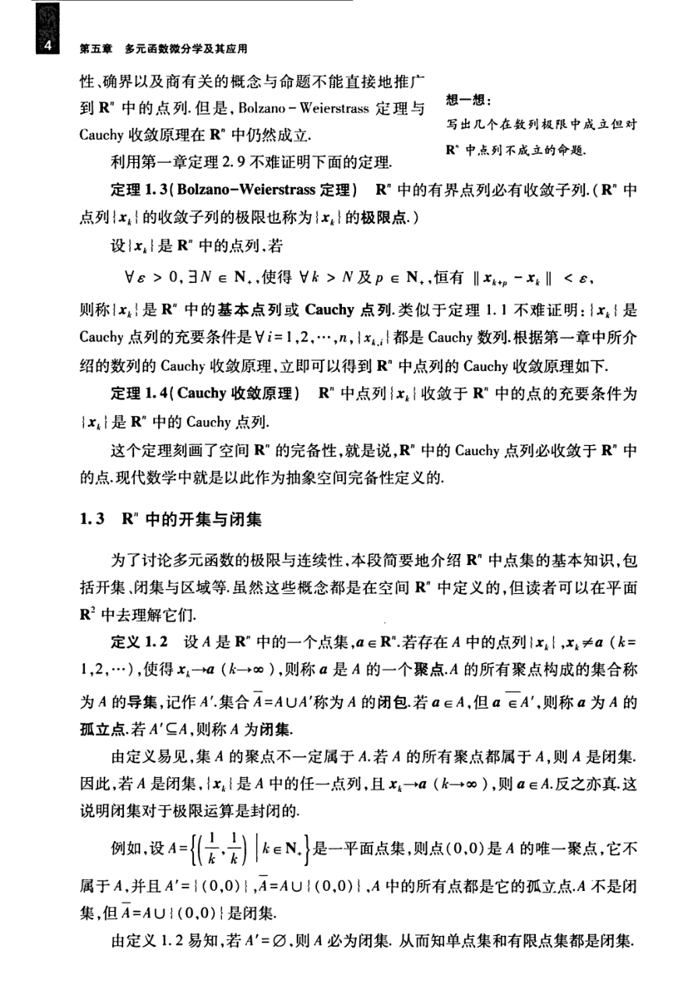

# 工科数学分析基础 下册 - Page 13

- 源文件：`temp/math/工科数学分析基础 下册.pdf`
- PDF 页码：13
- 教材页码：4
- 目录位置：第五章 / 第一节 / 1.2-1.3
- 页图：`temp/math/visual-latex/工科数学分析基础 下册/pages/page-0013.png`
- 转写方式：视觉阅读 + LaTeX 手工整理
- 状态：已转写

## LaTeX Markdown

性、确界以及商有关的概念与命题不能直接地推广到 $\mathbb{R}^n$ 中的点列。但是，Bolzano--Weierstrass 定理与 Cauchy 收敛原理在 $\mathbb{R}^n$ 中仍然成立。

利用第一章定理 2.9 不难证明下面的定理。

**定理 1.3（Bolzano--Weierstrass 定理）** $\mathbb{R}^n$ 中的有界点列必有收敛子列。（$\mathbb{R}^n$ 中点列 $\{x_k\}$ 的收敛子列的极限也称为 $\{x_k\}$ 的极限点。）

设 $\{x_k\}$ 是 $\mathbb{R}^n$ 中的点列，若

$$
\forall \varepsilon>0,\ \exists N\in\mathbb{N}_+,\ \text{使得}\ \forall k>N\ \text{及}\ p\in\mathbb{N}_+,\ \text{恒有}\ \|x_{k+p}-x_k\|<\varepsilon,
$$

则称 $\{x_k\}$ 是 $\mathbb{R}^n$ 中的**基本点列**或 **Cauchy 点列**。类似于定理 1.1 不难证明：$\{x_k\}$ 是 Cauchy 点列的充要条件是 $\forall i=1,2,\cdots,n$，$\{x_{k,i}\}$ 都是 Cauchy 数列。根据第一章中所介绍的数列的 Cauchy 收敛原理，立即可以得到 $\mathbb{R}^n$ 中点列的 Cauchy 收敛原理如下。

**定理 1.4（Cauchy 收敛原理）** $\mathbb{R}^n$ 中点列 $\{x_k\}$ 收敛于 $\mathbb{R}^n$ 中的点的充要条件为 $\{x_k\}$ 是 $\mathbb{R}^n$ 中的 Cauchy 点列。

这个定理刻画了空间 $\mathbb{R}^n$ 的完备性，就是说，$\mathbb{R}^n$ 中的 Cauchy 点列必收敛于 $\mathbb{R}^n$ 中的点。现代数学中就是以此作为抽象空间完备性定义的。

## 1.3 $\mathbb{R}^n$ 中的开集与闭集

为了讨论多元函数的极限与连续性，本段简要地介绍 $\mathbb{R}^n$ 中点集的基本知识，包括开集、闭集与区域等。虽然这些概念都是在空间 $\mathbb{R}^n$ 中定义的，但读者可以在平面 $\mathbb{R}^2$ 中去理解它们。

**定义 1.2** 设 $A$ 是 $\mathbb{R}^n$ 中的一个点集，$a\in\mathbb{R}^n$。若存在 $A$ 中的点列 $\{x_k\}$，$x_k\ne a$（$k=1,2,\cdots$），使得 $x_k\to a$（$k\to\infty$），则称 $a$ 是 $A$ 的一个**聚点**。$A$ 的所有聚点构成的集合称为 $A$ 的**导集**，记作 $A'$。集合 $\bar A=A\cup A'$ 称为 $A$ 的**闭包**。若 $a\in A$，但 $a\notin A'$，则称 $a$ 为 $A$ 的**孤立点**。若 $A'\subseteq A$，则称 $A$ 为**闭集**。

由定义易见，集 $A$ 的聚点不一定属于 $A$。若 $A$ 的所有聚点都属于 $A$，则 $A$ 是闭集。因此，若 $A$ 是闭集，$\{x_k\}$ 是 $A$ 中的任一点列，且 $x_k\to a$（$k\to\infty$），则 $a\in A$。反之亦真。这说明闭集对于极限运算是封闭的。

例如，设

$$
A=\left\{\left(\frac1k,\frac1k\right)\ \middle|\ k\in\mathbb{N}_+\right\}
$$

是一平面点集，则点 $(0,0)$ 是 $A$ 的唯一聚点，它不属于 $A$，并且 $A'=\{(0,0)\}$，$\bar A=A\cup\{(0,0)\}$。$A$ 中的所有点都是它的孤立点。$A$ 不是闭集，但 $\bar A=A\cup\{(0,0)\}$ 是闭集。

由定义 1.2 易知，若 $A'=\varnothing$，则 $A$ 必为闭集。从而知单点集和有限点集都是闭集。
