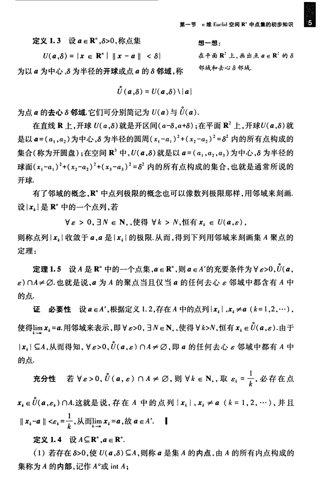

# 工科数学分析基础 下册 - Page 14

- 源文件：`temp/math/工科数学分析基础 下册.pdf`
- PDF 页码：14
- 教材页码：5
- 目录位置：第五章 / 第一节 / 1.3 $\mathbb{R}^n$ 中的开集与闭集
- 页图：`temp/math/visual-latex/工科数学分析基础 下册/pages/page-0014.png`
- 转写方式：视觉阅读 + LaTeX 手工整理
- 状态：已转写

## LaTeX Markdown

**定义 1.3** 设 $a\in\mathbb{R}^n$，$\delta>0$，称点集

$$
U(a,\delta)=\{x\in\mathbb{R}^n\mid \|x-a\|<\delta\}
$$

为以 $a$ 为中心、$\delta$ 为半径的**开球**或点 $a$ 的 $\delta$ **邻域**，称

$$
\overset{\circ}{U}(a,\delta)=U(a,\delta)\setminus\{a\}
$$

为点 $a$ 的**去心 $\delta$ 邻域**。它们可分别简记为 $U(a)$ 与 $\overset{\circ}{U}(a)$。

在直线 $\mathbb{R}$ 上，开球 $U(a,\delta)$ 就是开区间 $(a-\delta,a+\delta)$；在平面 $\mathbb{R}^2$ 上，开球 $U(a,\delta)$ 就是以 $a=(a_1,a_2)$ 为中心、$\delta$ 为半径的圆周

$$
(x_1-a_1)^2+(x_2-a_2)^2=\delta^2
$$

内的所有点构成的集合（称为开圆盘）；在空间 $\mathbb{R}^3$ 中，$U(a,\delta)$ 就是以 $a=(a_1,a_2,a_3)$ 为中心、$\delta$ 为半径的球面

$$
(x_1-a_1)^2+(x_2-a_2)^2+(x_3-a_3)^2=\delta^2
$$

内的所有点构成的集合，也就是通常所说的开球。

有了邻域的概念，$\mathbb{R}^n$ 中点列极限的概念也可以像数列极限那样，用邻域来刻画。设 $\{x_k\}$ 是 $\mathbb{R}^n$ 中的一个点列，若

$$
\forall\varepsilon>0,\ \exists N\in\mathbb{N}_+,\ \text{使得}\ \forall k>N,\ \text{恒有}\ x_k\in U(a,\varepsilon),
$$

则称点列 $\{x_k\}$ 收敛于 $a$，$a$ 是 $\{x_k\}$ 的极限。从而，得到下列用邻域来刻画集 $A$ 聚点的定理。

**定理 1.5** 设 $A$ 是 $\mathbb{R}^n$ 中的一个点集，$a\in\mathbb{R}^n$，则 $a\in A'$ 的充要条件为

$$
\forall\varepsilon>0,\quad \overset{\circ}{U}(a,\varepsilon)\cap A\ne\varnothing.
$$

也就是说，$a$ 为 $A$ 的聚点当且仅当 $a$ 的任何去心 $\varepsilon$ 邻域中都含有 $A$ 中的点。

**证** 必要性：设 $a\in A'$，根据定义 1.2，存在 $A$ 中的点列 $\{x_k\}$，$x_k\ne a$（$k=1,2,\cdots$），使得 $\lim_{k\to\infty}x_k=a$。用邻域来表示，即 $\forall\varepsilon>0$，$\exists N\in\mathbb{N}_+$，使得 $\forall k>N$，恒有 $x_k\in\overset{\circ}{U}(a,\varepsilon)$。由于 $\{x_k\}\subseteq A$，从而得知 $\forall\varepsilon>0$，

$$
\overset{\circ}{U}(a,\varepsilon)\cap A\ne\varnothing.
$$

充分性：若 $\forall\varepsilon>0$，$\overset{\circ}{U}(a,\varepsilon)\cap A\ne\varnothing$，则 $\forall k\in\mathbb{N}_+$，取 $\varepsilon_k=\frac1k$，必存在点

$$
x_k\in \overset{\circ}{U}(a,\varepsilon_k)\cap A.
$$

这就是说，存在 $A$ 中的点列 $\{x_k\}$，$x_k\ne a$（$k=1,2,\cdots$），并且

$$
\|x_k-a\|<\varepsilon_k=\frac1k,
$$

从而 $\lim_{k\to\infty}x_k=a$，故 $a\in A'$。

**定义 1.4** 设 $A\subseteq\mathbb{R}^n$，$a\in\mathbb{R}^n$。

1. 若存在 $\delta>0$，使 $U(a,\delta)\subseteq A$，则称 $a$ 是集 $A$ 的**内点**，由 $A$ 的所有内点构成的集合称为 $A$ 的**内部**，记作 $A^\circ$ 或 $\operatorname{int}A$；
