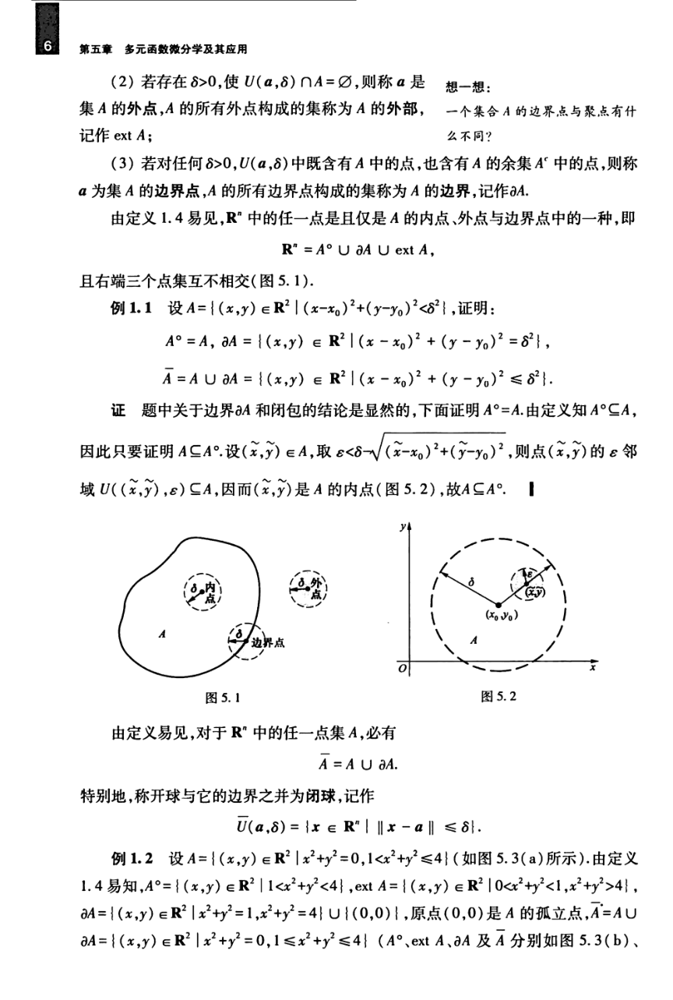

# 工科数学分析基础 下册 - Page 15

- 源文件：`temp/math/工科数学分析基础 下册.pdf`
- PDF 页码：15
- 教材页码：6
- 目录位置：第五章 / 第一节 / 1.3 $\mathbb{R}^n$ 中的开集与闭集
- 页图：`temp/math/visual-latex/工科数学分析基础 下册/pages/page-0015.png`
- 转写方式：视觉阅读 + LaTeX 手工整理
- 状态：已转写

## LaTeX Markdown

2. 若存在 $\delta>0$，使 $U(a,\delta)\cap A=\varnothing$，则称 $a$ 是集 $A$ 的**外点**，$A$ 的所有外点构成的集合称为 $A$ 的**外部**，记作 $\operatorname{ext}A$；
3. 若对任何 $\delta>0$，$U(a,\delta)$ 中既含有 $A$ 中的点，也含有 $A$ 的余集 $A^c$ 中的点，则称 $a$ 为集 $A$ 的**边界点**，$A$ 的所有边界点构成的集合称为 $A$ 的**边界**，记作 $\partial A$。

由定义 1.4 易见，$\mathbb{R}^n$ 中的任一点是且仅是 $A$ 的内点、外点与边界点中的一种，即

$$
\mathbb{R}^n=A^\circ\cup \partial A\cup \operatorname{ext}A,
$$

且右端三个点集互不相交（图 5.1）。

**例 1.1** 设

$$
A=\{(x,y)\in\mathbb{R}^2\mid (x-x_0)^2+(y-y_0)^2<\delta^2\},
$$

证明：

$$
A^\circ=A,
$$

$$
\partial A=\{(x,y)\in\mathbb{R}^2\mid (x-x_0)^2+(y-y_0)^2=\delta^2\},
$$

$$
\bar A=A\cup\partial A
=\{(x,y)\in\mathbb{R}^2\mid (x-x_0)^2+(y-y_0)^2\le \delta^2\}.
$$

**证** 题中关于边界 $\partial A$ 和闭包的结论是显然的，下面证明 $A^\circ=A$。由定义知 $A^\circ\subseteq A$，因此只要证明 $A\subseteq A^\circ$。设 $(\tilde x,\tilde y)\in A$，取

$$
\varepsilon<\delta-\sqrt{(\tilde x-x_0)^2+(\tilde y-y_0)^2},
$$

则点 $(\tilde x,\tilde y)$ 的 $\varepsilon$ 邻域

$$
U((\tilde x,\tilde y),\varepsilon)\subseteq A,
$$

因而 $(\tilde x,\tilde y)$ 是 $A$ 的内点，故 $A\subseteq A^\circ$。

由定义易见，对于 $\mathbb{R}^n$ 中的任一点集 $A$，必有

$$
\bar A=A\cup\partial A.
$$

特别地，称开球与它的边界之并为**闭球**，记作

$$
\overline{U}(a,\delta)=\{x\in\mathbb{R}^n\mid \|x-a\|\le \delta\}.
$$

**例 1.2** 设

$$
A=\{(x,y)\in\mathbb{R}^2\mid x^2+y^2=0\ \text{或}\ 1<x^2+y^2\le 4\}
$$

（如图 5.3(a) 所示）。由定义 1.4 易知，

$$
A^\circ=\{(x,y)\in\mathbb{R}^2\mid 1<x^2+y^2<4\},
$$

$$
\operatorname{ext}A=\{(x,y)\in\mathbb{R}^2\mid 0<x^2+y^2<1\ \text{或}\ x^2+y^2>4\},
$$

$$
\partial A=\{(x,y)\in\mathbb{R}^2\mid x^2+y^2=1,\ x^2+y^2=4\}\cup\{(0,0)\},
$$

原点 $(0,0)$ 是 $A$ 的孤立点，

$$
\bar A=A\cup\partial A
=\{(x,y)\in\mathbb{R}^2\mid x^2+y^2=0\ \text{或}\ 1\le x^2+y^2\le 4\}.
$$

（$A^\circ$、$\operatorname{ext}A$、$\partial A$ 及 $\bar A$ 分别如图 5.3(b) [续下页]）
