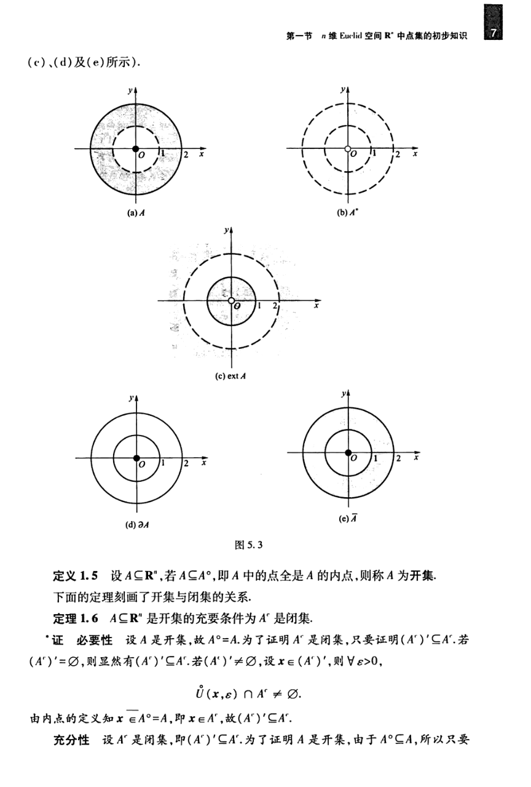

# 工科数学分析基础 下册 - Page 16

- 源文件：`temp/math/工科数学分析基础 下册.pdf`
- PDF 页码：16
- 教材页码：7
- 目录位置：第五章 / 第一节 / 1.3 $\mathbb{R}^n$ 中的开集与闭集
- 页图：`temp/math/visual-latex/工科数学分析基础 下册/pages/page-0016.png`
- 转写方式：视觉阅读 + LaTeX 手工整理
- 状态：已转写

## LaTeX Markdown

（c）、（d）及（e）所示。）

**定义 1.5** 设 $A\subseteq\mathbb{R}^n$，若 $A\subseteq A^\circ$，即 $A$ 中的点全是 $A$ 的内点，则称 $A$ 为**开集**。

下面的定理刻画了开集与闭集的关系。

**定理 1.6** $A\subseteq\mathbb{R}^n$ 是开集的充要条件为 $A^c$ 是闭集。

**证** 必要性：设 $A$ 是开集，故 $A^\circ=A$。为了证明 $A^c$ 是闭集，只要证明 $(A^c)'\subseteq A^c$。若 $(A^c)'=\varnothing$，则显然有 $(A^c)'\subseteq A^c$。若 $(A^c)'\ne\varnothing$，设 $x\in(A^c)'$，则 $\forall\varepsilon>0$，

$$
\overset{\circ}{U}(x,\varepsilon)\cap A^c\ne\varnothing.
$$

由内点的定义知 $x\notin A^\circ=A$，即 $x\in A^c$，故 $(A^c)'\subseteq A^c$。

充分性：设 $A^c$ 是闭集，即 $(A^c)'\subseteq A^c$。为了证明 $A$ 是开集，由于 $A^\circ\subseteq A$，所以只要
