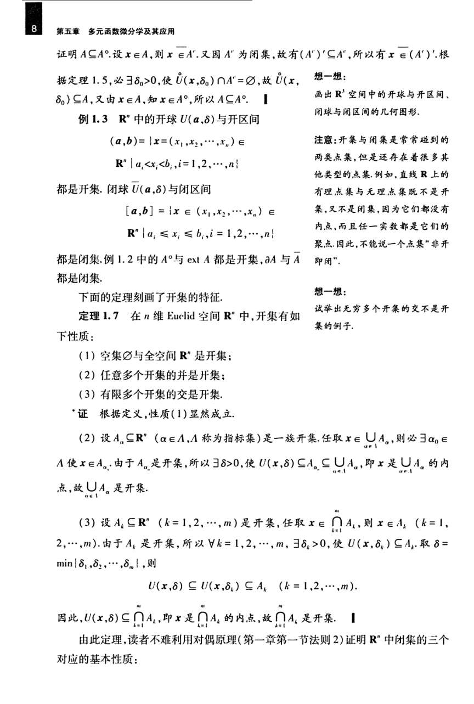

# 工科数学分析基础 下册 - Page 17

- 源文件：`temp/math/工科数学分析基础 下册.pdf`
- PDF 页码：17
- 教材页码：8
- 目录位置：第五章 / 第一节 / 1.3 $\mathbb{R}^n$ 中的开集与闭集
- 页图：`temp/math/visual-latex/工科数学分析基础 下册/pages/page-0017.png`
- 转写方式：视觉阅读 + LaTeX 手工整理
- 状态：已转写

## LaTeX Markdown

证明 $A\subseteq A^\circ$。设 $x\in A$，则 $x\notin A^c$。又因 $A^c$ 为闭集，故有 $(A^c)'\subseteq A^c$，所以有 $x\notin(A^c)'$。根据定理 1.5，必 $\exists\delta_0>0$，使

$$
\overset{\circ}{U}(x,\delta_0)\cap A^c=\varnothing,
$$

故 $\overset{\circ}{U}(x,\delta_0)\subseteq A$。又由 $x\in A$，知 $x\in A^\circ$，所以 $A\subseteq A^\circ$。

**例 1.3** $\mathbb{R}^n$ 中的开球 $U(a,\delta)$ 与开区间

$$
(a,b)=\{x=(x_1,x_2,\cdots,x_n)\in\mathbb{R}^n\mid a_i<x_i<b_i,\ i=1,2,\cdots,n\}
$$

都是开集。闭球 $\overline U(a,\delta)$ 与闭区间

$$
[a,b]=\{x=(x_1,x_2,\cdots,x_n)\in\mathbb{R}^n\mid a_i\le x_i\le b_i,\ i=1,2,\cdots,n\}
$$

都是闭集。例 1.2 中的 $A^\circ$ 与 $\operatorname{ext}A$ 都是开集，$\partial A$ 与 $\bar A$ 都是闭集。

下面的定理刻画了开集的特征。

**定理 1.7** 在 $n$ 维 Euclid 空间 $\mathbb{R}^n$ 中，开集有如下性质：

1. 空集 $\varnothing$ 与全空间 $\mathbb{R}^n$ 是开集；
2. 任意多个开集的并是开集；
3. 有限多个开集的交是开集。

**证** 根据定义，性质（1）显然成立。

（2）设 $A_\alpha\subseteq\mathbb{R}^n$（$\alpha\in\Lambda$，$\Lambda$ 称为指标集）是一族开集。任取 $x\in\bigcup_{\alpha\in\Lambda}A_\alpha$，则必 $\exists\alpha_0\in\Lambda$ 使 $x\in A_{\alpha_0}$。由于 $A_{\alpha_0}$ 是开集，所以 $\exists\delta>0$，使

$$
U(x,\delta)\subseteq A_{\alpha_0}\subseteq\bigcup_{\alpha\in\Lambda}A_\alpha,
$$

即 $x$ 是 $\bigcup_{\alpha\in\Lambda}A_\alpha$ 的内点，故 $\bigcup_{\alpha\in\Lambda}A_\alpha$ 是开集。

（3）设 $A_k\subseteq\mathbb{R}^n$（$k=1,2,\cdots,m$）是开集，任取

$$
x\in\bigcap_{k=1}^{m}A_k,
$$

则 $x\in A_k$（$k=1,2,\cdots,m$）。由于 $A_k$ 是开集，所以 $\forall k=1,2,\cdots,m$，$\exists\delta_k>0$，使 $U(x,\delta_k)\subseteq A_k$。取

$$
\delta=\min\{\delta_1,\delta_2,\cdots,\delta_m\},
$$

则

$$
U(x,\delta)\subseteq U(x,\delta_k)\subseteq A_k\qquad(k=1,2,\cdots,m).
$$

因此，

$$
U(x,\delta)\subseteq \bigcap_{k=1}^{m}A_k,
$$

即 $x$ 是 $\bigcap_{k=1}^{m}A_k$ 的内点，故 $\bigcap_{k=1}^{m}A_k$ 是开集。

由此定理，读者不难利用对偶原理（第一章第一节法则 2）证明 $\mathbb{R}^n$ 中闭集的三个对应的基本性质：
