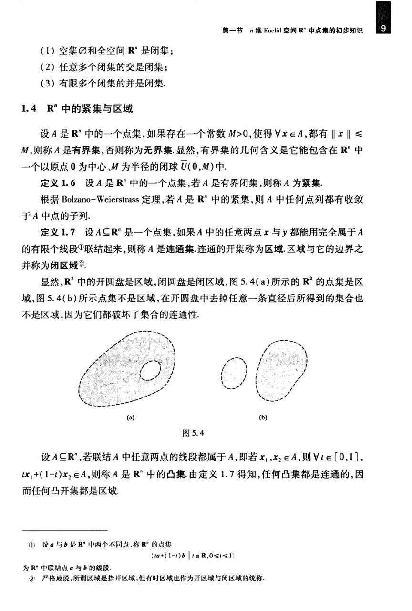

# 工科数学分析基础 下册 - Page 18

- 源文件：`temp/math/工科数学分析基础 下册.pdf`
- PDF 页码：18
- 教材页码：9
- 目录位置：第五章 / 第一节 / 1.4 $\mathbb{R}^n$ 中的紧集与区域
- 页图：`temp/math/visual-latex/工科数学分析基础 下册/pages/page-0018.png`
- 转写方式：视觉阅读 + LaTeX 手工整理
- 状态：已转写

## LaTeX Markdown

1. 空集 $\varnothing$ 和全空间 $\mathbb{R}^n$ 是闭集；
2. 任意多个闭集的交是闭集；
3. 有限多个闭集的并是闭集。

## 1.4 $\mathbb{R}^n$ 中的紧集与区域

设 $A$ 是 $\mathbb{R}^n$ 中的一个点集，如果存在一个常数 $M>0$，使得 $\forall x\in A$，都有 $\|x\|\le M$，则称 $A$ 是**有界集**，否则称为**无界集**。显然，有界集的几何含义是它能包含在 $\mathbb{R}^n$ 中一个以原点 $0$ 为中心、$M$ 为半径的闭球 $\overline U(0,M)$ 中。

**定义 1.6** 设 $A$ 是 $\mathbb{R}^n$ 中的一个点集，若 $A$ 是有界闭集，则称 $A$ 为**紧集**。

根据 Bolzano--Weierstrass 定理，若 $A$ 是 $\mathbb{R}^n$ 中的紧集，则 $A$ 中任何点列都有收敛于 $A$ 中点的子列。

**定义 1.7** 设 $A\subseteq\mathbb{R}^n$ 是一个点集，如果 $A$ 中的任意两点 $x$ 与 $y$ 都能用完全属于 $A$ 的有限个线段联结起来，则称 $A$ 是**连通集**。连通的开集称为**区域**。区域与它的边界之并称为**闭区域**。

显然，$\mathbb{R}^2$ 中的开圆盘是区域，闭圆盘是闭区域，图 5.4(a) 所示的 $\mathbb{R}^2$ 的点集是区域，图 5.4(b) 所示点集不是区域，在开圆盘中去掉任意一条直径后所得到的集合也不是区域，因为它们都破坏了集合的连通性。

设 $A\subseteq\mathbb{R}^n$，若联结 $A$ 中任意两点的线段都属于 $A$，即若 $x_1,x_2\in A$，则 $\forall t\in[0,1]$，

$$
t x_1+(1-t)x_2\in A,
$$

则称 $A$ 是 $\mathbb{R}^n$ 中的**凸集**。由定义 1.7 得知，任何凸集都是连通的，因而任何凸开集都是区域。

> 注：若 $a$ 与 $b$ 是 $\mathbb{R}^n$ 中两个不同点，称 $\mathbb{R}^n$ 的点集
>
> $$
> \{ta+(1-t)b\mid t\in\mathbb{R},\ 0\le t\le 1\}
> $$
>
> 为 $\mathbb{R}^n$ 中联结点 $a$ 与 $b$ 的线段。
