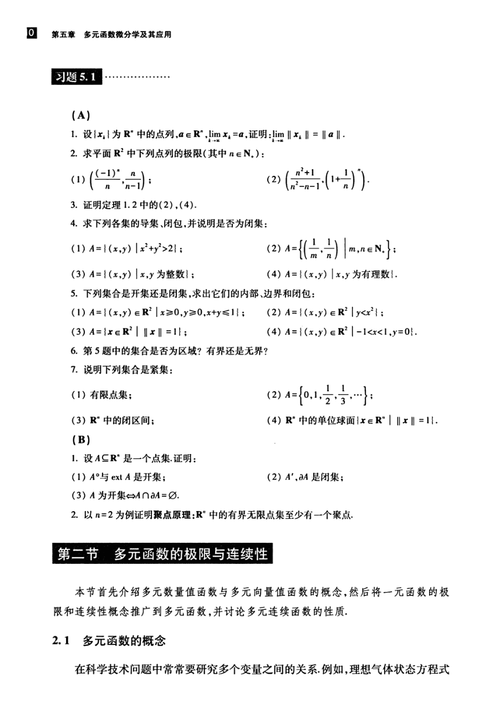

# 工科数学分析基础 下册 - Page 19

- 源文件：`temp/math/工科数学分析基础 下册.pdf`
- PDF 页码：19
- 教材页码：10
- 目录位置：第五章 / 习题 5.1；第二节 多元函数的极限与连续性 / 2.1 多元函数的概念
- 页图：`temp/math/visual-latex/工科数学分析基础 下册/pages/page-0019.png`
- 转写方式：视觉阅读 + LaTeX 手工整理
- 状态：已转写

## LaTeX Markdown

# 习题 5.1

## A

1. 设 $\{x_k\}$ 为 $\mathbb{R}^n$ 中的点列，$a\in\mathbb{R}^n$，$\lim_{k\to\infty}x_k=a$，证明：

   $$
   \lim_{k\to\infty}\|x_k\|=\|a\|.
   $$

2. 求平面 $\mathbb{R}^2$ 中下列点列的极限（其中 $n\in\mathbb{N}_+$）：

   $$
   \left(\frac{(-1)^n}{n},\frac{n}{n-1}\right);
   \qquad
   \left(\frac{n^2+1}{n^2-n-1},\left(1+\frac1n\right)^n\right).
   $$

3. 证明定理 1.2 中的（2）、（4）。

4. 求下列各集的导集、闭包，并说明是否为闭集：

   $$
   A=\{(x,y)\mid x^2+y^2>2\};
   $$

   $$
   A=\left\{\left(\frac1m,\frac1n\right)\ \middle|\ m,n\in\mathbb{N}_+\right\};
   $$

   $$
   A=\{(x,y)\mid x,y\ \text{为整数}\};
   $$

   $$
   A=\{(x,y)\mid x,y\ \text{为有理数}\}.
   $$

5. 下列集合是开集还是闭集，求出它们的内部、边界和闭包：

   $$
   A=\{(x,y)\in\mathbb{R}^2\mid x\ge 0,\ y\ge 0,\ x+y\le 1\};
   $$

   $$
   A=\{(x,y)\in\mathbb{R}^2\mid y<x^2\};
   $$

   $$
   A=\{x\in\mathbb{R}^2\mid \|x\|=1\};
   $$

   $$
   A=\{(x,y)\in\mathbb{R}^2\mid -1<x<1,\ y=0\}.
   $$

6. 第 5 题中的集合是否为区域？有界还是无界？

7. 说明下列集合是紧集：

   1. 有限点集；
   2. $A=\{0,1,\frac12,\frac13,\cdots\}$；
   3. $\mathbb{R}^n$ 中的闭区间；
   4. $\mathbb{R}^n$ 中的单位球面 $\{x\in\mathbb{R}^n\mid \|x\|=1\}$。

## B

1. 设 $A\subseteq\mathbb{R}^n$ 是一个点集，证明：

   1. $A^\circ$ 与 $\operatorname{ext}A$ 是开集；
   2. $A'$、$\partial A$ 是闭集；
   3. $A$ 为开集 $\Leftrightarrow A\cap\partial A=\varnothing$。

2. 以 $n=2$ 为例证明聚点原理：$\mathbb{R}^n$ 中的有界无限点集至少有一个聚点。

# 第二节 多元函数的极限与连续性

本节首先介绍多元数量值函数与多元向量值函数的概念，然后将一元函数的极限和连续性概念推广到多元函数，并讨论多元连续函数的性质。

## 2.1 多元函数的概念

在科学技术问题中常常要研究多个变量之间的关系。例如，理想气体状态方程
