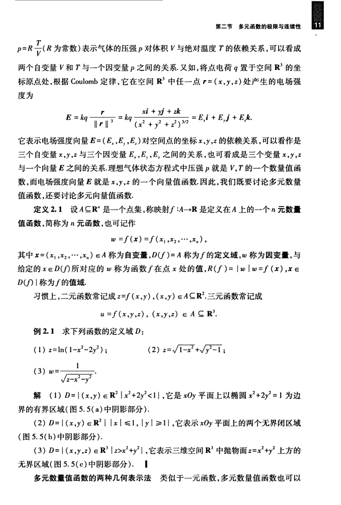

# 工科数学分析基础 下册 - Page 20

- 源文件：`temp/math/工科数学分析基础 下册.pdf`
- PDF 页码：20
- 教材页码：11
- 目录位置：第五章 / 第二节 / 2.1 多元函数的概念
- 页图：`temp/math/visual-latex/工科数学分析基础 下册/pages/page-0020.png`
- 转写方式：视觉阅读 + LaTeX 手工整理
- 状态：已转写

## LaTeX Markdown

$$
p=R\frac{T}{V}
$$

（$R$ 为常数）表示气体的压强 $p$ 对体积 $V$ 与绝对温度 $T$ 的依赖关系，可以看成两个自变量 $V$ 和 $T$ 与一个因变量 $p$ 之间的关系。又如，将点电荷 $q$ 置于空间 $\mathbb{R}^3$ 的坐标原点处，根据 Coulomb 定律，它在空间 $\mathbb{R}^3$ 中任一点 $r=(x,y,z)$ 处产生的电场强度为

$$
\mathbf{E}
=kq\frac{r}{\|r\|^3}
=kq\frac{x\mathbf{i}+y\mathbf{j}+z\mathbf{k}}{(x^2+y^2+z^2)^{3/2}}
=E_x\mathbf{i}+E_y\mathbf{j}+E_z\mathbf{k}.
$$

它表示电场强度向量 $\mathbf{E}=(E_x,E_y,E_z)$ 对空间点的坐标 $x,y,z$ 的依赖关系，可以看作是三个自变量 $x,y,z$ 与三个因变量 $E_x,E_y,E_z$ 之间的关系，也可看成是三个变量 $x,y,z$ 与一个向量 $\mathbf{E}$ 之间的关系。理想气体状态方程中压强 $p$ 就是 $V,T$ 的一个数量值函数，而电场强度向量 $\mathbf{E}$ 就是 $x,y,z$ 的一个向量值函数。因此，我们既要讨论多元数量值函数，还要讨论多元向量值函数。

**定义 2.1** 设 $A\subseteq\mathbb{R}^n$ 是一个点集，称映射 $f:A\to\mathbb{R}$ 是定义在 $A$ 上的一个 $n$ 元数量值函数，简称为 $n$ 元函数，也可记作

$$
w=f(x)=f(x_1,x_2,\cdots,x_n),
$$

其中 $x=(x_1,x_2,\cdots,x_n)\in A$ 称为自变量，$D(f)=A$ 称为 $f$ 的定义域，$w$ 称为因变量，与给定的 $x\in D(f)$ 所对应的 $w$ 称为函数 $f$ 在点 $x$ 处的值，

$$
R(f)=\{w\mid w=f(x),\ x\in D(f)\}
$$

称为 $f$ 的值域。

习惯上，二元函数常记成

$$
z=f(x,y),\qquad (x,y)\in A\subseteq\mathbb{R}^2;
$$

三元函数常记成

$$
u=f(x,y,z),\qquad (x,y,z)\in A\subseteq\mathbb{R}^3.
$$

**例 2.1** 求下列函数的定义域 $D$：

1. $z=\ln(1-x^2-2y^2)$；
2. $z=\sqrt{1-x^2}+\sqrt{y^2-1}$；
3. $w=\dfrac1{\sqrt{z-x^2-y^2}}$。

**解**

1. $D=\{(x,y)\in\mathbb{R}^2\mid x^2+2y^2<1\}$，它是 $xOy$ 平面上以椭圆 $x^2+2y^2=1$ 为边界的有界区域（图 5.5(a) 中阴影部分）。
2. $D=\{(x,y)\in\mathbb{R}^2\mid |x|\le 1,\ |y|\ge 1\}$，它表示 $xOy$ 平面上的两个无界闭区域（图 5.5(b) 中阴影部分）。
3. $D=\{(x,y,z)\in\mathbb{R}^3\mid z>x^2+y^2\}$，它表示三维空间 $\mathbb{R}^3$ 中抛物面 $z=x^2+y^2$ 上方的无界区域（图 5.5(c) 中阴影部分）。

**多元数量值函数的两种几何表示法** 类似于一元函数，多元数量值函数也可以
