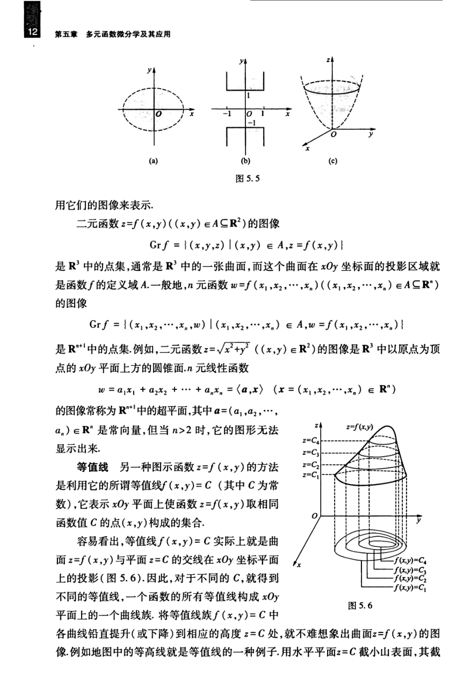

# 工科数学分析基础 下册 - Page 21

- 源文件：`temp/math/工科数学分析基础 下册.pdf`
- PDF 页码：21
- 教材页码：12
- 目录位置：第五章 / 第二节 / 2.1 多元函数的概念
- 页图：`temp/math/visual-latex/工科数学分析基础 下册/pages/page-0021.png`
- 转写方式：视觉阅读 + LaTeX 手工整理
- 状态：已转写

## LaTeX Markdown

用它们的图像来表示。

二元函数 $z=f(x,y)$（$(x,y)\in A\subseteq\mathbb{R}^2$）的图像

$$
\operatorname{Gr}f=\{(x,y,z)\mid (x,y)\in A,\ z=f(x,y)\}
$$

是 $\mathbb{R}^3$ 中的点集，通常是 $\mathbb{R}^3$ 中的一张曲面，而这个曲面在 $xOy$ 坐标面的投影区域就是函数 $f$ 的定义域 $A$。一般地，$n$ 元函数

$$
w=f(x_1,x_2,\cdots,x_n),\qquad (x_1,x_2,\cdots,x_n)\in A\subseteq\mathbb{R}^n
$$

的图像

$$
\operatorname{Gr}f
=\{(x_1,x_2,\cdots,x_n,w)\mid (x_1,x_2,\cdots,x_n)\in A,\ w=f(x_1,x_2,\cdots,x_n)\}
$$

是 $\mathbb{R}^{n+1}$ 中的点集。例如，二元函数

$$
z=\sqrt{x^2+y^2}\qquad ((x,y)\in\mathbb{R}^2)
$$

的图像是 $\mathbb{R}^3$ 中以原点为顶点的 $xOy$ 平面上方的圆锥面。$n$ 元线性函数

$$
w=a_1x_1+a_2x_2+\cdots+a_nx_n=\langle a,x\rangle,\qquad
x=(x_1,x_2,\cdots,x_n)\in\mathbb{R}^n
$$

的图像常称为 $\mathbb{R}^{n+1}$ 中的超平面，其中

$$
a=(a_1,a_2,\cdots,a_n)\in\mathbb{R}^n
$$

是常向量，但当 $n>2$ 时，它的图形无法显示出来。

**等值线** 另一种图示函数 $z=f(x,y)$ 的方法是利用它的所谓等值线

$$
f(x,y)=C
$$

（其中 $C$ 为常数），它表示 $xOy$ 平面上使函数 $z=f(x,y)$ 取相同函数值 $C$ 的点 $(x,y)$ 构成的集合。

容易看出，等值线 $f(x,y)=C$ 实际上就是曲面 $z=f(x,y)$ 与平面 $z=C$ 的交线在 $xOy$ 坐标平面上的投影（图 5.6）。因此，对于不同的 $C$，就得到不同的等值线，一个函数的所有等值线构成 $xOy$ 平面上的一个曲线族。将等值线族 $f(x,y)=C$ 中各曲线铅直提升（或下降）到相应的高度 $z=C$ 处，就不难想象出曲面 $z=f(x,y)$ 的图像。例如地图中的等高线就是等值线的一种例子。用水平平面 $z=C$ 截小山表面，其截
