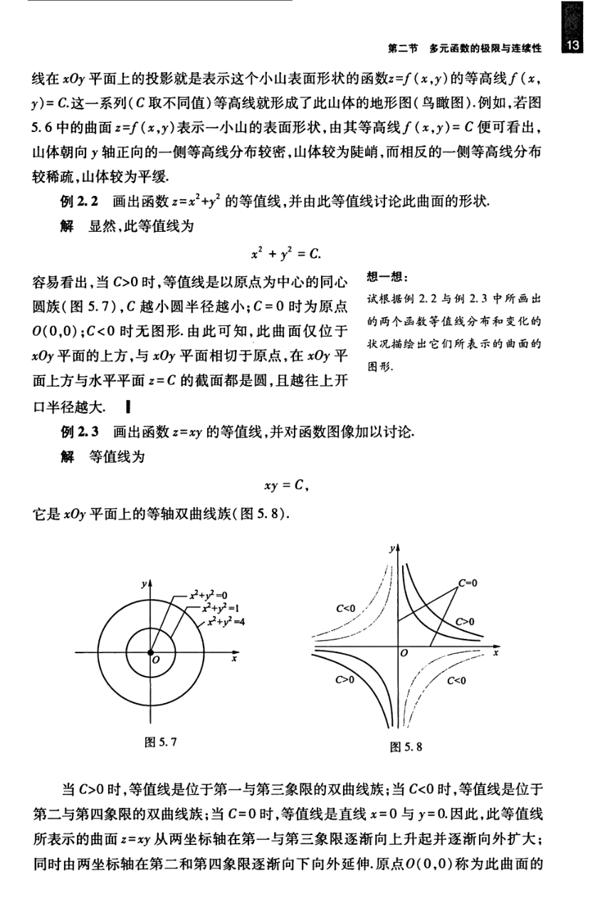

# 工科数学分析基础 下册 - Page 22

- 源文件：`temp/math/工科数学分析基础 下册.pdf`
- PDF 页码：22
- 教材页码：13
- 目录位置：第五章 / 第二节 / 2.1 多元函数的概念
- 页图：`temp/math/visual-latex/工科数学分析基础 下册/pages/page-0022.png`
- 转写方式：视觉阅读 + LaTeX 手工整理
- 状态：已转写

## LaTeX Markdown

线在 $xOy$ 平面上的投影就是表示这个小山表面形状的函数 $z=f(x,y)$ 的等高线 $f(x,y)=C$。这一系列（$C$ 取不同值）等高线就形成了此山体的地形图（鸟瞰图）。例如，若图 5.6 中的曲面 $z=f(x,y)$ 表示一小山的表面形状，由其等高线 $f(x,y)=C$ 便可看出，山体朝向 $y$ 轴正向的一侧等高线分布较密，山体较为陡峭，而相反的一侧等高线分布较稀疏，山体较为平缓。

**例 2.2** 画出函数

$$
z=x^2+y^2
$$

的等值线，并由此等值线讨论此曲面的形状。

**解** 显然，此等值线为

$$
x^2+y^2=C.
$$

容易看出，当 $C>0$ 时，等值线是以原点为中心的同心圆族（图 5.7），$C$ 越小圆半径越小；$C=0$ 时为原点 $O(0,0)$；$C<0$ 时无图形。由此可知，此曲面仅位于 $xOy$ 平面的上方，与 $xOy$ 平面相切于原点，在 $xOy$ 平面上方与水平平面 $z=C$ 的截面都是圆，且越往上开口半径越大。

**例 2.3** 画出函数

$$
z=xy
$$

的等值线，并对函数图像加以讨论。

**解** 等值线为

$$
xy=C,
$$

它是 $xOy$ 平面上的等轴双曲线族（图 5.8）。

当 $C>0$ 时，等值线是位于第一与第三象限的双曲线族；当 $C<0$ 时，等值线是位于第二与第四象限的双曲线族；当 $C=0$ 时，等值线是直线 $x=0$ 与 $y=0$。因此，此等值线所表示的曲面 $z=xy$ 从两坐标轴在第一与第三象限逐渐向上升起并逐渐向外扩大；同时由两坐标轴在第二和第四象限逐渐向下向外延伸。原点 $O(0,0)$ 称为此曲面的
