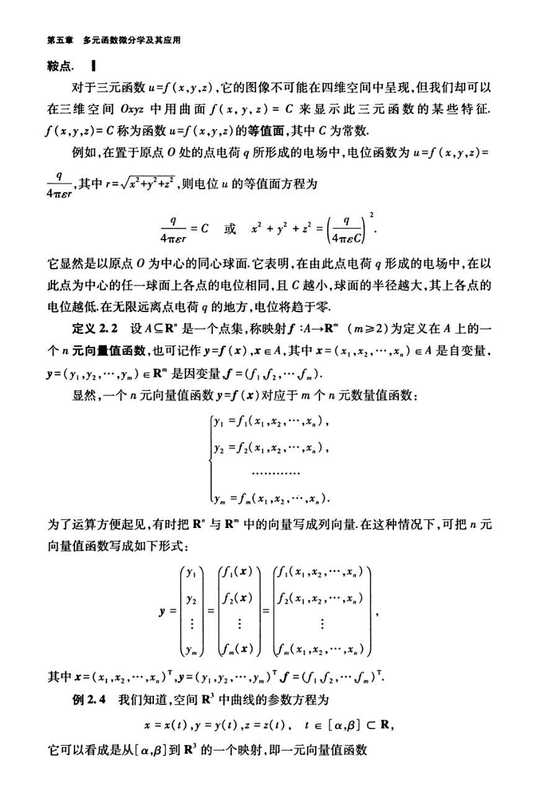

# 工科数学分析基础 下册 - Page 23

- 源文件：`temp/math/工科数学分析基础 下册.pdf`
- PDF 页码：23
- 教材页码：14
- 目录位置：第五章 / 第二节 / 2.1 多元函数的概念
- 页图：`temp/math/visual-latex/工科数学分析基础 下册/pages/page-0023.png`
- 转写方式：视觉阅读 + LaTeX 手工整理
- 状态：已转写

## LaTeX Markdown

鞍点。

对于三元函数 $u=f(x,y,z)$，它的图像不可能在四维空间中呈现，但我们却可以在三维空间 $Oxyz$ 中用曲面

$$
f(x,y,z)=C
$$

来显示此三元函数的某些特征。$f(x,y,z)=C$ 称为函数 $u=f(x,y,z)$ 的**等值面**，其中 $C$ 为常数。

例如，在置于原点 $O$ 处的点电荷 $q$ 所形成的电场中，电位函数为

$$
u=f(x,y,z)=\frac{q}{4\pi\varepsilon r},
\qquad r=\sqrt{x^2+y^2+z^2},
$$

则电位 $u$ 的等值面方程为

$$
\frac{q}{4\pi\varepsilon r}=C
\quad\text{或}\quad
x^2+y^2+z^2=\left(\frac{q}{4\pi\varepsilon C}\right)^2.
$$

它显然是以原点 $O$ 为中心的同心球面。它表明，在由此点电荷 $q$ 形成的电场中，在以此点为中心的任一球面上各点的电位相同，且 $C$ 越小，球面的半径越大，其上各点的电位越低。在无限远离点电荷 $q$ 的地方，电位将趋于零。

**定义 2.2** 设 $A\subseteq\mathbb{R}^n$ 是一个点集，称映射 $f:A\to\mathbb{R}^m$（$m\ge 2$）为定义在 $A$ 上的一个 $n$ 元向量值函数，也可记作

$$
y=f(x),\qquad x\in A,
$$

其中 $x=(x_1,x_2,\cdots,x_n)\in A$ 是自变量，$y=(y_1,y_2,\cdots,y_m)\in\mathbb{R}^m$ 是因变量，

$$
f=(f_1,f_2,\cdots,f_m).
$$

显然，一个 $n$ 元向量值函数 $y=f(x)$ 对应于 $m$ 个 $n$ 元数量值函数：

$$
\begin{cases}
y_1=f_1(x_1,x_2,\cdots,x_n),\\
y_2=f_2(x_1,x_2,\cdots,x_n),\\
\cdots\cdots\cdots\cdots\\
y_m=f_m(x_1,x_2,\cdots,x_n).
\end{cases}
$$

为了运算方便起见，有时把 $\mathbb{R}^n$ 与 $\mathbb{R}^m$ 中的向量写成列向量。在这种情况下，可把 $n$ 元向量值函数写成如下形式：

$$
y=
\begin{pmatrix}
y_1\\y_2\\ \vdots\\ y_m
\end{pmatrix}
=
\begin{pmatrix}
f_1(x)\\f_2(x)\\ \vdots\\ f_m(x)
\end{pmatrix}
=
\begin{pmatrix}
f_1(x_1,x_2,\cdots,x_n)\\
f_2(x_1,x_2,\cdots,x_n)\\
\vdots\\
f_m(x_1,x_2,\cdots,x_n)
\end{pmatrix}.
$$

其中

$$
x=(x_1,x_2,\cdots,x_n)^T,\quad
y=(y_1,y_2,\cdots,y_m)^T,\quad
f=(f_1,f_2,\cdots,f_m)^T.
$$

**例 2.4** 我们知道，空间 $\mathbb{R}^3$ 中曲线的参数方程为

$$
x=x(t),\qquad y=y(t),\qquad z=z(t),\qquad t\in[\alpha,\beta]\subseteq\mathbb{R},
$$

它可以看成是从 $[\alpha,\beta]$ 到 $\mathbb{R}^3$ 的一个映射，即一元向量值函数
