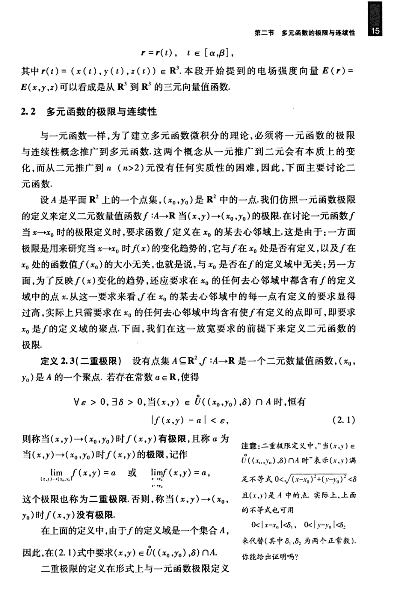

# 工科数学分析基础 下册 - Page 24

- 源文件：`temp/math/工科数学分析基础 下册.pdf`
- PDF 页码：24
- 教材页码：15
- 目录位置：第五章 / 第二节 / 2.2 多元函数的极限与连续性
- 页图：`temp/math/visual-latex/工科数学分析基础 下册/pages/page-0024.png`
- 转写方式：视觉阅读 + LaTeX 手工整理
- 状态：已转写

## LaTeX Markdown

$$
r=r(t),\qquad t\in[\alpha,\beta],
$$

其中

$$
r(t)=(x(t),y(t),z(t))\in\mathbb{R}^3.
$$

本段开始提到的电场强度向量

$$
E(r)=E(x,y,z)
$$

可以看成是从 $\mathbb{R}^3$ 到 $\mathbb{R}^3$ 的三元向量值函数。

## 2.2 多元函数的极限与连续性

与一元函数一样，为了建立多元函数微积分的理论，必须将一元函数的极限与连续性概念推广到多元函数。这两个概念从一元推广到二元会有本质上的变化，而从二元推广到 $n$（$n>2$）元没有任何实质性的困难，因此，下面主要讨论二元函数。

设 $A$ 是平面 $\mathbb{R}^2$ 上的一个点集，$(x_0,y_0)$ 是 $\mathbb{R}^2$ 中的一点。我们仿照一元函数极限的定义来定义二元数量值函数 $f:A\to\mathbb{R}$ 当 $(x,y)\to(x_0,y_0)$ 的极限。在讨论一元函数 $f$ 当 $x\to x_0$ 时的极限定义时，要求函数 $f$ 定义在 $x_0$ 的某去心邻域上。这是由于：一方面极限是用来研究当 $x\to x_0$ 时 $f(x)$ 的变化趋势的，它与 $f$ 在 $x_0$ 处是否有定义，以及 $f$ 在 $x_0$ 处的函数值 $f(x_0)$ 的大小无关，也就是说，与 $x_0$ 是否在 $f$ 的定义域中无关；另一方面，为了反映 $f(x)$ 变化的趋势，还应要求在 $x_0$ 的任一去心邻域中都含有使 $f$ 有定义的点。从这一要求来看，$f$ 在 $x_0$ 的某去心邻域中的每一点有定义的要求显得过高，实际上只需要求在 $x_0$ 的任何去心邻域中均含有使 $f$ 有定义的点即可，即要求 $x_0$ 是 $f$ 的定义域的聚点。下面，我们在这一放宽要求的前提下来定义二元函数的极限。

**定义 2.3（二重极限）** 设有点集 $A\subseteq\mathbb{R}^2$，$f:A\to\mathbb{R}$ 是一个二元数量值函数，$(x_0,y_0)$ 是 $A$ 的一个聚点。若存在常数 $a\in\mathbb{R}$，使得

$$
\forall\varepsilon>0,\ \exists\delta>0,\ \text{当}\ (x,y)\in\overset{\circ}{U}((x_0,y_0),\delta)\cap A\ \text{时，恒有}
$$

$$
|f(x,y)-a|<\varepsilon, \tag{2.1}
$$

则称当 $(x,y)\to(x_0,y_0)$ 时 $f(x,y)$ 有极限，且称 $a$ 为当 $(x,y)\to(x_0,y_0)$ 时 $f(x,y)$ 的极限，记作

$$
\lim_{(x,y)\to(x_0,y_0)}f(x,y)=a
\quad\text{或}\quad
\lim_{\substack{x\to x_0\\ y\to y_0}}f(x,y)=a.
$$

这个极限也称为**二重极限**。否则，称当 $(x,y)\to(x_0,y_0)$ 时 $f(x,y)$ 没有极限。

在上面的定义中，由于 $f$ 的定义域是一个集合 $A$，因此，在 $(2.1)$ 式中要求

$$
(x,y)\in\overset{\circ}{U}((x_0,y_0),\delta)\cap A.
$$

二重极限的定义在形式上与一元函数极限定义
