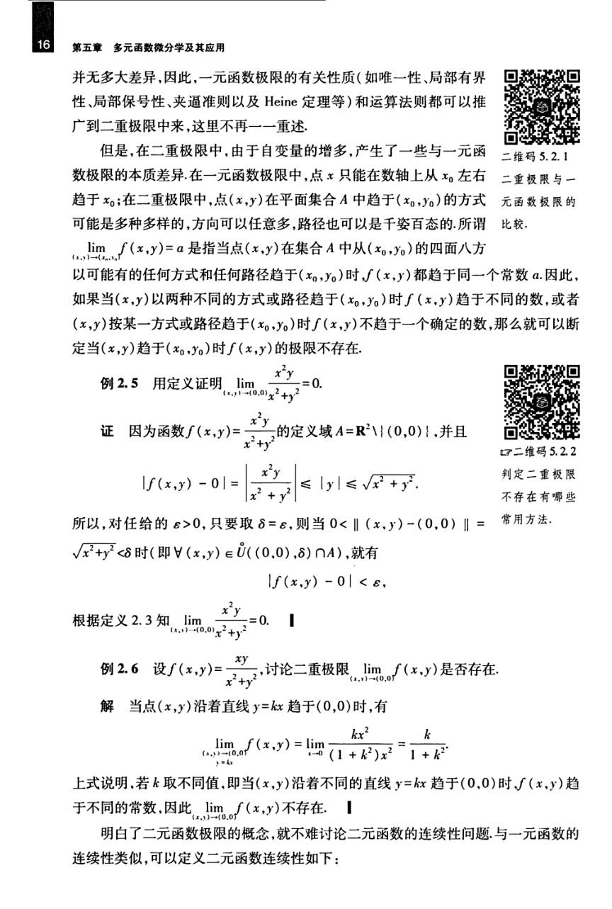

# 工科数学分析基础 下册 - Page 25

- 源文件：`temp/math/工科数学分析基础 下册.pdf`
- PDF 页码：25
- 教材页码：16
- 目录位置：第五章 / 第二节 / 2.2 多元函数的极限与连续性
- 页图：`temp/math/visual-latex/工科数学分析基础 下册/pages/page-0025.png`
- 转写方式：视觉阅读 + LaTeX 手工整理
- 状态：已转写

## LaTeX Markdown

并无多大差异，因此，一元函数极限的有关性质（如唯一性、局部有界性、局部保号性、夹逼准则以及 Heine 定理等）和运算法则都可以推广到二重极限中来，这里不再一一重述。

但是，在二重极限中，由于自变量的增多，产生了一些与一元函数极限的本质差异。在一元函数极限中，点 $x$ 只能在数轴上从 $x_0$ 左右趋于 $x_0$；在二重极限中，点 $(x,y)$ 在平面集合 $A$ 中趋于 $(x_0,y_0)$ 的方式可能是多种多样的，方向可以任意多，路径也可以是千变万化的。所谓

$$
\lim_{(x,y)\to(x_0,y_0)}f(x,y)=a
$$

是指当点 $(x,y)$ 在集合 $A$ 中从 $(x_0,y_0)$ 的四面八方以可能有的任何方式和任何路径趋于 $(x_0,y_0)$ 时，$f(x,y)$ 都趋于同一个常数 $a$。因此，如果当 $(x,y)$ 以两种不同的方式或路径趋于 $(x_0,y_0)$ 时 $f(x,y)$ 趋于不同的数，或者 $(x,y)$ 按某一方式或路径趋于 $(x_0,y_0)$ 时 $f(x,y)$ 不趋于一个确定的数，那么就可以断定当 $(x,y)$ 趋于 $(x_0,y_0)$ 时 $f(x,y)$ 的极限不存在。

**例 2.5** 用定义证明

$$
\lim_{(x,y)\to(0,0)}\frac{x^2y}{x^2+y^2}=0.
$$

**证** 因为函数

$$
f(x,y)=\frac{x^2y}{x^2+y^2}
$$

的定义域 $A=\mathbb{R}^2\setminus\{(0,0)\}$，并且

$$
|f(x,y)-0|
=\left|\frac{x^2y}{x^2+y^2}\right|
\le |y|
\le \sqrt{x^2+y^2}.
$$

所以，对任给的 $\varepsilon>0$，只要取 $\delta=\varepsilon$，则当

$$
0<\|(x,y)-(0,0)\|=\sqrt{x^2+y^2}<\delta
$$

时（即 $\forall(x,y)\in\overset{\circ}{U}((0,0),\delta)\cap A$），就有

$$
|f(x,y)-0|<\varepsilon.
$$

根据定义 2.3 知

$$
\lim_{(x,y)\to(0,0)}\frac{x^2y}{x^2+y^2}=0.
$$

**例 2.6** 设

$$
f(x,y)=\frac{xy}{x^2+y^2},
$$

讨论二重极限

$$
\lim_{(x,y)\to(0,0)}f(x,y)
$$

是否存在。

**解** 当点 $(x,y)$ 沿着直线 $y=kx$ 趋于 $(0,0)$ 时，有

$$
\lim_{\substack{(x,y)\to(0,0)\\y=kx}} f(x,y)
=\lim_{x\to 0}\frac{kx^2}{(1+k^2)x^2}
=\frac{k}{1+k^2}.
$$

上式说明，若 $k$ 取不同值，即当 $(x,y)$ 沿着不同的直线 $y=kx$ 趋于 $(0,0)$ 时，$f(x,y)$ 趋于不同的常数，因此

$$
\lim_{(x,y)\to(0,0)}f(x,y)
$$

不存在。

明白了二元函数极限的概念，就不难讨论二元函数的连续性问题。与一元函数的连续性类似，可以定义二元函数连续性如下：
