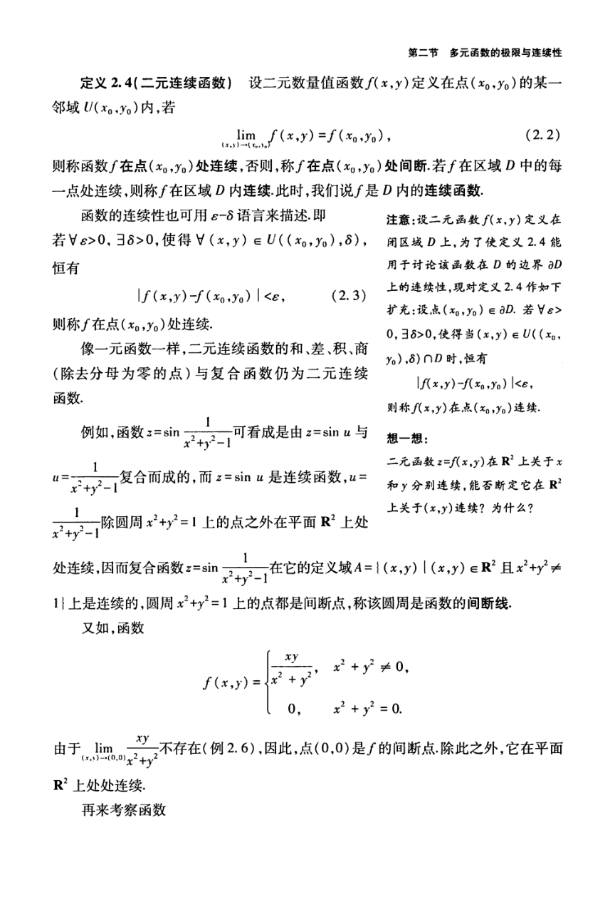

# 工科数学分析基础 下册 - Page 26

- 源文件：`temp/math/工科数学分析基础 下册.pdf`
- PDF 页码：26
- 教材页码：17
- 目录位置：第五章 / 第二节 / 2.2 多元函数的极限与连续性
- 页图：`temp/math/visual-latex/工科数学分析基础 下册/pages/page-0026.png`
- 转写方式：视觉阅读 + LaTeX 手工整理
- 状态：已转写

## LaTeX Markdown

**定义 2.4（二元连续函数）** 设二元数量值函数 $f(x,y)$ 定义在点 $(x_0,y_0)$ 的某一邻域 $U(x_0,y_0)$ 内，若

$$
\lim_{(x,y)\to(x_0,y_0)}f(x,y)=f(x_0,y_0), \tag{2.2}
$$

则称函数 $f$ 在点 $(x_0,y_0)$ 处连续，否则，称 $f$ 在点 $(x_0,y_0)$ 处间断。若 $f$ 在区域 $D$ 中的每一点处连续，则称 $f$ 在区域 $D$ 内连续。此时，我们说 $f$ 是 $D$ 内的连续函数。

函数的连续性也可用 $\varepsilon$-$\delta$ 语言来描述。即若

$$
\forall\varepsilon>0,\ \exists\delta>0,\ \text{使得}\ \forall(x,y)\in U((x_0,y_0),\delta),
$$

恒有

$$
|f(x,y)-f(x_0,y_0)|<\varepsilon, \tag{2.3}
$$

则称 $f$ 在点 $(x_0,y_0)$ 处连续。

像一元函数一样，二元连续函数的和、差、积、商（除去分母为零的点）与复合函数仍为二元连续函数。

例如，函数

$$
z=\sin\frac1{x^2+y^2-1}
$$

可看成是由 $z=\sin u$ 与

$$
u=\frac1{x^2+y^2-1}
$$

复合而成的，而 $z=\sin u$ 是连续函数，$u=\dfrac1{x^2+y^2-1}$ 除圆周 $x^2+y^2=1$ 上的点之外在平面 $\mathbb{R}^2$ 上处处连续，因而复合函数

$$
z=\sin\frac1{x^2+y^2-1}
$$

在它的定义域

$$
A=\{(x,y)\mid (x,y)\in\mathbb{R}^2\ \text{且}\ x^2+y^2\ne 1\}
$$

上是连续的，圆周 $x^2+y^2=1$ 上的点都是间断点，称该圆周是函数的间断线。

又如，函数

$$
f(x,y)=
\begin{cases}
\dfrac{xy}{x^2+y^2}, & x^2+y^2\ne 0,\\
0, & x^2+y^2=0,
\end{cases}
$$

由于

$$
\lim_{(x,y)\to(0,0)}\frac{xy}{x^2+y^2}
$$

不存在（例 2.6），因此，点 $(0,0)$ 是 $f$ 的间断点。除此之外，它在平面 $\mathbb{R}^2$ 上处处连续。

再来考察函数
