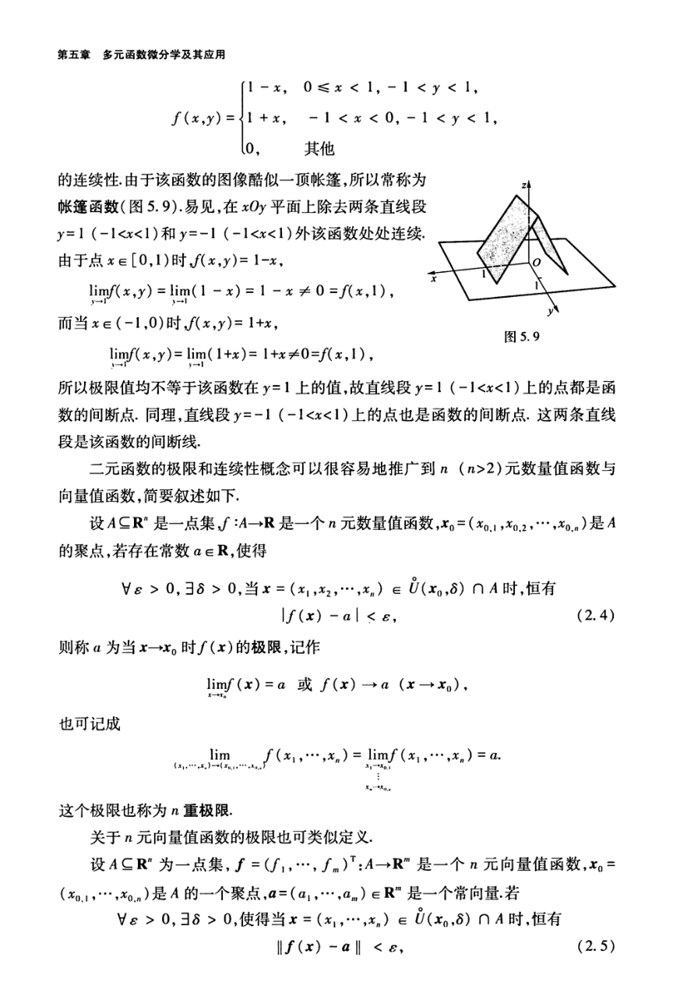

# 工科数学分析基础 下册 - Page 27

- 源文件：`temp/math/工科数学分析基础 下册.pdf`
- PDF 页码：27
- 教材页码：18
- 目录位置：第五章 / 第二节 / 2.2 多元函数的极限与连续性
- 页图：`temp/math/visual-latex/工科数学分析基础 下册/pages/page-0027.png`
- 转写方式：视觉阅读 + LaTeX 手工整理
- 状态：已转写

## LaTeX Markdown

$$
f(x,y)=
\begin{cases}
1-x, & 0\le x<1,\ -1<y<1,\\
1+x, & -1<x<0,\ -1<y<1,\\
0, & \text{其他}.
\end{cases}
$$

的连续性。由于该函数的图像酷似一顶帐篷，所以常称为**帐篷函数**（图 5.9）。易见，在 $xOy$ 平面上除去两条直线段

$$
y=1\quad(-1<x<1),\qquad y=-1\quad(-1<x<1)
$$

外该函数处处连续。

由于点 $x\in[0,1)$ 时 $f(x,y)=1-x$，

$$
\lim_{y\to 1}f(x,y)=\lim_{y\to 1}(1-x)=1-x\ne 0=f(x,1),
$$

而当 $x\in(-1,0)$ 时 $f(x,y)=1+x$，

$$
\lim_{y\to 1}f(x,y)=\lim_{y\to 1}(1+x)=1+x\ne 0=f(x,1),
$$

所以极限值均不等于该函数在 $y=1$ 上的值，故直线段 $y=1$（$-1<x<1$）上的点都是函数的间断点。同理，直线段 $y=-1$（$-1<x<1$）上的点也是函数的间断点。这两条直线段是该函数的间断线。

二元函数的极限和连续性概念可以很容易地推广到 $n$（$n>2$）元数量值函数与向量值函数，简要叙述如下。

设 $A\subseteq\mathbb{R}^n$ 是一点集，$f:A\to\mathbb{R}$ 是一个 $n$ 元数量值函数，

$$
x_0=(x_{0,1},x_{0,2},\cdots,x_{0,n})
$$

是 $A$ 的聚点，若存在常数 $a\in\mathbb{R}$，使得

$$
\forall\varepsilon>0,\ \exists\delta>0,\ \text{当}\ x=(x_1,x_2,\cdots,x_n)\in\overset{\circ}{U}(x_0,\delta)\cap A\ \text{时，恒有}
$$

$$
|f(x)-a|<\varepsilon, \tag{2.4}
$$

则称 $a$ 为当 $x\to x_0$ 时 $f(x)$ 的极限，记作

$$
\lim_{x\to x_0}f(x)=a
\quad\text{或}\quad
f(x)\to a\quad(x\to x_0),
$$

也可记成

$$
\lim_{(x_1,\cdots,x_n)\to(x_{0,1},\cdots,x_{0,n})}
f(x_1,\cdots,x_n)
=
\lim_{\substack{x_1\to x_{0,1}\\ \vdots\\ x_n\to x_{0,n}}}
f(x_1,\cdots,x_n)
=a.
$$

这个极限也称为 $n$ 重极限。

关于 $n$ 元向量值函数的极限也可类似定义。

设 $A\subseteq\mathbb{R}^n$ 为一点集，

$$
f=(f_1,\cdots,f_m)^T:A\to\mathbb{R}^m
$$

是一个 $n$ 元向量值函数，$x_0=(x_{0,1},\cdots,x_{0,n})$ 是 $A$ 的一个聚点，$a=(a_1,\cdots,a_m)\in\mathbb{R}^m$ 是一个常向量，若

$$
\forall\varepsilon>0,\ \exists\delta>0,\ \text{使得当}\ x=(x_1,\cdots,x_n)\in\overset{\circ}{U}(x_0,\delta)\cap A\ \text{时，恒有}
$$

$$
\|f(x)-a\|<\varepsilon, \tag{2.5}
$$
