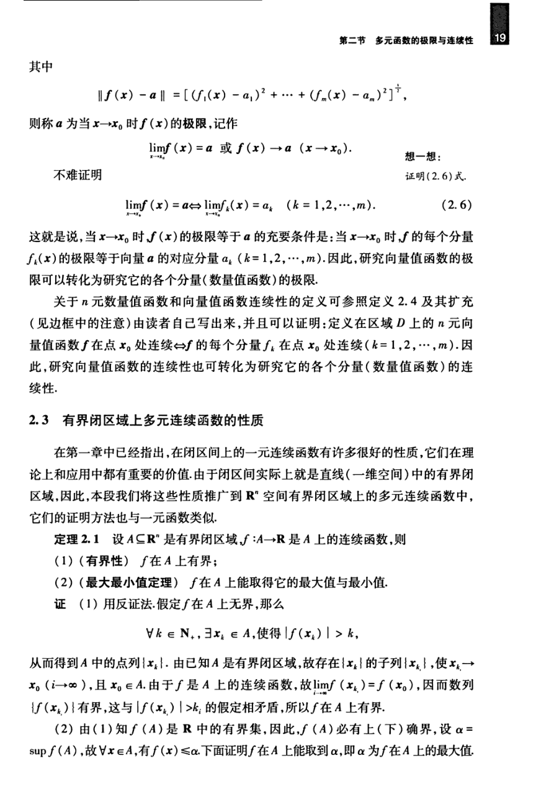

# 工科数学分析基础 下册 - Page 28

- 源文件：`temp/math/工科数学分析基础 下册.pdf`
- PDF 页码：28
- 教材页码：19
- 目录位置：第五章 / 第二节 / 2.2-2.3
- 页图：`temp/math/visual-latex/工科数学分析基础 下册/pages/page-0028.png`
- 转写方式：视觉阅读 + LaTeX 手工整理
- 状态：已转写

## LaTeX Markdown

其中

$$
\|f(x)-a\|
=\left[(f_1(x)-a_1)^2+\cdots+(f_m(x)-a_m)^2\right]^{1/2},
$$

则称 $a$ 为当 $x\to x_0$ 时 $f(x)$ 的极限，记作

$$
\lim_{x\to x_0}f(x)=a
\quad\text{或}\quad
f(x)\to a\quad(x\to x_0).
$$

不难证明

$$
\lim_{x\to x_0}f(x)=a
\Longleftrightarrow
\lim_{x\to x_0}f_k(x)=a_k\qquad(k=1,2,\cdots,m). \tag{2.6}
$$

这就是说，当 $x\to x_0$ 时 $f(x)$ 的极限等于 $a$ 的充要条件是：当 $x\to x_0$ 时 $f$ 的每个分量 $f_k(x)$ 的极限等于向量 $a$ 的对应分量 $a_k$（$k=1,2,\cdots,m$）。因此，研究向量值函数的极限可以转化为研究它的各个分量（数量值函数）的极限。

关于 $n$ 元数量值函数和向量值函数连续性的定义可参照定义 2.4 及其扩充（见边框中的注意）由读者自己写出来，并且可以证明：定义在区域 $D$ 上的 $n$ 元向量值函数 $f$ 在点 $x_0$ 处连续 $\Leftrightarrow f$ 的每个分量 $f_k$ 在点 $x_0$ 处连续（$k=1,2,\cdots,m$）。因此，研究向量值函数的连续性也可转化为研究它的各个分量（数量值函数）的连续性。

## 2.3 有界闭区域上多元连续函数的性质

在第一章中已经指出，在闭区间上的一元连续函数有许多很好的性质，它们在理论上和应用中都有重要的价值。由于闭区间实际上就是直线（一维空间）中的有界闭区域，因此，本段我们将这些性质推广到 $\mathbb{R}^n$ 空间有界闭区域上的多元连续函数中，它们的证明方法也与一元函数类似。

**定理 2.1** 设 $A\subseteq\mathbb{R}^n$ 是有界闭区域，$f:A\to\mathbb{R}$ 是 $A$ 上的连续函数，则：

1. **（有界性）** $f$ 在 $A$ 上有界；
2. **（最大最小值定理）** $f$ 在 $A$ 上能取得它的最大值与最小值。

**证** （1）用反证法。假定 $f$ 在 $A$ 上无界，那么

$$
\forall k\in\mathbb{N}_+,\ \exists x_k\in A,\ \text{使得}\ |f(x_k)|>k,
$$

从而得到 $A$ 中的点列 $\{x_k\}$。由已知 $A$ 是有界闭区域，故存在 $\{x_k\}$ 的子列 $\{x_{k_i}\}$，使

$$
x_{k_i}\to x_0\quad(i\to\infty),
$$

且 $x_0\in A$。由于 $f$ 是 $A$ 上的连续函数，故

$$
\lim_{i\to\infty}f(x_{k_i})=f(x_0),
$$

因而数列 $\{f(x_{k_i})\}$ 有界，这与 $|f(x_k)|>k$ 的假定相矛盾，所以 $f$ 在 $A$ 上有界。

（2）由（1）知 $f(A)$ 是 $\mathbb{R}$ 中的有界集，因此，$f(A)$ 必有上（下）确界。设

$$
\alpha=\sup f(A),
$$

故 $\forall x\in A$，有 $f(x)\le \alpha$。下面证明 $f$ 在 $A$ 上能取到 $\alpha$，即 $\alpha$ 为 $f$ 在 $A$ 上的最大值
