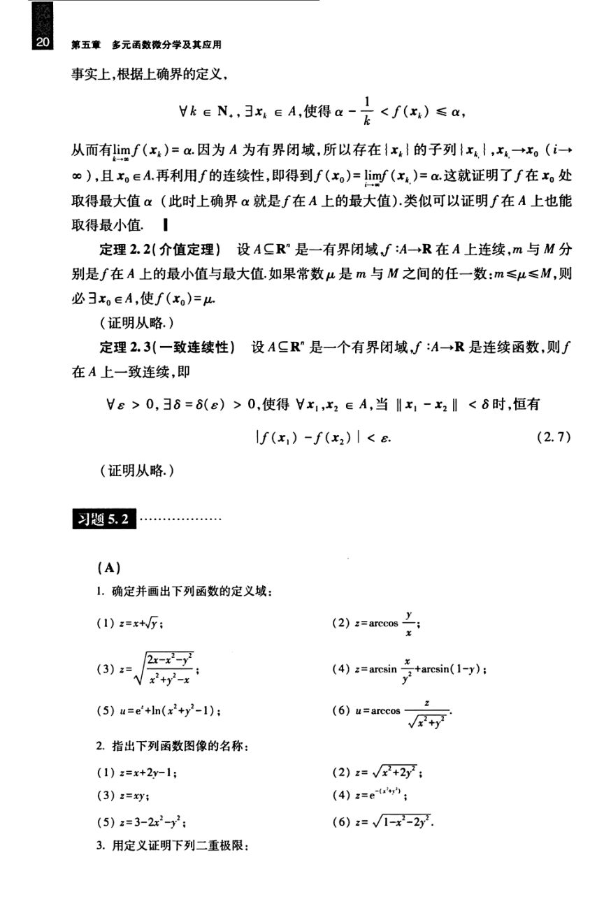

# 工科数学分析基础 下册 - Page 29

- 源文件：`temp/math/工科数学分析基础 下册.pdf`
- PDF 页码：29
- 教材页码：20
- 目录位置：第五章 / 第二节 / 2.3 有界闭区域上多元连续函数的性质
- 页图：`temp/math/visual-latex/工科数学分析基础 下册/pages/page-0029.png`
- 转写方式：视觉阅读 + LaTeX 手工整理
- 状态：已转写

## LaTeX Markdown

事实上，根据上确界的定义，

$$
\forall k\in\mathbb{N}_+,\ \exists x_k\in A,\ \text{使得}\ \alpha-\frac1k<f(x_k)\le \alpha,
$$

从而有

$$
\lim_{k\to\infty}f(x_k)=\alpha.
$$

因为 $A$ 为有界闭域，所以存在 $\{x_k\}$ 的子列 $\{x_{k_i}\}$，使

$$
x_{k_i}\to x_0\quad(i\to\infty),
$$

且 $x_0\in A$。再利用 $f$ 的连续性，即得到

$$
f(x_0)=\lim_{i\to\infty}f(x_{k_i})=\alpha.
$$

这就证明了 $f$ 在 $x_0$ 处取得最大值 $\alpha$（此时上确界 $\alpha$ 就是 $f$ 在 $A$ 上的最大值）。类似可以证明 $f$ 在 $A$ 上也能取得最小值。

**定理 2.2（介值定理）** 设 $A\subseteq\mathbb{R}^n$ 是一有界闭域，$f:A\to\mathbb{R}$ 在 $A$ 上连续，$m$ 与 $M$ 分别是 $f$ 在 $A$ 上的最小值与最大值。如果常数 $\mu$ 是 $m$ 与 $M$ 之间的任一数：

$$
m\le \mu\le M,
$$

则必 $\exists x_0\in A$，使 $f(x_0)=\mu$。

（证明从略。）

**定理 2.3（一致连续性）** 设 $A\subseteq\mathbb{R}^n$ 是一个有界闭域，$f:A\to\mathbb{R}$ 是连续函数，则 $f$ 在 $A$ 上一致连续，即

$$
\forall\varepsilon>0,\ \exists\delta=\delta(\varepsilon)>0,
$$

使得 $\forall x_1,x_2\in A$，当

$$
\|x_1-x_2\|<\delta
$$

时，恒有

$$
|f(x_1)-f(x_2)|<\varepsilon. \tag{2.7}
$$

（证明从略。）

# 习题 5.2

## A

1. 确定并画出下列函数的定义域：

   $$
   z=x+\sqrt y;
   $$

   $$
   z=\arccos\frac yx;
   $$

   $$
   z=\sqrt{\frac{2x-x^2-y^2}{x^2+y^2-x}};
   $$

   $$
   z=\arcsin\frac{x}{y^2}+\arcsin(1-y);
   $$

   $$
   u=e^t+\ln(x^2+y^2-1);
   $$

   $$
   u=\arccos\frac{z}{\sqrt{x^2+y^2}}.
   $$

2. 指出下列函数图像的名称：

   $$
   z=x+2y-1;
   \qquad
   z=\sqrt{x^2+2y^2};
   $$

   $$
   z=xy;
   \qquad
   z=e^{-(x^2+y^2)};
   $$

   $$
   z=3-2x^2-y^2;
   \qquad
   z=\sqrt{1-x^2-2y^2}.
   $$

3. 用定义证明下列二重极限：
