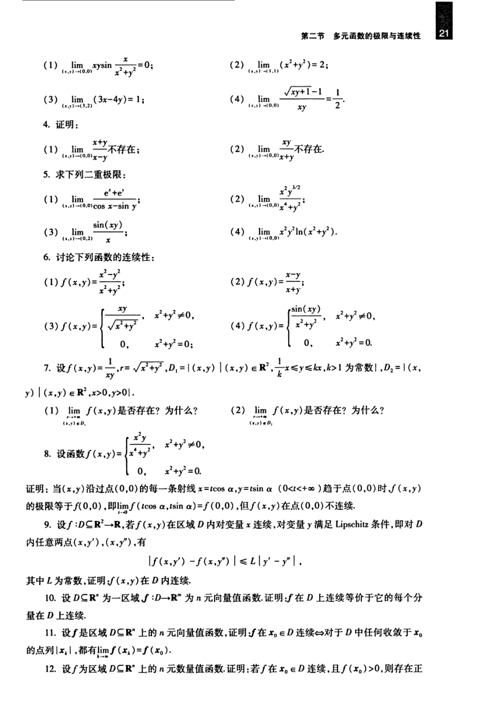

# 工科数学分析基础 下册 - Page 30

- 源文件：`temp/math/工科数学分析基础 下册.pdf`
- PDF 页码：30
- 教材页码：21
- 目录位置：第五章 / 习题 5.2
- 页图：`temp/math/visual-latex/工科数学分析基础 下册/pages/page-0030.png`
- 转写方式：视觉阅读 + LaTeX 手工整理
- 状态：已转写

## LaTeX Markdown

1. $$
   \lim_{(x,y)\to(0,0)}xy\sin\frac{x}{x^2+y^2}=0;
   $$

2. $$
   \lim_{(x,y)\to(1,1)}(x^2+y^2)=2;
   $$

3. $$
   \lim_{(x,y)\to(3,2)}(3x-4y)=1;
   $$

4. $$
   \lim_{(x,y)\to(0,0)}\frac{\sqrt{xy+1}-1}{xy}=\frac12.
   $$

4. 证明：

   1. $$
      \lim_{(x,y)\to(0,0)}\frac{x+y}{x-y}\ \text{不存在};
      $$

   2. $$
      \lim_{(x,y)\to(0,0)}\frac{xy}{x+y}\ \text{不存在}.
      $$

5. 求下列二重极限：

   1. $$
      \lim_{(x,y)\to(0,0)}\frac{e^x+e^y}{\cos x-\sin y};
      $$

   2. $$
      \lim_{(x,y)\to(0,0)}\frac{x^2y^{3/2}}{x^4+y^2};
      $$

   3. $$
      \lim_{(x,y)\to(0,2)}\frac{\sin(xy)}{x};
      $$

   4. $$
      \lim_{(x,y)\to(0,0)}x^2y^2\ln(x^2+y^2).
      $$

6. 讨论下列函数的连续性：

   1. $$
      f(x,y)=\frac{x^2-y^2}{x^2+y^2};
      $$

   2. $$
      f(x,y)=\frac{x-y}{x+y};
      $$

   3. $$
      f(x,y)=
      \begin{cases}
      \dfrac{xy}{\sqrt{x^2+y^2}}, & x^2+y^2\ne 0,\\
      0, & x^2+y^2=0;
      \end{cases}
      $$

   4. $$
      f(x,y)=
      \begin{cases}
      \dfrac{\sin(xy)}{x^2+y^2}, & x^2+y^2\ne 0,\\
      0, & x^2+y^2=0.
      \end{cases}
      $$

7. 设

   $$
   f(x,y)=\frac1{xy},\qquad r=\sqrt{x^2+y^2},
   $$

   $$
   D_1=\{(x,y)\mid (x,y)\in\mathbb{R}^2,\ \frac1k x\le y\le kx,\ k>1\ \text{为常数}\},
   $$

   $$
   D_2=\{(x,y)\mid (x,y)\in\mathbb{R}^2,\ x>0,\ y>0\}.
   $$

   1. $\displaystyle \lim_{\substack{r\to+\infty\\(x,y)\in D_1}} f(x,y)$ 是否存在？为什么？
   2. $\displaystyle \lim_{\substack{r\to+\infty\\(x,y)\in D_2}} f(x,y)$ 是否存在？为什么？

8. 设函数

   $$
   f(x,y)=
   \begin{cases}
   \dfrac{x^2y}{x^4+y^2}, & x^2+y^2\ne 0,\\
   0, & x^2+y^2=0.
   \end{cases}
   $$

   证明：当 $(x,y)$ 沿过点 $(0,0)$ 的每一条射线

   $$
   x=t\cos\alpha,\qquad y=t\sin\alpha\qquad(0<t<+\infty)
   $$

   趋于点 $(0,0)$ 时，$f(x,y)$ 的极限等于 $f(0,0)$，即

   $$
   \lim_{t\to 0}f(t\cos\alpha,t\sin\alpha)=f(0,0),
   $$

   但 $f(x,y)$ 在点 $(0,0)$ 不连续。

9. 设 $f:D\subseteq\mathbb{R}^2\to\mathbb{R}$，若 $f(x,y)$ 在区域 $D$ 内对变量 $x$ 连续，对变量 $y$ 满足 Lipschitz 条件，即对 $D$ 内任意两点 $(x,y')$、$(x,y'')$，有

   $$
   |f(x,y')-f(x,y'')|\le L|y'-y''|,
   $$

   其中 $L$ 为常数，证明：$f(x,y)$ 在 $D$ 内连续。

10. 设 $D\subseteq\mathbb{R}^n$ 为一区域，$f:D\to\mathbb{R}^m$ 为 $n$ 元向量值函数。证明：$f$ 在 $D$ 上连续等价于它的每个分量在 $D$ 上连续。

11. 设 $f$ 是区域 $D\subseteq\mathbb{R}^n$ 上的 $n$ 元向量值函数，证明：$f$ 在 $x_0\in D$ 连续 $\Leftrightarrow$ 对于 $D$ 中任何收敛于 $x_0$ 的点列 $\{x_k\}$，都有

    $$
    \lim_{k\to\infty}f(x_k)=f(x_0).
    $$

12. 设 $f$ 为区域 $D\subseteq\mathbb{R}^n$ 上的 $n$ 元数量值函数。证明：若 $f$ 在 $x_0\in D$ 连续，且 $f(x_0)>0$，则存在正
