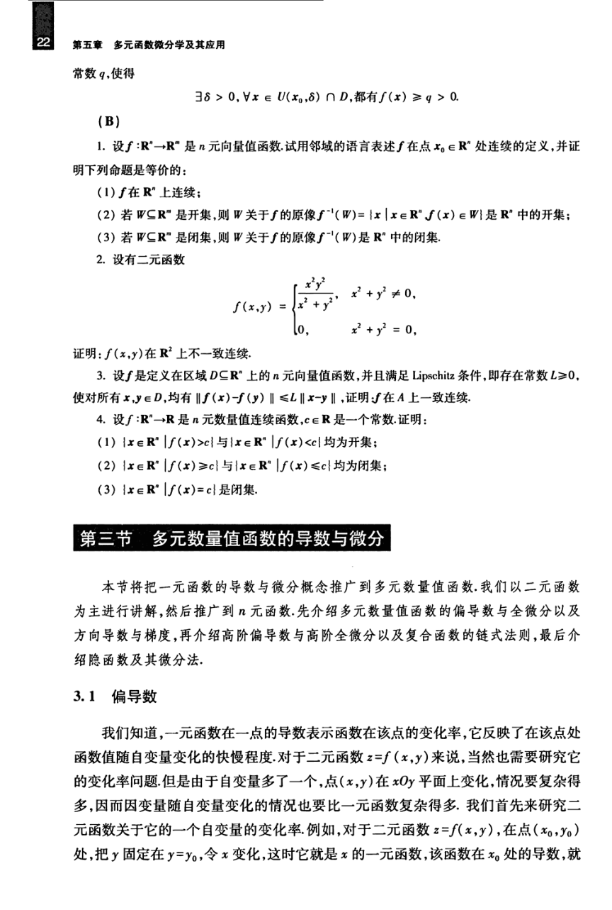

# 工科数学分析基础 下册 - Page 31

- 源文件：`temp/math/工科数学分析基础 下册.pdf`
- PDF 页码：31
- 教材页码：22
- 目录位置：第五章 / 习题 5.2；第三节 多元数量值函数的导数与微分 / 3.1 偏导数
- 页图：`temp/math/visual-latex/工科数学分析基础 下册/pages/page-0031.png`
- 转写方式：视觉阅读 + LaTeX 手工整理
- 状态：已转写

## LaTeX Markdown

常数 $q$，使得

$$
\exists\delta>0,\ \forall x\in U(x_0,\delta)\cap D,\ \text{都有}\ f(x)\ge q>0.
$$

## B

1. 设 $f:\mathbb{R}^n\to\mathbb{R}^m$ 是 $n$ 元向量值函数。试用邻域的语言表述 $f$ 在点 $x_0\in\mathbb{R}^n$ 处连续的定义，并证明下列命题是等价的：

   1. $f$ 在 $\mathbb{R}^n$ 上连续；
   2. 若 $W\subseteq\mathbb{R}^m$ 是开集，则 $W$ 关于 $f$ 的原像

      $$
      f^{-1}(W)=\{x\mid x\in\mathbb{R}^n,\ f(x)\in W\}
      $$

      是 $\mathbb{R}^n$ 中的开集；
   3. 若 $W\subseteq\mathbb{R}^m$ 是闭集，则 $W$ 关于 $f$ 的原像 $f^{-1}(W)$ 是 $\mathbb{R}^n$ 中的闭集。

2. 设有二元函数

   $$
   f(x,y)=
   \begin{cases}
   \dfrac{x^2y^2}{x^2+y^2}, & x^2+y^2\ne 0,\\
   0, & x^2+y^2=0,
   \end{cases}
   $$

   证明：$f(x,y)$ 在 $\mathbb{R}^2$ 上不一致连续。

3. 设 $f$ 是定义在区域 $D\subseteq\mathbb{R}^n$ 上的 $n$ 元向量值函数，并且满足 Lipschitz 条件，即存在常数 $L\ge 0$，使对所有 $x,y\in D$，均有

   $$
   \|f(x)-f(y)\|\le L\|x-y\|,
   $$

   证明：$f$ 在 $A$ 上一致连续。

4. 设 $f:\mathbb{R}^n\to\mathbb{R}$ 是 $n$ 元数量值连续函数，$c\in\mathbb{R}$ 是一个常数。证明：

   1. $\{x\in\mathbb{R}^n\mid f(x)>c\}$ 与 $\{x\in\mathbb{R}^n\mid f(x)<c\}$ 均为开集；
   2. $\{x\in\mathbb{R}^n\mid f(x)\ge c\}$ 与 $\{x\in\mathbb{R}^n\mid f(x)\le c\}$ 均为闭集；
   3. $\{x\in\mathbb{R}^n\mid f(x)=c\}$ 是闭集。

# 第三节 多元数量值函数的导数与微分

本节将把一元函数的导数与微分概念推广到多元数量值函数。我们以二元函数为主进行讲解，然后推广到 $n$ 元函数。先介绍多元数量值函数的偏导数与全微分以及方向导数与梯度，再介绍高阶偏导数与高阶全微分以及复合函数的链式法则，最后介绍隐函数及其微分法。

## 3.1 偏导数

我们知道，一元函数在一点的导数表示函数在该点的变化率，它反映了在该点处函数值随自变量变化的快慢程度。对于二元函数 $z=f(x,y)$ 来说，当然也需要研究它的变化率问题。但是由于自变量多了一个，点 $(x,y)$ 在 $xOy$ 平面上变化，情况要复杂得多，因而因变量随自变量变化的情况也要比一元函数复杂得多。我们首先来研究二元函数关于它的一个自变量的变化率。例如，对于二元函数 $z=f(x,y)$，在点 $(x_0,y_0)$ 处，把 $y$ 固定在 $y=y_0$，令 $x$ 变化，这时它就是 $x$ 的一元函数，该函数在 $x_0$ 处的导数，就
