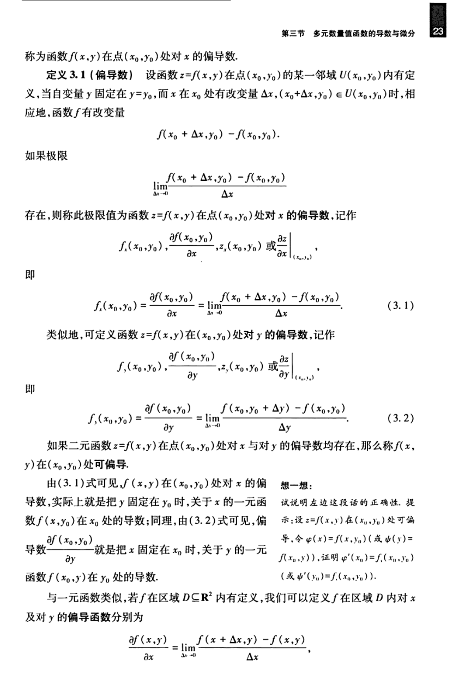

# 工科数学分析基础 下册 - Page 32

- 源文件：`temp/math/工科数学分析基础 下册.pdf`
- PDF 页码：32
- 教材页码：23
- 目录位置：第五章 / 第三节 / 3.1 偏导数
- 页图：`temp/math/visual-latex/工科数学分析基础 下册/pages/page-0032.png`
- 转写方式：视觉阅读 + LaTeX 手工整理
- 状态：已转写

## LaTeX Markdown

称为函数 $f(x,y)$ 在点 $(x_0,y_0)$ 处对 $x$ 的偏导数。

**定义 3.1（偏导数）** 设函数 $z=f(x,y)$ 在点 $(x_0,y_0)$ 的某一邻域 $U(x_0,y_0)$ 内有定义，当自变量 $y$ 固定在 $y=y_0$，而 $x$ 在 $x_0$ 处有改变量 $\Delta x$，$(x_0+\Delta x,y_0)\in U(x_0,y_0)$ 时，相应地，函数 $f$ 有改变量

$$
f(x_0+\Delta x,y_0)-f(x_0,y_0).
$$

如果极限

$$
\lim_{\Delta x\to 0}
\frac{f(x_0+\Delta x,y_0)-f(x_0,y_0)}{\Delta x}
$$

存在，则称此极限值为函数 $z=f(x,y)$ 在点 $(x_0,y_0)$ 处对 $x$ 的**偏导数**，记作

$$
f_x(x_0,y_0),\quad
\frac{\partial f(x_0,y_0)}{\partial x},\quad
z_x(x_0,y_0),\quad
\left.\frac{\partial z}{\partial x}\right|_{(x_0,y_0)},
$$

即

$$
f_x(x_0,y_0)
=\frac{\partial f(x_0,y_0)}{\partial x}
=\lim_{\Delta x\to 0}
\frac{f(x_0+\Delta x,y_0)-f(x_0,y_0)}{\Delta x}. \tag{3.1}
$$

类似地，可定义函数 $z=f(x,y)$ 在 $(x_0,y_0)$ 处对 $y$ 的偏导数，记作

$$
f_y(x_0,y_0),\quad
\frac{\partial f(x_0,y_0)}{\partial y},\quad
z_y(x_0,y_0),\quad
\left.\frac{\partial z}{\partial y}\right|_{(x_0,y_0)},
$$

即

$$
f_y(x_0,y_0)
=\frac{\partial f(x_0,y_0)}{\partial y}
=\lim_{\Delta y\to 0}
\frac{f(x_0,y_0+\Delta y)-f(x_0,y_0)}{\Delta y}. \tag{3.2}
$$

如果二元函数 $z=f(x,y)$ 在点 $(x_0,y_0)$ 处对 $x$ 与对 $y$ 的偏导数均存在，那么称 $f(x,y)$ 在 $(x_0,y_0)$ 处**可偏导**。

由 $(3.1)$ 式可见，$f(x,y)$ 在 $(x_0,y_0)$ 处对 $x$ 的偏导数，实际上就是把 $y$ 固定在 $y_0$ 时，关于 $x$ 的一元函数 $f(x,y_0)$ 在 $x_0$ 处的导数；同理，由 $(3.2)$ 式可见，偏导数 $\dfrac{\partial f(x_0,y_0)}{\partial y}$ 就是把 $x$ 固定在 $x_0$ 时，关于 $y$ 的一元函数 $f(x_0,y)$ 在 $y_0$ 处的导数。

与一元函数类似，若 $f$ 在区域 $D\subseteq\mathbb{R}^2$ 内有定义，我们可以定义 $f$ 在区域 $D$ 内对 $x$ 及对 $y$ 的偏导函数分别为

$$
\frac{\partial f(x,y)}{\partial x}
=\lim_{\Delta x\to 0}\frac{f(x+\Delta x,y)-f(x,y)}{\Delta x},
$$
